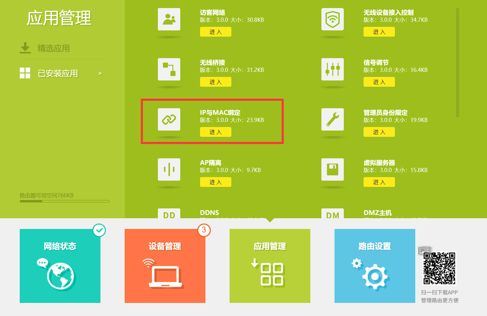
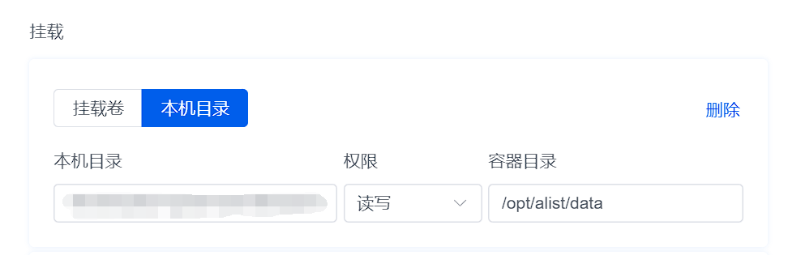

:::warning  
2024年6月起，由于一些原因，Docker镜像服务器的连通性存在问题，请确认您的网络质量。  
:::

> 上帝说“要有光”，于是有了 BT 协议——Duke486

书接上文，我们已经成功在一台主机上部署了 1Panel 面板，并且利用它一键安装了 Alist。有了前面的铺垫，本期基本只需要点几下鼠标就能轻松完成。接下来我们就开始配置自己的网盘，影视库，自动下载等功能。

## 本期效果图

​​

新番自动下载，并且自动匹配封面、缩略图、海报、剧情、演员等元数据

​​

Alist 网盘和离线下载功能，支持普通下载、磁力链、BT 种子

​​

qbit 网页访问，它负责下载新番，也从 Alist 接受下载任务

## 固定内网 IP 地址

一般来说，路由器会把我们家里的所有设备放在一个局域网里，并且给每台设备分配一个 IP 地址。IP 在分配时从地址池中选取，并在租约过期后回收，但是为了方便地访问我们的主机，我们不希望它的内网 IP 发生变化。所以在配置之前，需要设置一下静态IP。

​​

最简单的方式是在路由器后台设置，以 TPLINK 路由器为例，进入 IP 与 MAC 绑定页面。对着主机点击加号，IP 就被固定下来了。

小米路由器则是高级->DHCP。其他路由器找找带着 DHCP，静态，绑定之类词语的选项。

​​

## 为 Alist 添加对应目录

刚配置好的 Alist 是空白的，我们希望能把它当做网盘使用，同时利用它管理下载和视频库。因此需要为它设置三个文件夹——`Upload`​ 上传、`Download`​ 下载、`Series`​ 剧集。

打开面板，选择左侧的容器，勾选“显示应用商店容器”，对着 Alist 点击更多-> 编辑-> 挂载，在这里设置目录映射关系。

​​

它自带的不需要动，我们直接添加三条映射，文件夹名称参考前文三个单词填写，

​`本机：/home/你的主机用户名/文件夹
容器：/mnt/文件夹`​

最后点击确认，面板提示`将会重建容器，未持久化数据将丢失`​，确认。不用担心，因为相关配置文件默认映射到主机位置了。之后通过下图快捷入口登录Alist。

​

点击页面最底部的管理，进入后台设置页面，在存储选项卡里添加文件夹。

​​

驱动选择“本机存储”；挂载路径输入`/上传的文件`​，其他名称也可以；根文件夹路径输入`/mnt/Upload`​保存即可。其他两个文件夹以此类推。

至此，我们已经完成网盘功能了，在 Alist 主页右下角可以上传文件，右键文件可以下载，点击文件可以直接预览。

## 安装媒体库

接下来是媒体库的安装和设置，和 Alist 相比简单很多。直接在 1Panel 应用商店安装 Jellyfin，选上“允许外部端口”，其他的选项都不管即可。

安装后，仍然需要添加一条映射：本机为`/home/你的主机用户名/Series`​，容器为`/media/Series`​，保存，然后通过快捷入口访问，即可打开首次使用设置。

​​

首先选择汉语，账号密码随意，点击添加媒体库，类型为节目，名称随意，文件夹如图填写。下面的语言一律选中文，国家选 People 开头的祖国全名。打钩媒体资料储存方式，打钩将媒体图像保存到媒体所在文件夹，其他的不用动，一路下一步。

​​

## 立即体验

我以芙莉莲为例，演示一下从网盘添加视频。我在 Alist 里面选择 Series 文件夹，创建“葬送的芙莉莲”文件夹，放几集进去。

​​

在 jellyfin 控制台里点一下扫描，来让他寻找番剧并补全缺失的信息。扫描一旦完成，就可以在浏览器、电视、平板等任何地方打开 jellyfin 网址或者 APP 来享受完美观影体验了~

​​

不过由于元数据获取器是国外的，或者我们的片源命名不规范，个别剧集可能出现没有封面的情况，可以搜索“Jellyfin 手动刮削”来解决问题。也可以搜索 Jellyfin 豆瓣等，采用国内数据来一劳永逸，不过这些都是后话了。希望有更多人能体会到本地观影的乐趣！

​​
