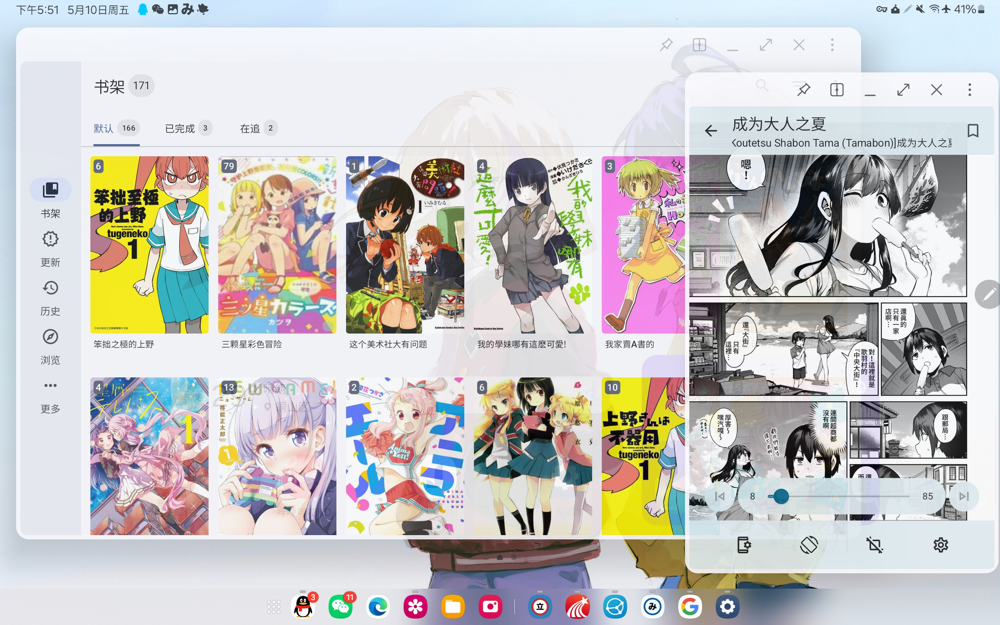
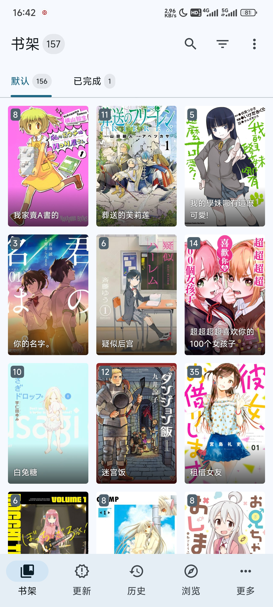
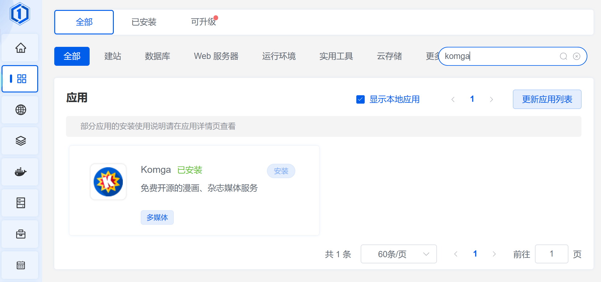
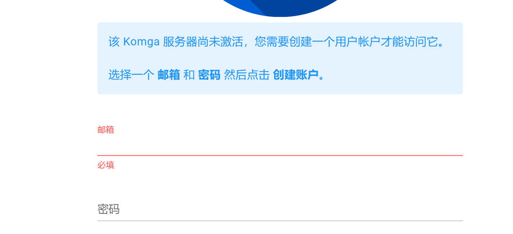
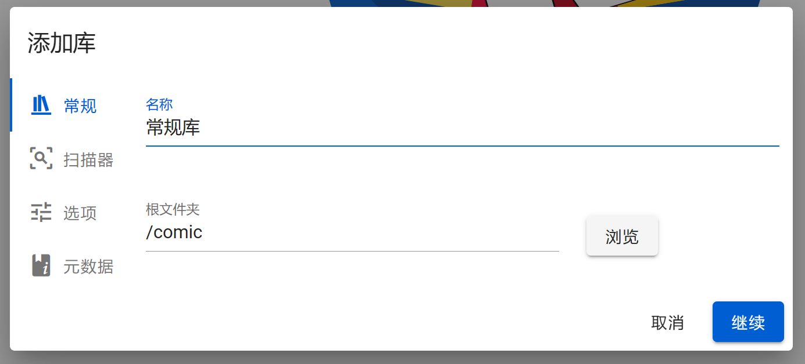
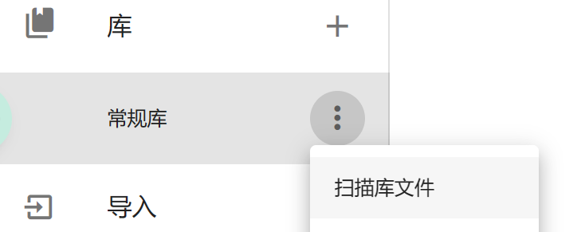
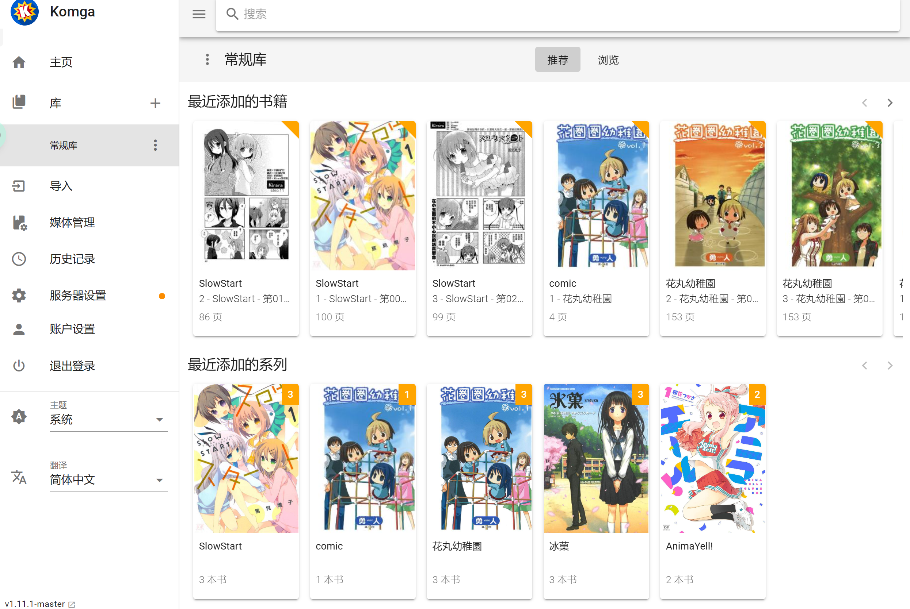
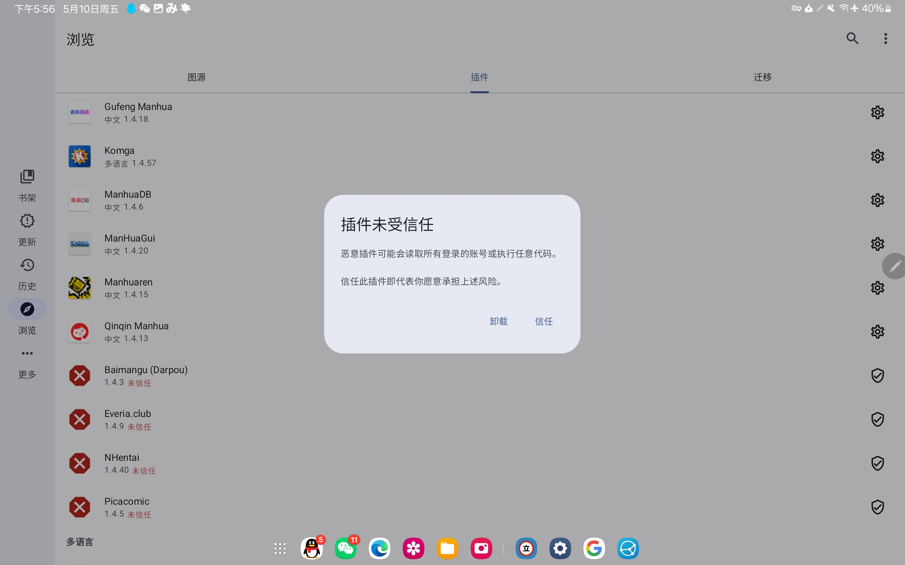
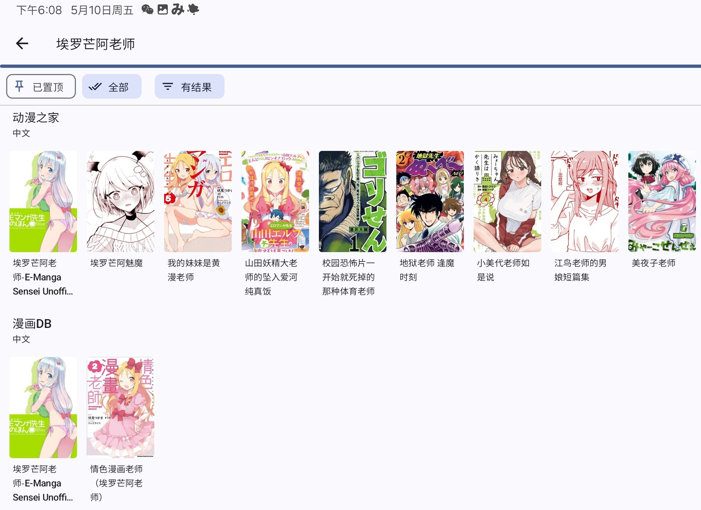

:::warning  
2024年6月起，由于一些原因，Docker镜像服务器的连通性存在问题，请确认您的网络质量。  
:::

## 前言

在准备系列教程之初，我就计划将漫画库放在前面讲，因为它真的极大地改善了我追漫、收藏电子漫画的幸福感和方便程度。但是在 24 年初的时候，开源漫画阅读器项目 Tachiyomi 面临法务危机，其项目自身和众多第三方插件的后续更新都得不到保障，教程也就之好先略过这部分不讲。

不久后 Tachiyomi 的开发者将项目归档，并在 wiki 中发布了告别信，事件算是尘埃落定。不过好在开源社区有着极大的活力，仅仅数日后 Discord 上便成立了 Mihon 项目的发布服务器。作为 Tachiyomi 的后继者，Mihon 青出于蓝，不仅做到了全面向后兼容，在 UI 设计和稳定性上也积极更新。同时，作为阅读器灵魂所在的第三方插件仓库也得到了维护，目前来看 Mihon 已经稳定更新，适合用来日用了。

## 本期目标

这次我们将通过 Docker 来部署 Komga 漫画服务，以便在浏览器、手机、平板等设备上无缝阅读。推荐的方式是通过面板应用商店一键安装，不过对老司机，也会在文末提供 Docker Compose 配置供直接安装。

这次的效果图如下，多设备同时共享同一个漫画库：

​​

‍

​​

​​

## 在服务端安装 Komga

来到我们之前设置过的面板后台，格式是 `http://IP地址:端口/安全入口`​，如果忘记了可以在 Ubuntu 终端或者 SSH 中输入 `sudo 1pctl user-info` ​来获得一个地址。

> 什么是终端、SSH？不妨看看教程第1篇吧。[阅读](http://duke486.pub:5212/archives/59)

进入后台，在应用商店中搜索 komga 然后点击安装，记得勾选允许外部端口访问。

​​

安装后来到容器页面，勾选“显示应用商店容器”，对着 komga 点击更多 > 编辑 > 挂载 > 添加 > 本机目录。第一个框填写 `/home/你的用户名/comic`​ 第二个空填写 `/comic`​，保存即可。

## 导入已有漫画

无论是 Komga 还是 Mihon，对于漫画的目录结构都有一定要求。简单来说就是放漫画的文件夹里面，要有不同的作品文件夹，每个作品文件夹里面有 `PDF、EPUB、ZIP、装在文件夹里的图片` ​等章节文件。例如，如果你和我一样用 comic 文件夹当做漫画库：

> /comic/星电感应/第 1 话.cbz
>
> /comic/你的名字/设定集/001.png
>
> 错误例子：/comic/葬送的芙莉莲 001.zip
>
> /黄金拼图第 1 话.mobi
>
> /comic/你的名字/你的名字第一话/你的名字第一话/第一话.cbz

1. 方法一：Alist 上传。打开容器面板，选择左侧的容器，对着 Alist 点击更多-> 编辑-> 挂载，在这里设置目录映射关系。它自带的不需要动，我们直接添加

   ​`本机：/home/你的用户名/comic`​  
   ​`容器：/mnt/comic`​

   然后登录 Alist ，设置一个新的本地存储，把漫画上传进 comic 就好，这种方法以后上传都比较方便
2. 方法二：面板直接上传。首先把漫画打包，然后在面板中打开主机 > 文件 > 找到 `/home/用户名/comic`​> 上传压缩包 > 解压到此

   这种方法最简单，但是每次导入都得这样操作一遍。
3. 方法三：FTP/SFTP 客户端

   在你的 SSH 软件里找到关于文件管理的按钮，直接把电脑里的漫画拖进去。例如Tabby就支持此功能。

## 应用内设置

点击快捷入口按钮进入 Komga 网页版，根据提示设置一下账号密码。点击“添加库”按钮，根文件夹设置为`/comic`​ 然后一路下一步即可。如果你是的机器性能不太够，可以取消勾选“计算文件哈希”，这个功能影响不大。

​​

​​

最后我们点一下扫描，自动分析就开始了，稍等就可以啦。

​​

​​

‍

## 移动端阅读

由于涉及到 Github 的 Mihon 和 Keiyoushi 仓库下载，但是由于一股神秘的东方力量，一些读者的网络连接不畅，所以我准备了能点开的下载链接。

iPhone 和 iPad 可以参考官方 wiki 安装软件，步骤相对简单，在此不在赘述（其实是我没有苹果手机，哭）。[苹果教程](https://komga.org/docs/guides/panels)

Mihon 本体：[下载](http://duke486.pub:5244/d/data/mihon-v0.16.5.apk?sign=R4fqg1uUupVkZ-_D6mHJZv7v_RhGY0UBDOBtfx6Kppw=:0)

Komga 插件：[下载](http://duke486.pub:5244/d/data/tachiyomi-all.komga-v1.4.57.apk?sign=TSB8XiSUDALZHc37wEiLufrE2qrv3SgMPctZKP8t978=:0)

全部安装好后打开 Mihon，选择存储位置时在手机根目录新建文件夹，起名为 Mihon，然后选择“使用此文件夹”。其他设置按照喜好选就好了。​

选择浏览，插件，对着红色的 Komga 点击一下，信任他。之后点击 Komga 旁边的设置图标，关闭 Komga2 和 Komga3。点击 Komga(ALL)旁边的设置图标，在 address 里面填入 `http://IP地址:25600` ​username 和 password 则是你设置的账号密码，填写后返回即可。

​​

重启 Mihon，再次进入浏览 > 图源 >komga，长按漫画即可加入书架。

我个人推荐使用这种阅读方式而不是网页版，因为Mihon会预加载漫画，也可以缓存到本地，翻页更流畅。

## 看几乎任何漫画

如果本地没有多少漫画资源，或者想阅读更多漫画，可以使用 Mihon 的插件功能。如果你的网络比较好，可以在插件页面看见一个很长的列表，就可以下滑找到中文分类，然后随便安装几个喜欢的插件。信任他们后，回到主页搜索栏输入漫画名，点击全局搜索，点击全部结果就可以把在线资源加入书架啦。

对于连接被阻断的读者，可以尝试在网上或者码云搜索`Tachiyomi插件`​来下载。

​​

我会在后期讲解如何把这些网络资源变成自己漫画库的一部分、公网 IP、内网穿透、域名绑定等操作，让你随时随地都能享受私有云的便利或者和朋友分享。

## 给老手的 DockerCompose

```dockerfile
version: '3.3'

services:
  komga:
    image: gotson/komga
    volumes:
      - /home/name/comic:/comics  # 映射漫画目录
      - ./config:/config          # Komga配置文件和数据库存储位置
    ports:
      - "25600:8080"              # 将主机的25600端口映射到容器的8080端口
    environment:
      - SPRING_PROFILES_ACTIVE=native
    restart: always
```

‍
