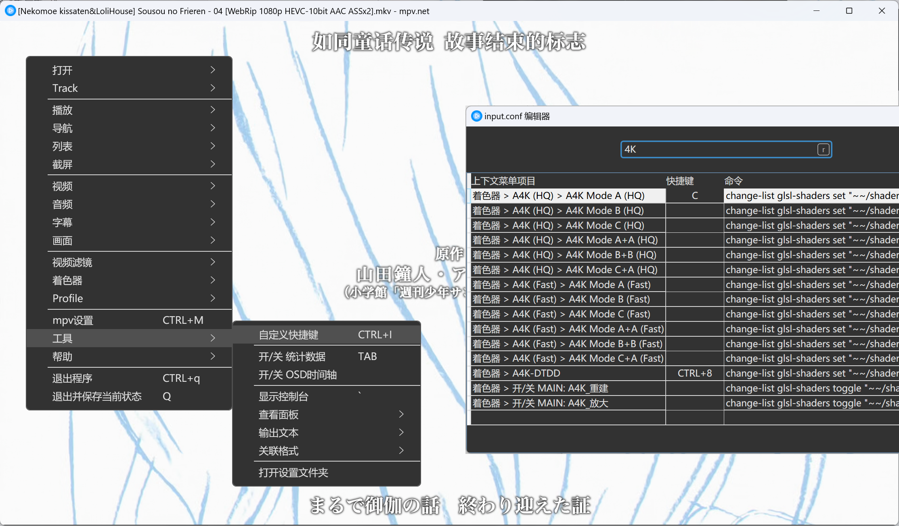

## 概要

使用MPV.net-DW和Reex播放器，与Anime4K算法搭配，在全平台实现视频超分。效果如下图。

​​

这次我们先不聊服务端，而是从播放器入手提升我们观看的幸福度。从感知上来说，无论我们的影片下载、收集、整理等步骤做得多好，如果没有一个好的播放器来呈现它们，我们实际的观看体验并不会好很多。很多朋友在折腾的过程中容易错把手段当做目的，实际上折腾的目标应该是为观看的幸福服务，而不是致力于提高NAS的参数、PT的流量等等。

现在大多数番剧资源都是720P分辨率，新番也往往只有1080P高码，对于4K屏幕或追求画质的人来说实在有些不够，旧番全屏之后更是糊上加糊。因此为了能够以4K分辨率爽看古今动画，接下来介绍一种思路。

## 播放器安装

从系统自带播放器，到优酷、迅雷看看、暴风影音、VLC、potplayer，我在冲浪的路上遇到了许多播放器，每次相遇都有一种“我怎么没早点发现？”的感慨。现在这种感慨又来了。

MPV作为开源项目，拥有众多分支，我们选用的是大佬做好的整合版MPV.net-DW。相比其他播放器，优势在于界面简洁美观、能正确渲染特效字幕、支持AI插帧、AI超分、支持HDR、支持杜比视界（据我所知PotPlayer直到最近才添加对杜比视界的官方支持）等等。接下来我们就看一看如何使用吧。

​​

首先从github的`diana7127/mpv.net-DW`​页面下载大佬打包的安装器，不过由于来自东方的神秘力量，我准备了能直接下载的链接。[下载链接](http://duke486.pub:5244/d/data/mpv.net-DW_v2.0.0_Setup.exe?sign=aH0EvP_-bZlYn3qEacAlcBZ_uomEjXt8m-bZ57-jQAM=:0)

安装完成后来到安装地址，打开播放器，右键画面进行设置。

​​

在mpv设置中，`基础->vo`​选项，如果你是比较新的N卡可以改成`next`​。

​`.NET专属->start-size`​选项，建议改成`session`​，否则切换视频到时候窗口大小跳来跳去。

之后我们找到一个视频文件，右键->打开方式->选择其他应用->在电脑上选择应用->选中刚才播放器文件->点击“始终”就可以用新播放器双击打开视频了。

​​

## 开启超分和插帧

对于不同类型的视频，有不同的优化方法，我大致分为2D、3D、实拍三种来介绍。以下是插帧、超分功能的开启位置，具体选择什么可以自己尝试一下，图中是我推荐的选项。

​​

​​

对于2D动漫来说，推荐开启`A4K HQ`​，不开启插帧。

对于3D视频，推荐同时开启二者，如果原视频本身就比较清晰，应该选择`A4K Fast`​来避免卡顿。

对于实拍视频，只建议开启插帧，`A4K`​会丢失细节。

通过右键设置的效果，在关闭窗口后不会保存，因此建议设置一下快捷键来方便一键开启这些效果。例如“按C开超”，“按V开插”。

​​

## 手机平板超分

MPV官方播放器因为和高版本Android的兼容性问题，很难读到Anime4K配置文件。我们使用界面更美观，更方便的Reex播放器。[播放器下载地址](http://duke486.pub:5244/d/data/Reex%E8%A7%86%E9%A2%91%E6%92%AD%E6%94%BE%E5%99%A8v1.8.4.apk?sign=Vt4K7o6EuqgL1FkeziUYFof4dyui5H_1s8E82vlOl8s=:0)，[Anime4K文件下载地址](http://duke486.pub:5244/d/data/Anime4K_v4.0.zip?sign=omY9KCjBdoMyDZLY2yIllNcMeTS3is5FqBDrorSAhig=:0)。

将Anime4K解压到手机里，例如 `内部存储/shaders`​。然后安装Reex，打开设置->着色器->加号，选择刚才shader文件夹里的所有文件。

​​

这里建议选择`DTD x2`​，速度和效果比较均衡，当然其他的效果可以自己尝试。前，后对比如图。

​​

​​

## 结尾

超分拯救了低码率老番，就像近视患者带上眼镜一样，极大地提高了我们观看的幸福程度。不过这种粗暴加效果的方式可能会破坏压制组精心调教的画面效果，具体怎么选择就见仁见智咯，我个人是倾向于更高的分辨率，因为这是最直观最容易感受到的部分。本人才疏学浅，如果有不足之处欢迎留言！

‍
