:::warning
2024年6月起，由于一些原因，Docker镜像服务器的连通性存在问题，请确认您的网络质量。
:::

> “互联网上的东西都不是你的，只有存在硬盘的东西才属于自己。”

我在上网时偶然看的这么一句评论，对此深感赞同。多少音乐，小说，影视作品在网上能看的时候我没有珍惜，等到多年后某一天突然回想起来，却翻遍全网也找不到下载的地址了......

所以，为了让更多人能便捷的管理自己的“收藏品”，更好地体验欣赏作品的乐趣，我决定开一系列入门文章来分享一下自己的经验。

如果你在寻找一个在线看动画、漫画、小说的网站或 APP，那么本系列文章并不适合你。

## 效果图
在系列文章中私人影视库采用 Jellfin，可存放电视剧、电影、番剧、音乐。支持自动补全海报、封面、简介、演员照片等元数据。
​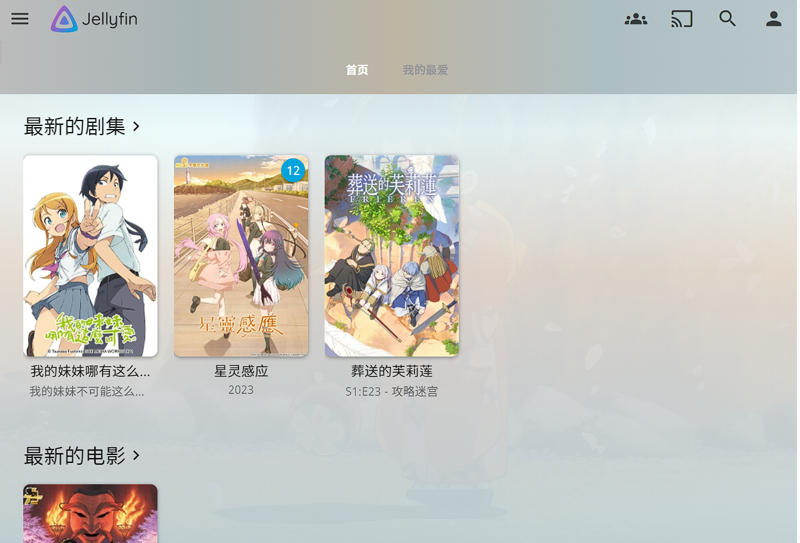​
​​
漫画库则采用 Komga，支持在线管理和阅读。虽说 tachidesk 可能功能更丰富些，不过鉴于最近的删库风波，不知道它的插件日后的可用性有没有保障遂放弃。
​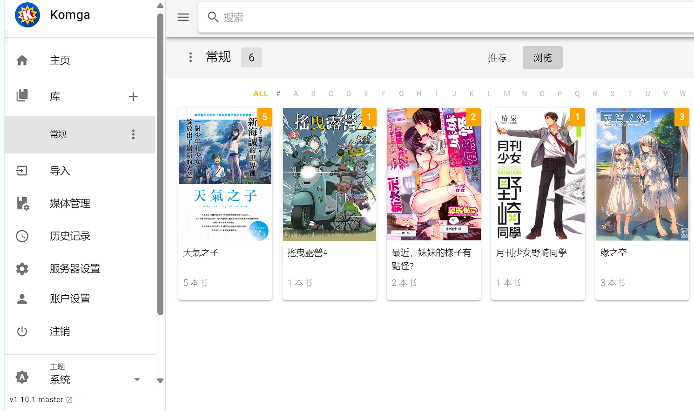
​​

最后是文件库，也可以叫云盘，采用大名鼎鼎的 Alist。优势就在于配置和使用起来都异常简单，还可以接入国内网盘，接入离线下载，支持常见格式在线预览（妈妈再也不用担心我熬夜下种子了）

​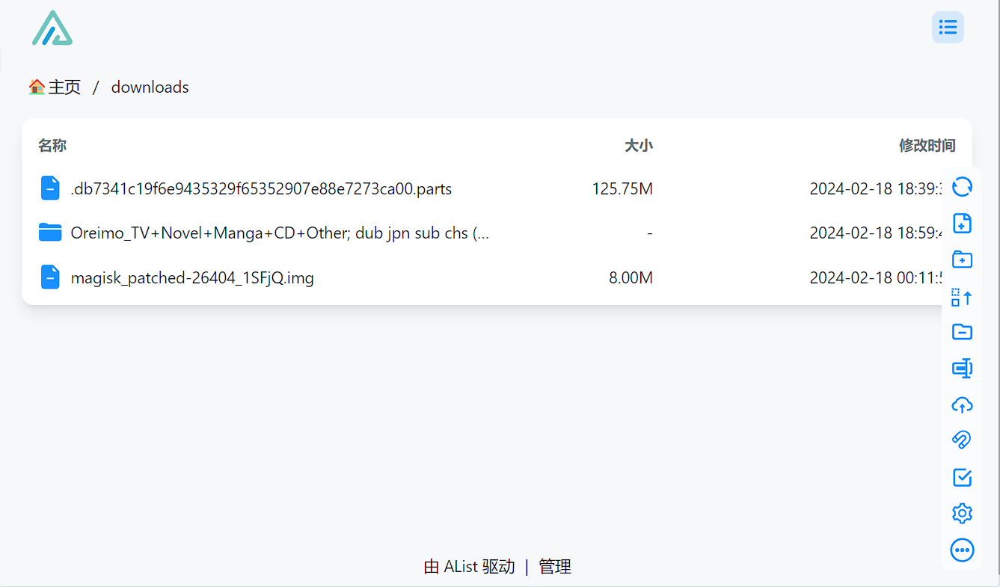​

## 先决条件

* 一台充当服务器的主机（可以是电脑，NAS，云服务器等等。但是考虑到随时访问的需求，最好是后两者）
* 主机是 x86 架构，内存 2G+
* 如果打算随时访问的话，需要公网 IP 或者购买内网穿透

目前先介绍如何搭建并在内网访问，外网访问后续单开文章说明。

## 准备主机

如果你使用 windows 电脑，需要在应用商店下载一个 ubuntu 作为运行环境。后面的教程以 Ubuntu 环境为基础。

​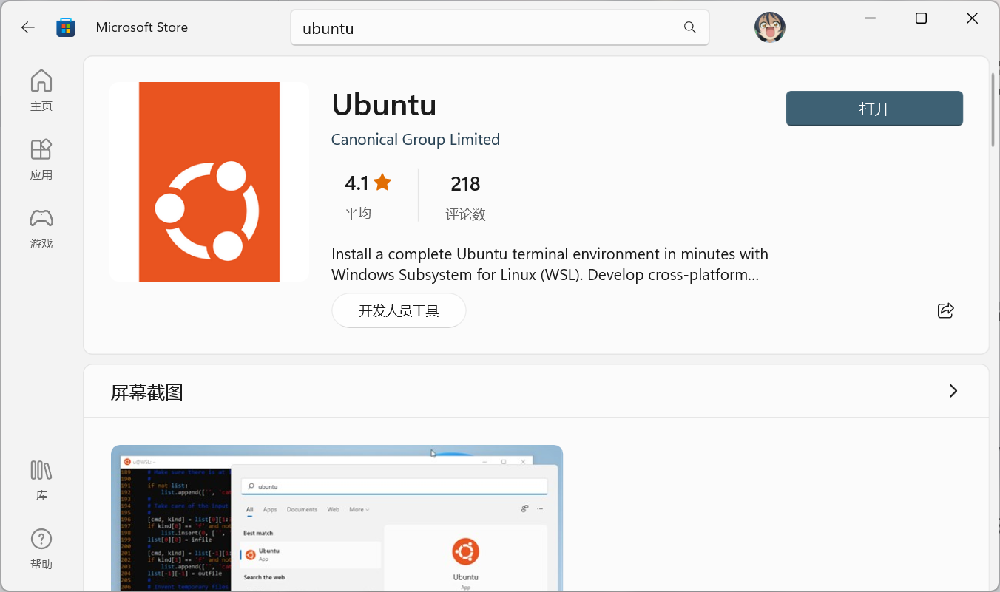​

如果你使用其他设备或者云服务器，请确保操作系统是 Ubuntu 或类似发行版。

如果你使用群晖，想安装应用只需要在网上搜索 `应用名+DockerCompose` ​就能找到方法。

在这里我是用的是一台赛扬 J1900 处理器的小主机，功耗很低，可以一直开着当服务器用。海鲜市场大概 150 就可以入一个。

​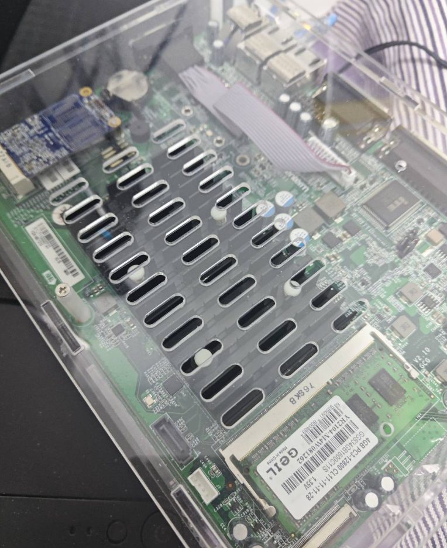​

‍

## 安装面板

在 Ubuntu 环境下我们面对的是一个黑底白字的终端。但是作为入门教程我们不需要捣鼓这个玩意，我们使用下图的 1Panel 面板提供的界面来操作，难度直线下降。

​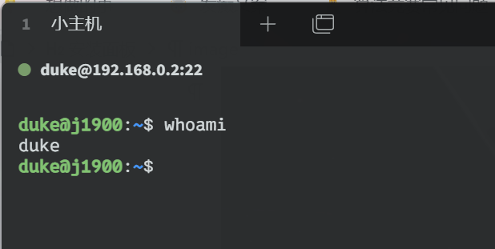​

​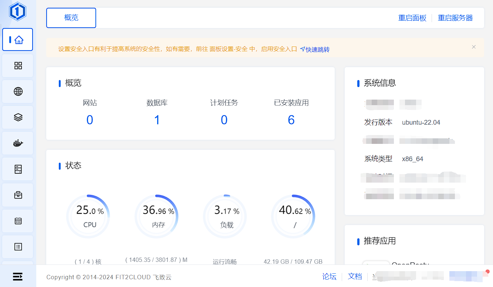​

如果你在 Microsoft store 安装 Ubuntu，那么直接打开就能看见终端。
如果你是其他情况，请打开你家路由器的设备管理页，看看你的机器对应的 IP 是什么。然后通过打开网上搜到的任何一款“SSH”软件，输入 IP 和主机账号密码即可看到终端。

我们使用 1Panel 官方提供的一键安装命令来安装面板

​`curl -sSL https://resource.fit2cloud.com/1panel/package/quick_start.sh -o quick_start.sh && sudo bash quick_start.sh`​

输入命令后直接一路回车，碰见设密码的地方设置一下即可安装成功。安装成功后终端里会显示你的访问地址和账号密码，请务必牢记。我们的安装工作现在大功告成了，可以扔掉这个终端了。

​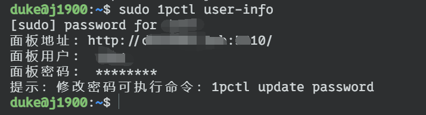​

## 安装第一个服务

打开浏览器，输入终端给我们的链接，然后输入面板的账号密码就可以进入易于使用管理页面了。

如果突然访问不了了，可能是 IP 变动导致的，这个问题以后细说解决方案，现阶段可以通过在终端输入 `sudo 1pctl user-info` ​来获得一个新地址。​

我们直接来到面板左侧的应用商店按钮，搜索 Alist 来一键安装我们的第一个应用：网盘服务。安装的时候有很多选项我们全都不用看，建议勾选“外部端口访问”。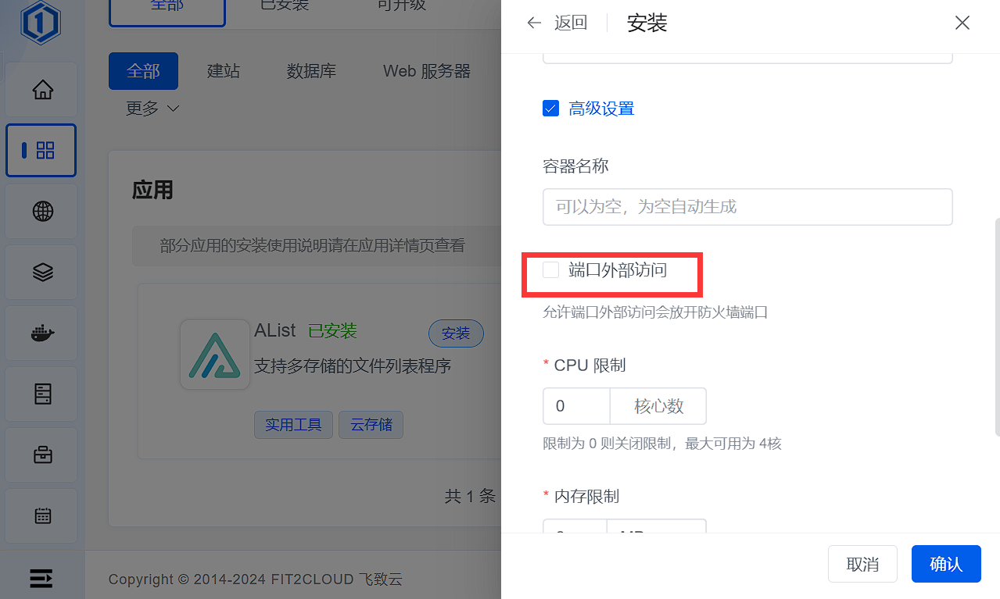​

接下来切换到已安装的应用，安装一旦完成就会出现一个入口。

​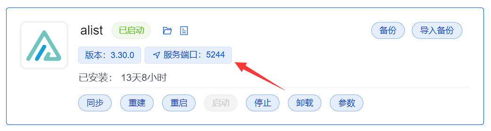​

点击服务端口，会要求设置地址，只需要填入我们机器所在的 IP 即可，以后都不会再弹出了。

​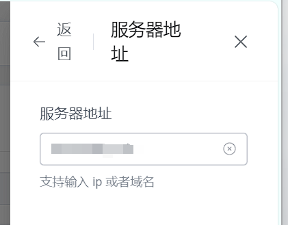​

填写完后再点一下刚才的入口就能进入应用。初始密码位于应用商店 ＞ 已安装 ＞alist＞ 日志中，点击一下日志按钮，找到 `Successfully created the admin user and the initial password is:XXXXXXX` ​这里的 XX 就是你的默认密码，默认用户名是 admin。

随后通过快捷入口进入 Alist 并登录。我们跟随 Alist 的指引设置一下自己的密码就大功告成了。

​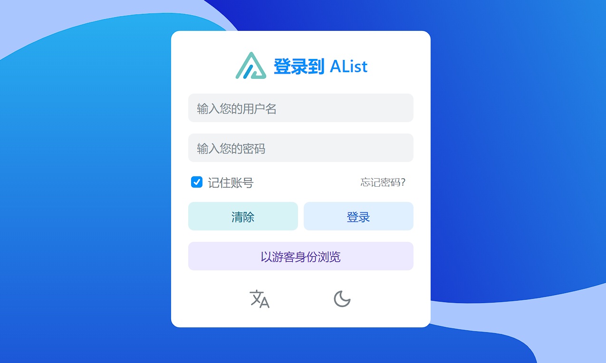​

## 无限可能

至此，我们已经打通了一键安装服务的道路，从此以后再继续添加影视库、漫画库、博客、网站等等各种服务不过是分分钟的事情。1Panel 面板本质上是代替我们操作主机上的 Docker 容器来实现运行程序，Docker 容器由于他本身的特性，玩法和可拓展性都极高。

​​

‍
