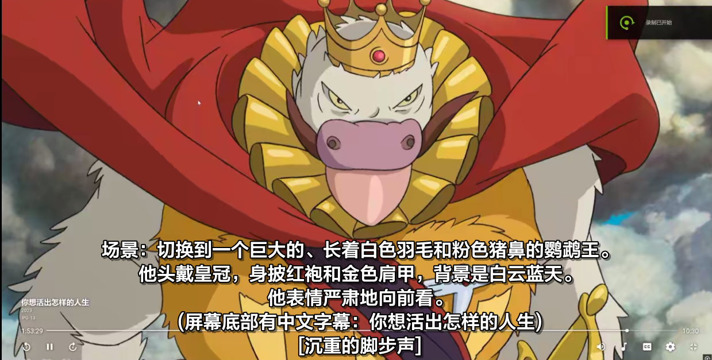

谷歌Gemini音视频实测！以后再也不需要字幕组了？

## Gemini 2.5 Pro 是啥

谷歌在前几天（25年3月25号）发布了 Gemini 2.5 Pro 模型，综合排名世界第一，号称有**百万上下文**，后期将会开放 200 万上下文。最大输出长度约为 6 万 token。  
刚发布时我就快速体验了一下代码和散文写作能力，毫无疑问就我个人体验而言，Gemini 2.5 Pro 是目前效果最强的。尤其是文章写作，剧情连贯，措辞合理，不像 DeepSeek R1、Claude 3.7 Thinking 等思考模型，会自我意识过剩导致文章中意象和辞藻堆砌。  
**不过本文的重点不在此**。今天我看到了网络上有人用 2.5Pro 处理一段多语言视频的效果展示，于是便想要测试一下 Gemini 对音视频的理解能力如何、能处理多长的音视频。谷歌在 AI Studio 网站给所有人提供免费使用，我立刻开始了测试。结果令我震撼，尤其是测试 4：动漫加字幕！

## 测试内容

测试主要关注这几个方面：音频内容识别、音视频时间轴、视频内容理解、音视频上下文连贯性理解、音效音乐等元素识别。  
**太长不看，结论**：除了中文歌和刁钻题材（专有词地狱的动画、发音人类都很难听懂的视频）之外，Gemini 无敌了，可以完美给视频加字幕！  
我准备了**下面几个任务**，依次来看看结果吧。以下素材在喂给 AI 之前均已经裁掉字幕，提供给 AI 信息的只有字幕要求以及来源作品名称，也就是说角色名字和额外剧情信息均为 Gemini 依靠知识库脑补的！

1. 《你想活出怎样的人生》插曲视频片段——要求输出画面内容、剧情、中文字幕、日文字幕、音效描述
2. 《你的名字》英文版片头曲视频——要求输出画面内容、英文字幕、中文字幕、音效描述
3. 初音未来《Miku》短视频——要求输出画面内容、中日歌词
4. 大的来了，《New Game》第一集全部音频👍——要求输出中日字幕、音效、根据声线与上下文推断说话人名字、OP/ED 中日歌词
5. 中日英歌曲各一首，吐字较为清晰，《Hello World 》- Kizuna AI，《真昼の空の月》- アビドス高等学校対策委員会，《漂亮面对》- 洛天依; 阿良良木健——要求输出双语滚动歌词、每句话的歌唱感情

## 测试结果

所有结果我都人工检查过通篇，有错误会指出。如果没指出则代表**通篇都正确**。  
所有的时间轴均精确到 0.01 秒，可以和视频**完美对应**，下文不再提及时间轴。

### 1《你想活出怎样的人生》

结论：完美完成任务。无任何错误。

画面内容识别↑  

​​  
​  

↑知识库丰富度、剧情上下文识别。可以正确认识角色，可以识别安慰剧情。

​  

↑音效和音乐识别  

​  

↑嘈杂环境中的语音识别

### 2 《你的名字》英文版片头

英语歌词部分出现个位数识别错误，为同音词或短语连读出错，基本没有影响汉语意思。其他方面完美完成任务，甚至可以根据电影剧情补充信息，例如“口嚼酒”、“东京街道”等。  
​  
​  
↑画面识别，音效识别  
​  
​  
​  
↑根据电影剧情补充画面描述信息，例如组纽、系守、口嚼酒

### 3 《Miku》短视频

视频镜头快速切换的时候，字幕中漏掉了一两个分镜。歌词与音乐节奏识别完美。  
​  
​  
​

### 4 《New Game》第一集👍

**本测试只提供了音频和作品名称给 AI。**
极个别台词没分清说话人是谁，不过这个要求对于只听音频来说有点难了。  
角色尖叫的时候，有概率识别不出在叫什么（有时候成功，有时候只显示尖叫）。  
其他地方完美。  
​  
↑语音识别与角色名推断，即使是初次登场也可以自动推断发言角色名。  
​  
​  
↑片假名专有名词自动补充英文、或者直接使用剧中原文（我没要求它）  
​  
​  
​  
↑日语、英语混合 OPED 识别，非常准确。甚至能在角色发言的时候，同时识别台词和歌词（图 3）  
​  
↑**最逆天的**，角色默念的所有短信全都标注了【message】，有的短信甚至没有上下文可供推测，我怀疑它能识别角色内心独白时候的回音效果。

### 5 中日英三首歌

时间轴全对。日文错了两个单词，英文全对，中文错了接近一半。这里直接放结果图。  
日文，只有开头错了两个词。  
​  
英文，全对。  
​  
中文，错一半，不标注了。  
​

## 能处理多长的视频

我没有测试极限长度。但是可以根据 token 使用量大致推算，我在上传视频时，为了方便 AI 处理，将视频码率压缩到了 2Mbps，一分钟视频大约占用 4-6 万 token。24 分钟音频占用 5 万 token。

处理一集动漫长度的视频大约需要 2 万 token。由此可见，输入长度并非瓶颈，真正的瓶颈在于输出长度。如果以动漫视频的 token 消耗量计算，一次性最长可以处理 60-80 分钟的音频。如果是网课视频，处理时长可能会更短。

不过总的来说，目前来看还是非常够用的，毕竟在现阶段，我们不太可能上传整部电影。Gemini 这一举措无疑为 AI 应用开辟了更广阔的道路！

## 结论

看来 AI 的进化超出了我的想象。我还停留在用一堆工作流+人工辅助打轴的认知呢，现在看，AI 来为日常番、外语网课加字幕，已经可以做到无敌了。甚至可以为视力障碍者直接描述剧情和画面。一切都发生得太快了。
