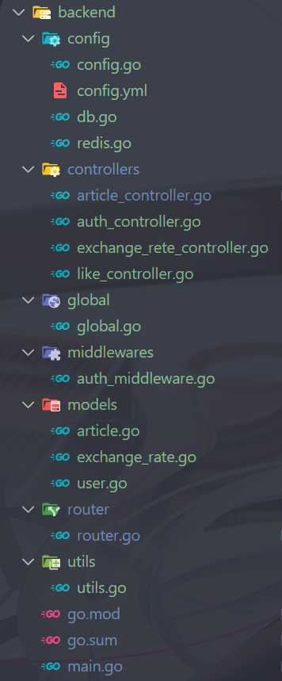

## Go Gin Gorm

### 精炼笔记：Go + Gin + Gorm 项目

这个教程内容涵盖了Go + Gin + Gorm + MySQL + Redis 的技术栈。下面是我学习后的精华笔记，按模块叙述了每个重要的知识点和代码实现。

[课程视频：InkkaPlum频道](https://www.bilibili.com/video/BV1BY4UefEkM)

[配套资料：Github](https://github.com/Slumhee/Web003Gin-01_gingormtutorials)

[Gin官方文档（模板）](https://gin-gonic.com/zh-cn/docs/examples/param-in-path/)

[GORM官方文档](https://gorm.io/zh_CN/docs/query.html)

---

### 1. 项目结构设计

#### 1.1 项目目录结构

​

首先，在main.go开始运行时，config包负责读取程序的配置文件，并按照配置连接数据库，将数据库实例保存到global包的变量中方便调用。

之后，调用router包进行路由初始化设置，初始化函数返回一个`r *gin.Engine`​。main.go将在goroutine中使用`r`​来非阻塞式地启动服务，监听配置文件中指定的端口。

当接收到请求的时候，http包的上下文数据会按照路由规则交给不同的controllers和中间件处理。utils中定义了程序常用的工具、方法，models中定义了文章、用户等数据的结构、数据库的表结构。

服务运行时，main将会被channel阻塞。当程序接收到的系统的停止信号时，将会开始进行优雅关闭，停止接受连接并释放资源。

#### 1.2 资源和API设计

这套教程的目标是开发一个能够实现汇率查询、文章获取、点赞、用户注册、登录功能的，使用mySQL和Redis数据库的go后端项目。因此应该基于这个最终目标来设计各种API。

RESTful API：一种设计风格

* **RESTful API**：基于资源设计路径，使用 HTTP 方法定义操作。REST（Representational State Transfer，表述性状态转移）本身不是一种技术，而是一组设计约束。遵循这些约束设计的 API 就被称为 RESTful API。

  在同一个路径上，可以通过不同的HTTP方法和参数来区分不同的功能，例如：

  * ​`GET /api/articles`​ 获取所有文章
  * ​`POST /api/articles`​ 创建新文章
  * ​`GET /api/articles/:id`​ 获取单篇文章
  * ​`POST /api/articles/:id/like`​ 为文章点赞
* **请求路径设计如下**：

  * ​`/api/v1/articles`​：文章相关资源
  * ​`/api/v1/auth/login`​：登录接口
  * ​`/api/v1/auth/register`​：注册接口

#### 1.3 使用HTTP状态码向客户端反馈

* ​`200 OK`​：请求成功
* ​`201 Created`​：成功创建资源
* ​`400 Bad Request`​：请求无效，通常由参数错误引起
* ​`401 Unauthorized`​：未授权的请求
* ​`404 Not Found`​：请求的资源不存在
* ​`500 Internal Server Error`​：服务器错误

---

### 2. Gin框架

#### 2.1 简单配置和初始化

Gin框架是Go语言中高效的Web框架，用于处理HTTP请求和响应。这是一个最小的gin服务，监听8080端口`/ping`​路径的GET请求，并返回json。

```go
package main

import "github.com/gin-gonic/gin"

func main() {
    r := gin.Default()
    r.GET("/ping", func(c *gin.Context) {
        c.JSON(200, gin.H{"message": "pong"})
    })
    r.Run(":8080")
}
```

* ​`gin.Default()`​ 创建带有日志和恢复中间件的默认引擎。
* ​`c.JSON()`​ 用于返回JSON格式的响应。

#### 2.2 路由与分组

```go
r := gin.Default()

// 路由分组
auth := r.Group("/api/auth")
{
    auth.POST("/login", controllers.Login)
    auth.POST("/register", controllers.Register)

}

api := r.Group("/api")
api.GET("/exchangeRates", controllers.GetExchangeRates)
api.Use(middlewares.AuthMiddleWare())
{
    //此处的api都将受到用户认证中间件的保护，登录用户才能使用
    api.POST("/exchangeRates", controllers.CreateExchangeRate)
    api.POST("/articles", controllers.CreateArticle)
    api.GET("/articles", controllers.GetArticles)
    api.GET("/articles/:id", controllers.GetArticlesByID)
    api.POST("/articles/:id/like", controllers.LikeArticle)
    api.GET("/articles/:id/like", controllers.GetArticleLikes)
}
)
    

```

* 使用`Group`​可以对相似的路由进行分组，有助于管理和维护。
* 会路由指向不同路径的请求，并将请求上下文交给handler函数处理

#### 2.3 中间件

```go
func AuthMiddleWare() gin.HandlerFunc {
    return func(ctx *gin.Context) {
        token := ctx.GetHeader("Authorization")
        //获取请求头中的token
        if token == "" {
        //无token，结束处理
            ctx.JSON(http.StatusUnauthorized, gin.H{"error": "Token is missing"})
            ctx.Abort()
            return
        }

        username, err := utils.ParseJWT(token)

        if err != nil {
            ctx.JSON(http.StatusUnauthorized, gin.H{"error": "Invalid token"})
            ctx.Abort()
            return
        }
        ctx.Set("username", username)
        //解析成功，获得用户名，进行下一步操作
        ctx.Next()
    }
}
```

* 自定义中间件，用于记录请求时间、验证用户身份或执行其他操作。

#### 2.4 请求绑定

```go
type Login struct {
    Username string `json:"username" binding:"required"`
    Password string `json:"password" binding:"required"`
}

func LoginHandler(c *gin.Context) {
    var login Login
    if err := c.ShouldBindJSON(&login); err != nil {
        c.JSON(400, gin.H{"error": err.Error()})
        return
    }
    c.JSON(200, gin.H{"message": "Login successful"})
}
```

* ​`ShouldBindJSON()`​ 绑定JSON数据到结构体，并进行验证。

---

### 3. Gorm ORM

#### 3.1 配置与数据库连接

Gorm是Go中常用的ORM库，用于简化与数据库的交互。

```go
func initDB() {

    db, err := gorm.Open(mysql.Open(AppConfig.Database.Dsn), &gorm.Config{})

    if err != nil {
        log.Fatalf("failed to connect database: %v", err)
    }

    sqlDB, err := db.DB()
    //设置连接的限制
    sqlDB.SetMaxIdleConns(AppConfig.Database.MaxIdleConns)
    sqlDB.SetMaxOpenConns(AppConfig.Database.MaxOpenConns)
    sqlDB.SetConnMaxLifetime(time.Hour)

    if err != nil {
        log.Fatalf("failed to config database: %v", err)
    }
    // 添加这段代码，在应用启动时迁移所有模型
    if err := db.AutoMigrate(&models.User{}, &models.ExchangeRate{}); err != nil {
        log.Fatalf("failed to auto migrate: %v", err)
    }
    //存入global方便使用
    global.Db = db
}
```

* ​`mysql.Open(dsn)`​：连接数据库
* ​`gorm.Config{}`​：提供数据库连接的配置。

#### 3.2 模型定义

```go
package models

import "gorm.io/gorm"

type User struct {
    gorm.Model
    Username string `gorm:"unique"`
    Password string
}

```

* ​`gorm:"primaryKey"`​：定义主键字段。
* ​`gorm:"uniqueIndex"`​：确保字段唯一。
* gorm.models是自带的，包含了：

  > ```go
  > type Model struct { // size=88 (0x58)
  >     ID        uint `gorm:"primarykey"`
  >     CreatedAt time.Time
  >     UpdatedAt time.Time
  >     DeletedAt DeletedAt `gorm:"index"`
  > }
  > ```
  >

#### 3.3 数据库操作

```go
// 创建用户
db.Create(&User{Username: "john", Password: "12345"})

// 查询用户
var user User
db.Where("username = ?", "john").First(&user)

// 更新用户
db.Model(&user).Update("Password", "newpassword")

// 删除用户
db.Delete(&user)
```

#### 3.4 自动迁移

​`AutoMigrate`​方法可以自动同步数据库表结构。

```go
db.AutoMigrate(&models.User{})
```

#### 3.5 数据库连接池配置

```go
sqlDB, err := db.DB()
if err != nil {
    log.Fatal(err)
}
sqlDB.SetMaxIdleConns(10) // 设置最大空闲连接数
sqlDB.SetMaxOpenConns(100) // 设置最大连接数
sqlDB.SetConnMaxLifetime(time.Hour) // 设置最大连接生命周期
```

---

### 4. 配置与初始化

#### 4.1 配置文件（YAML）

为了方便修改程序的配置，避免把数据库地址、密码等信息写死在代码中，可以使用yaml来存储配置信息。

```yaml
# config/config.yml
app:
  name: CurrencyExchangeApp
  port: ":3000"

database:
  host: "localhost"
  port: "3306"
  user: "root"
  password: "password"
  name: "currency_exchange_db"
```

#### 4.2 配置加载

```go
func InitConfig() {
    viper.SetConfigName("config")
    viper.SetConfigType("yml")
    viper.AddConfigPath("./config")

    if err := viper.ReadInConfig(); err != nil {
        log.Fatalf("读配置文件失败: %v", err)
    }

    AppConfig = &Config{}

    if err := viper.Unmarshal(AppConfig); err != nil {
        log.Fatalf("解析配置文件失败: %v", err)
    }

    initDB()
    initRedis()
}
```

* 使用`viper`​加载YAML配置文件。

#### 4.3 配置结构体

```go
type Config struct {
    App struct {
        Name string
        Port string
    }
    Database struct {
        Dsn          string
        MaxIdleConns int
        MaxOpenConns int
    }
}
```

* ​`viper.Unmarshal`​将配置映射到结构体。

---

### 5. 身份验证与JWT

#### 5.1 JWT生成与验证

JWT（JSON Web Token）用于实现用户身份验证。

```go
func GenerateJWT(username string) (string, error) {
    token := jwt.NewWithClaims(jwt.SigningMethodHS256, jwt.MapClaims{
        "username": username,
        "exp":      time.Now().Add(time.Hour * 24).Unix(),
    })
    //使用密钥签名
    SignedToken, err := token.SignedString([]byte("secret"))
    return "Bearer " + SignedToken, err
}
```

* ​`jwt.NewWithClaims()`​：根据指定的签名方法和声明生成JWT。

对应的，可以使用相反的流程来解析JWT：

```go
func ParseJWT(tokenString string) (string, error) {
    // 移除 "Bearer " 前缀
    if len(tokenString) > 7 && tokenString[:7] == "Bearer " {
        tokenString = tokenString[7:]
    }

    // 解析 JWT token
    token, err := jwt.Parse(tokenString, func(token *jwt.Token) (interface{}, error) {
        // 检查 signing 方法
        if _, ok := token.Method.(*jwt.SigningMethodHMAC); !ok {
            return nil, errors.New("unexpected signing method") // signing 方法错误
        }
        return []byte("secret"), nil // 秘钥
    })

    if err != nil {
        return "", err // 解析失败
    }

    // 验证 token 并提取 claims
    if claims, ok := token.Claims.(jwt.MapClaims); ok && token.Valid {
        username, ok := claims["username"].(string)
        if !ok {
            return "", errors.New("Username not found in token") // username 不存在
        }
        return username, nil // 成功返回 username
    }

    return "", errors.New("Invalid token") // 无效 token
}

```

---

### 6. 用户注册与登录

#### 6.1 用户注册

​`auth_controller.go`​：

```go
func Register(ctx *gin.Context) {
    var user models.User
    //请求json绑定到结构体
    if err := ctx.ShouldBindJSON(&user); err != nil {
        ctx.JSON(http.StatusBadRequest, gin.H{
            "error": err.Error(),
        })
        return
    }
    //两次调用utils中的函数
    hashedPwd, err := utils.HashPassword(user.Password)

    if err != nil {
        ctx.JSON(http.StatusInternalServerError, gin.H{
            "error": err.Error(),
        })
    }
    user.Password = hashedPwd

    token, err := utils.GenerateJWT(user.Username)

    if err != nil {
        ctx.JSON(http.StatusInternalServerError, gin.H{
            "error": err.Error(),
        })
        return
    }
    //尝试在数据库中创建用户
    if err := global.Db.Create(&user).Error; err != nil {
        ctx.JSON(http.StatusInternalServerError, gin.H{
            "error": err.Error(),
        })
        return
    }
    //没有出错，返回新用户的token
    ctx.JSON(http.StatusOK, gin.H{
        "token": token,
    })
}
```

* 用户密码加密存储，生成JWT并返回。

#### 6.2 用户登录

```go
func Login(ctx *gin.Context) {
    // 定义输入结构体
    var input struct {
        Username string `json:"username"`
        Password string `json:"password"`
    }

    // 绑定JSON数据到结构体
    if err := ctx.ShouldBindJSON(&input); err != nil {
        ctx.JSON(http.StatusBadRequest, gin.H{"error": err.Error()})
        return
    }

    var user models.User

    // 根据用户名查询用户
    if err := global.Db.Where("username = ?", input.Username).First(&user).Error; err != nil {
        ctx.JSON(http.StatusUnauthorized, gin.H{"error": "invalid username or password"})
        return
    }

    // 验证密码
    if !utils.CheckPassword(input.Password, user.Password) {
        ctx.JSON(http.StatusUnauthorized, gin.H{"error": "invalid username or password"})
        return
    }

    // 生成JWT token
    token, err := utils.GenerateJWT(user.Username)
    if err != nil {
        ctx.JSON(http.StatusInternalServerError, gin.H{"error": err.Error()})
        return
    }

    // 返回token
    ctx.JSON(http.StatusOK, gin.H{"token": token})
}

```

---

### 7. 点赞缓存

#### 7.1 Redis缓存（文章点赞）

初始化Redis：

```go
func initRedis() {
    redisClient := redis.NewClient(&redis.Options{
        Addr:     "localhost:6379",
        DB:       0,
        Password: "",
    })

    _, err := redisClient.Ping().Result()
    if err != nil {
        log.Fatalf("Failed to connect redis: %v", err)
    }

    global.RedisDB = redisClient
}
```

* 使用Go-Redis库与Redis服务器交互。

#### 7.2 文章点赞

```go
func LikeArticle(ctx *gin.Context) {
    articleID := ctx.Param("id")
    //组装出键
    likeKey := "article:" + articleID + ":likes"
    if err := global.RedisDB.Incr(likeKey).Err(); err != nil {
        ctx.JSON(http.StatusInternalServerError, gin.H{
            "error": err.Error(),
        })
        return
    }

    ctx.JSON(http.StatusOK, gin.H{
        "message": "点赞成功",
    })
}
```

* 使用`Incr`​命令递增文章的点赞数。

#### 7.3 获取点赞

```go
func GetArticleLikes(ctx *gin.Context) {
    articleID := ctx.Param("id")
    fmt.Print(articleID)
    likeKey := "article:" + articleID + ":likes"

    likes, err := global.RedisDB.Get(likeKey).Result()
    if err == redis.Nil {
        likes = "0"//没有数据则创建一个0值
    } else if err != nil {
        ctx.JSON(http.StatusInternalServerError, gin.H{
            "error": err.Error(),
        })
    }

    ctx.JSON(http.StatusOK, gin.H{
        "likes": likes,
    })
}
```

### 8. 文章与缓存

#### 8.1 创建文章并更新缓存

在创建文章的同时，删除Articles缓存，避免用户获取到旧的文章列表。

```go
func CreateArticle(ctx *gin.Context) {
    // 绑定JSON请求体到文章结构
    var article models.Article
    if err := ctx.ShouldBindJSON(&article); err != nil {
        ctx.JSON(http.StatusBadRequest, gin.H{
            "error": err.Error(),
        })
        return
    }

    // 自动迁移表结构
    if err := global.Db.AutoMigrate(&article); err != nil {
        ctx.JSON(http.StatusInternalServerError, gin.H{
            "error": err.Error(),
        })
        return
    }

    // 创建文章记录
    if err := global.Db.Create(&article).Error; err != nil {
        ctx.JSON(http.StatusInternalServerError, gin.H{
            "error": err.Error(),
        })
        return
    }

    // 删除缓存以保证数据一致性
    if err := global.RedisDB.Del(cacheKey).Err(); err != nil {
        ctx.JSON(http.StatusInternalServerError, gin.H{
            "error": err.Error(),
        })
        return
    }

    // 返回创建的文章
    ctx.JSON(http.StatusCreated, article)

}
```

#### 8.2 获取全部文章

优先从缓存中获取，如果获取不到再从数据库查询，并写入缓存。

```go
func GetArticles(ctx *gin.Context) {
    // 尝试从Redis获取缓存数据
    cachedData, err := global.RedisDB.Get(cacheKey).Result()

    if err == redis.Nil {
        // 缓存不存在，从数据库查询
        var articles []models.Article

        if err := global.Db.Find(&articles).Error; err != nil {
            ctx.JSON(http.StatusInternalServerError, gin.H{
                "error": err.Error(),
            })
            return
        }

        // 序列化文章数据
        articleJSON, err := json.Marshal(articles)
        if err != nil {
            ctx.JSON(http.StatusInternalServerError, gin.H{
                "error": err.Error(),
            })
            return
        }

        // 设置Redis缓存，有效期10分钟
        if err := global.RedisDB.Set(cacheKey, articleJSON, 10*time.Minute).Err(); err != nil {
            ctx.JSON(http.StatusInternalServerError, gin.H{
                "error": err.Error(),
            })
            return
        }
        ctx.JSON(http.StatusOK, articles)
    } else if err != nil {
        // Redis操作出错
        ctx.JSON(http.StatusInternalServerError, gin.H{
            "error": err.Error(),
        })
        return

    } else {
        // 使用缓存的数据
        var articles []models.Article
        if err := json.Unmarshal([]byte(cachedData), &articles); err != nil {
            ctx.JSON(http.StatusInternalServerError, gin.H{
                "error": err.Error(),
            })
            return
        }
        ctx.JSON(http.StatusOK, articles)
    }

}
```

### 总结

此项目结合了Gin框架和Gorm ORM，使用JWT进行用户身份验证，通过Redis缓存实现点赞功能，且配置通过Viper加载。项目结构简洁而清晰，代码通过分层结构便于维护，包含了基本的CRUD操作和API设计。

‍
