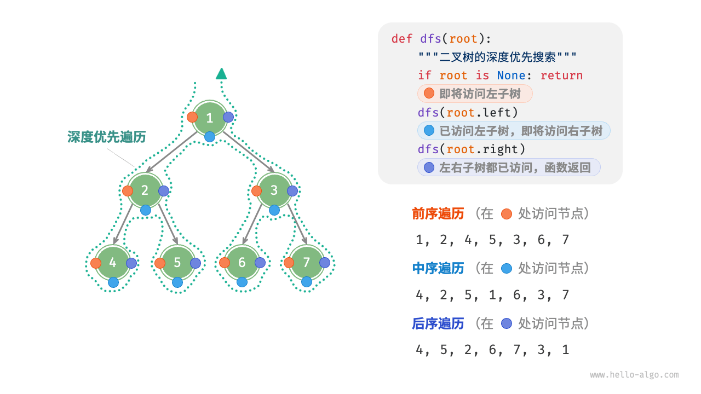
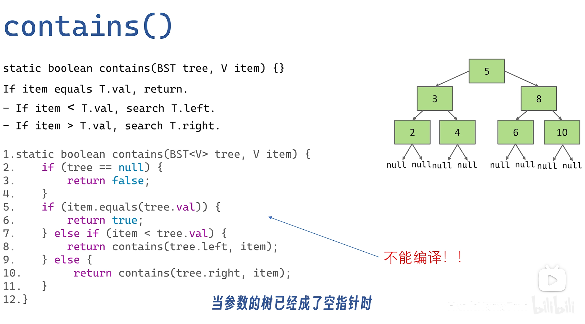
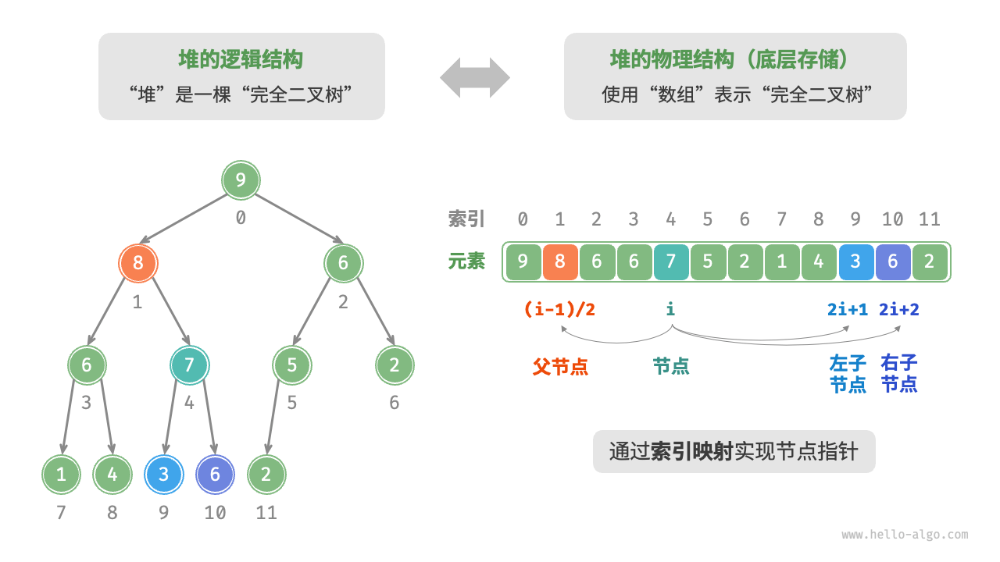

:::note
参考文档见于文末
:::
在学习数据结构的过程中遇到了一些常用的STL操作和算法知识点，下面是整理后的结果。

## 数组

数组支持随机访问、占用内存较少；但插入和删除元素效率低，且初始化后长度不可变特点。

### 基本操作

```cpp
/* 初始化数组 */
// 存储在栈上
int arr[5];
int nums[5] = { 1, 3, 2, 5, 4 };
// 存储在堆上（需要手动释放空间）
int* arr1 = new int[5];
int* nums1 = new int[5] { 1, 3, 2, 5, 4 };
```

### 增删改

```cpp
/* 索引 index 处插入 num */
void insert(int *nums, int size, int num, int index) {
    // 把索引 index 以及之后的所有元素向后移动一位
    for (int i = size - 1; i > index; i--) {
        nums[i] = nums[i - 1];
    }
    // 将 num 赋给 index 处的元素
    nums[index] = num;
}

/* 删除 index 处 */
for (int i = index; i < size - 1; i++) {
    nums[i] = nums[i + 1];
}
```

### 扩容

创建->复制->释放

## 链表

链表通过更改引用（指针）实现高效的节点插入与删除，且可以灵活调整长度；但节点访问效率低、占用内存较多。常见的链表类型包括单向链表、环形链表、双向链表。

### 数组与链表的效率

||数组|链表|
| ----------| --------------------------------| ----------------|
|存储方式|连续内存空间|分散内存空间|
|容量扩展|长度不可变|可灵活扩展|
|内存效率|元素占用内存少、但可能浪费空间|元素占用内存多|
|访问元素|𝑂(1)|𝑂(𝑛)|
|添加元素|𝑂(𝑛)|𝑂(1)|
|删除元素|𝑂(𝑛)|𝑂(1)|

### 增删改

```cpp
/* 节点 n0 之后插入节点 P */
void insert(ListNode *n0, ListNode *P) {
    ListNode *n1 = n0->next;
    P->next = n1;
    n0->next = P;
}

/* 删除 n0 之后的首个节点 */
void remove(ListNode *n0) {
    if (n0->next == nullptr)
        return;
    // n0 -> P -> n1
    ListNode *P = n0->next;
    ListNode *n1 = P->next;
    n0->next = n1;
    // 释放内存
    delete P;
}
```

## Vector列表

列表（list）是一个抽象概念，它表示元素的有序集合，支持元素访问、修改、添加、删除和遍历等操作。列表可以基于链表或数组实现。

### 常用操作

```cpp
//初始化
vector<int> nums1;
vector<int> nums = { 1, 3, 2, 5, 4 };

//末尾插入删除
nums.push_back(元素)；
nums.pop_back()；//动态数组为空时pop会出错

//中间插入删除
nums.insert(nums.begin() + 3, 6);  // 在索引 3 处插入 6
nums.erase(nums.begin() + 3);      // 删除索引 3 处

// 将列表 nums1 拼接到 nums 之后
nums.insert(nums.end(), nums1.begin(), nums1.end());

//长度
nums.size();

//排序
sort(nums.begin(), nums.end());

//清空释放内存
vector<类型>().swap(名字);
```

一个列表类示例

```cpp

class MyList {
  private:
    int *arr;             // 数组（存储列表元素）
    int arrCapacity = 10; // 列表容量
    int arrSize = 0;      // 列表长度（当前元素数量）
    int extendRatio = 2;   // 每次列表扩容的倍数

  public:
    /* 构造方法 */
    MyList() {
        arr = new int[arrCapacity];
    }

    /* 析构方法 */
    ~MyList() {
        delete[] arr;
    }

    /* 获取列表长度（当前元素数量）*/
    int size() {
        return arrSize;
    }

    /* 获取列表容量 */
    int capacity() {
        return arrCapacity;
    }

    /* 访问元素 */
    int get(int index) {
        // 索引如果越界，则抛出异常，下同
        if (index < 0 || index >= size())
            throw out_of_range("索引越界");
        return arr[index];
    }

    /* 更新元素 */
    void set(int index, int num) {
        if (index < 0 || index >= size())
            throw out_of_range("索引越界");
        arr[index] = num;
    }

    /* 在尾部添加元素 */
    void add(int num) {
        // 元素数量超出容量时，触发扩容机制
        if (size() == capacity())
            extendCapacity();
        arr[size()] = num;
        // 更新元素数量
        arrSize++;
    }

    /* 在中间插入元素 */
    void insert(int index, int num) {
        if (index < 0 || index >= size())
            throw out_of_range("索引越界");
        // 元素数量超出容量时，触发扩容机制
        if (size() == capacity())
            extendCapacity();
        // 将索引 index 以及之后的元素都向后移动一位
        for (int j = size() - 1; j >= index; j--) {
            arr[j + 1] = arr[j];
        }
        arr[index] = num;
        // 更新元素数量
        arrSize++;
    }

    /* 删除元素 */
    int remove(int index) {
        if (index < 0 || index >= size())
            throw out_of_range("索引越界");
        int num = arr[index];
        // 将索引 index 之后的元素都向前移动一位
        for (int j = index; j < size() - 1; j++) {
            arr[j] = arr[j + 1];
        }
        // 更新元素数量
        arrSize--;
        // 返回被删除的元素
        return num;
    }

    /* 列表扩容 */
    void extendCapacity() {
        // 新建一个长度为原数组 extendRatio 倍的新数组
        int newCapacity = capacity() * extendRatio;
        int *tmp = arr;
        arr = new int[newCapacity];
        // 将原数组中的所有元素复制到新数组
        for (int i = 0; i < size(); i++) {
            arr[i] = tmp[i];
        }
        // 释放内存
        delete[] tmp;
        arrCapacity = newCapacity;
    }

    /* 将列表转换为 Vector 用于打印 */
    vector<int> toVector() {
        // 仅转换有效长度范围内的列表元素
        vector<int> vec(size());
        for (int i = 0; i < size(); i++) {
            vec[i] = arr[i];
        }
        return vec;
    }
};
```

## 栈

### 常用操作

```cpp
/* 初始化栈 */
stack<int> stack;

/* 入栈 */
stack.push(1);

/* 访问栈顶 */
int top = stack.top();

/* 元素出栈 */
stack.pop(); // 无返回值

/* 长度 */
stack.size();

/* 是否为空 */
stack.empty();
```

### 手动实现

:::note  
较为冗长，点击此处[阅读](https://www.hello-algo.com/chapter_stack_and_queue/stack/#1)  
:::

## 队列、双向队列

### 常用操作

队列

```cpp
/* 初始化 */
queue<int> queue;

/* 入队 */
queue.push(1);

/* 访问队首 */
queue.front();

/* 出队 */
queue.pop();

queue.size();
queue.empty();
```

双向队列

:::tip  
兼具栈与队列的逻辑，**因此它可以实现这两者的所有应用场景，同时提供更高的自由度**。  
:::

```cpp
deque<int> deque;

/* 入队 */
deque.push_back(2);   // 添加至队尾
deque.push_front(3);  // 添加至队首

/* 访问 */
deque.front(); // 队首元素
deque.back();   // 队尾元素

/* 出队 */
deque.pop_front();  // 队首元素出队
deque.pop_back();   // 队尾元素出队

/* 获取双向队列的长度 */
int size = deque.size();

/* 判断双向队列是否为空 */
bool empty = deque.empty();
```

## 实现

队列可以基于链表或者数组实现。基于链表时可以将列表的头尾节点分别视为队首和队尾，只在队尾插入只在队首删除；使用数组实现时只需要记录队首的索引、长度，通过公式计算队尾索引。

当队伍移动到数组末尾时可以使用环形数组的存储方式，对队尾索引取模可得队尾实际位置。但是实现的队列仍然具有局限性：其长度不可变。

## 哈希表

负载因子（load factor）是哈希表的一个重要概念，其定义为哈希表的元素数量除以桶数量，用于衡量哈希冲突的严重程度，**也常作为哈希表扩容的触发条件**。

哈希表的结构改良方法主要包括 **“链式地址”和“开放寻址”** 。

**链式地址**（separate chaining）将单个元素转换为链表，将键值对作为链表节点，将所有发生冲突的键值对都存储在同一链表中。当链表很长时，查询效率 𝑂(𝑛) 很差。此时可以将链表转换为“AVL 树”或“红黑树”，从而将查询操作的时间复杂度优化至 𝑂(log⁡𝑛) 。

**开放寻址**（open addressing）不引入额外的数据结构，而是通过“多次探测”来处理哈希冲突，探测方式主要包括**线性探测、平方探测和多次哈希**等。我们不能在开放寻址哈希表中直接删除元素。

**线性探测**采用固定步长的线性搜索来进行探测。过哈希函数计算桶索引，若发现桶内已有元素，则从冲突位置向后线性遍历（步长通常为 1 ），直至找到空桶，将元素插入其中​线性探测容易产生 **“聚集现象”** 。具体来说，数组中连续被占用的位置越长，这些连续位置发生哈希冲突的可能性越大，从而进一步促使该位置的聚堆生长，形成恶性循环，最终导致增删查改操作效率劣化。

**平方探测**与线性探测类似，都是开放寻址的常见策略之一。当发生冲突时，平方探测不是简单地跳过一个固定的步数，而是跳过“探测次数的平方”的步数，即 1,4,9,… 步。

**多次哈希**方法使用多个哈希函数 𝑓1(𝑥)、𝑓2(𝑥)、𝑓3(𝑥)、… 进行探测。与线性探测相比，多次哈希方法不易产生聚集，但多个哈希函数会带来额外的计算量。

### 常用操作

```cpp
/* 初始化 */
unordered_map<int, string> map;

// 添加键值对 (key, value)
map[12836] = "小哈";

// 查询value
string name = map[15937];

// 删除键值对 (key, value)
map.erase(10583);

/* 遍历哈希表 */
// 遍历键值对 key->value
for (auto kv: map) {
    cout << kv.first << " -> " << kv.second << endl;
}
// 使用迭代器遍历 key->value
for (auto iter = map.begin(); iter != map.end(); iter++) {
    cout << iter->first << "->" << iter->second << endl;
}
```

## 树

### 术语

* 节点所在的层（level）：从顶至底递增，根节点所在层为 1 。
* 节点的度（degree）：节点的子节点的数量。
* 二叉树的高度（height）：从根节点到最远叶节点所经过的边的数量。
* 节点的深度（depth）：从根节点到该节点所经过的**边**的数量。
* 节点的高度（height）：从距离该节点**最远的叶节点**到该节点所经过的**边**的数量。

### 二叉树常用操作

#### 插入与删除节点

```cpp
TreeNode* P = new TreeNode(0);
// 在 n1 -> n2 中间插入节点 P
n1->left = P;
P->left = n2;
// 删除节点 P
n1->left = n2;
```

#### [层序遍历](https://www.hello-algo.com/chapter_tree/binary_tree_traversal/#721)（BFS）

可以借助队列来实现

​​

```cpp
/* 层序遍历 */
vector<int> levelOrder(TreeNode *root) {
    // 初始化队列，加入根节点
    queue<TreeNode *> queue;
    queue.push(root);
    // 初始化一个列表，用于保存遍历序列
    vector<int> vec;
    while (!queue.empty()) {
        TreeNode *node = queue.front();
        queue.pop();              // 队列出队
        vec.push_back(node->val); // 保存节点值
        if (node->left != nullptr)
            queue.push(node->left); // 左子节点入队
        if (node->right != nullptr)
            queue.push(node->right); // 右子节点入队
    }
    return vec;
}
```

#### 前中后序遍历（DFS）

深搜借助递归来实现。二叉搜索树中进行中序遍历时，总是会优先遍历下一个最小节点，从而得出一个重要性质：**二叉搜索树的中序遍历序列是升序的**。

​​

```cpp
/* 前序遍历 */
void preOrder(TreeNode *root) {
    if (root == nullptr)
        return;
    // 访问优先级：根节点 -> 左子树 -> 右子树
    vec.push_back(root->val);
    preOrder(root->left);
    preOrder(root->right);
}

/* 中序遍历 */
void inOrder(TreeNode *root) {
    if (root == nullptr)
        return;
    // 访问优先级：左子树 -> 根节点 -> 右子树
    inOrder(root->left);
    vec.push_back(root->val);
    inOrder(root->right);
}

/* 后序遍历 */
void postOrder(TreeNode *root) {
    if (root == nullptr)
        return;
    // 访问优先级：左子树 -> 右子树 -> 根节点
    postOrder(root->left);
    postOrder(root->right);
    vec.push_back(root->val);
}
```

### 实现

完全二叉树可以用数组来实现，但是不适合存储数据量过大的树，增删节点需要通过数组插入与删除操作实现，效率较低。

```cpp
/* 二叉搜索树查找 */
TreeNode *search(int num) {
    TreeNode *cur = root;
    while (cur != nullptr) {
        // 目标节点在 cur 的右子树中
        if (cur->val < num)
            cur = cur->right;
        // 目标节点在 cur 的左子树中
        else if (cur->val > num)
            cur = cur->left;
        else
            break;
    }
    // 返回目标节点
    return cur;
}
```

### AVL树、B树、红黑树

**AVL树**（Adelson-Velsky and Landis树）是一种自平衡的二叉搜索树。它通过在每个节点上维护平衡因子（即左子树和右子树的高度差）来确保树的平衡，从而保证基本操作的时间复杂度为O(log n)。每次插入或删除操作后，AVL树会通过旋转操作来重新平衡树。

与二叉搜索树不同，**B树**的节点可以有多个子节点。适用于大规模数据存储，因为它可以高效地进行范围查询和顺序遍历，并且由于其节点可以存储多个键值对，它减少了需要访问磁盘的次数，从而提高了性能。

**红黑树**（Red-Black Tree）是一种自平衡的二叉搜索树。它通过在每个节点上附加一个颜色属性（红色或黑色）来保持平衡，确保树的高度大致为O(log n)

实现细节可以参考**CS61B**的七海版教学：[七海讲数据结构](https://www.bilibili.com/video/BV1eN411u7gr)，质量很好也很有趣。

​​

## 堆

需要指出的是，许多编程语言提供的是优先队列（priority queue），这是一种抽象的数据结构，定义为具有优先级排序的队列。

实际上，**堆通常用于实现优先队列，大顶堆相当于元素按从大到小的顺序出队的优先队列**。从使用角度来看，我们可以将“优先队列”和“堆”看作等价的数据结构。

### 常用操作

```cpp
/* 初始化堆 */
// 初始化小顶堆
priority_queue<int, vector<int>, greater<int>> minHeap;
// 初始化大顶堆
priority_queue<int, vector<int>, less<int>> maxHeap;

/* 元素入堆 */
maxHeap.push(1);

/* 获取堆顶元素 */
maxHeap.top(); 

/* 堆顶元素出堆 */
// 出堆元素会形成一个从大到小的序列
maxHeap.pop(); //c++中无返回值，python有

maxHeap.size();
maxHeap.empty();

/* 输入列表并建堆 */
vector<int> input{1, 3, 2, 5, 4};
priority_queue<int, vector<int>, greater<int>> minHeap(input.begin(), input.end());
```

### 实现

完全二叉树非常适合用数组来表示。由于堆正是一种完全二叉树，**因此可以采用数组来存储堆。**

**节点指针通过索引映射公式来实现**。给定索引 𝑖 ，其左子节点的索引为 2𝑖+1 ，右子节点的索引为 2𝑖+2 ，父节点的索引为 (𝑖−1)/2（向下整除）。当索引越界时，表示空节点或节点不存在。

​​

添加元素之后，由于 值 可能大于堆中其他元素，堆的成立条件可能已被破坏，**因此需要修复从插入节点到根节点的路径上的各个节点**，这个操作被称为堆化（heapify）。从入堆节点开始，**从底至顶执行堆化**。出堆时根节点开始，**从顶至底执行堆化**

## 参考资料

1. [你好，算法！](https://www.hello-algo.com/)Github
2. [Krahets 笔面试精选 88 题](https://leetcode.cn/studyplan/selected-coding-interview/) LeetCode
3. [图解算法数据结构](https://leetcode.cn/leetbook/read/illustration-of-algorithm) LeetCode
4. [大话数据结构](https://book.douban.com/subject/35229404/) Douban

‍
