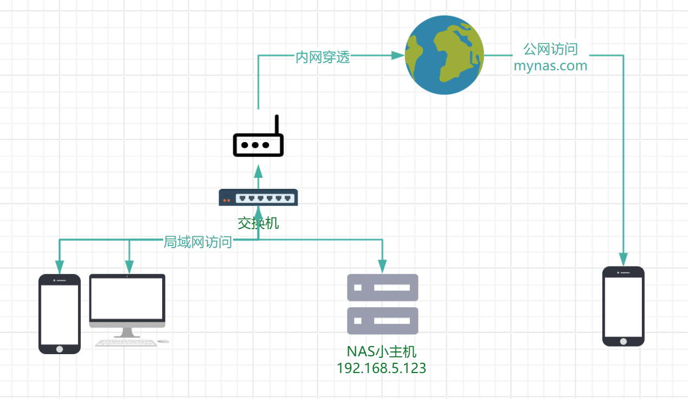

# 告别手动切换！实现 NAS 服务内外网无缝访问

自从组建了我的丐版 NAS 后，生活便利了不少。我在上面部署了 Komga 漫画库、Emby 媒体服务器、用于同步的 WebDAV 服务，以及 qBittorrent 下载器等。借助内网穿透，这些服务都能通过专属域名从公网访问。理论上，无论我身在何处，即使校园网宵禁，也能愉快地使用 NAS 上的资源。

下面是我的网络拓扑示意图：



然而，一个恼人的问题始终困扰着我：  
每当我在宿舍内网和外部网络环境之间切换时（比如从宿舍的 Wi-Fi 切换到手机热点或校园网），都必须手动更改各种客户端软件或网页书签中的 URL 地址。这意味着我不得不在 `192.168.5.123`​ (内网 IP) 和 `mynas.com`​ (我的公网域名，此处为示例) 之间反复横跳，才能重新连接服务。这涉及到手机上的文件管理器、相册同步工具、Emby 客户端等等。

更令人抓狂的是，有些应用天生就不适合这种频繁切换。例如，Mihon 的 Komga 插件，一旦添加了某个源（漫画库），除非执行繁琐的手动迁移（而且只能一本一本地操作），否则根本无法更改其目标服务器地址。难道我为了能在内外网都能看漫画，需要在插件里把同一个漫画库添加两遍（一个内网 IP 版，一个公网域名版）吗？即便如此，版本冲突、阅读进度同步等新问题又会接踵而至。还有各类软件内置的 WebDAV 同步功能，通常只允许设置一个服务器地址，来回修改配置几乎不可能。

这种不便极大地影响了我享受珍藏资料的热情。毕竟，谁愿意在想看电影、追漫画或读小说之前，先折腾一通服务器地址，然后焦急地等待加载圈转完呢？我们存储资源是为了欣赏，开启 WebDAV 是为了便捷同步，如果这些基本操作都变得费时费力，那 NAS 的乐趣何在？本文就将分享我如何解决这个问题，实现内外网访问的无缝切换。

## 我的网络环境

在开始之前，先明确一下我的网络状况：

* **NAS 主机**: 运行在家庭内网，固定 IP 地址为 `192.168.5.123`​。
* **内网访问**: NAS 上运行的各项服务（如 Emby, Komga 等）分别监听不同的端口，例如 `5001`​, `5002`​, `5003`​ 等。在内网中，可以直接通过 `http://192.168.5.123:端口号`​ 的方式访问这些服务。
* **外网访问**: NAS 上运行了内网穿透客户端，将内网服务暴露到公网。可以通过 `https://mynas.com:外网端口号`​ 的方式访问，其中 `mynas.com`​ 是我的域名，`外网端口号`​ 是由穿透服务商分配的公网端口（例如 `1234`​）。

**核心问题**: 内外网访问时，不仅 **主机名** (`192.168.5.123`​ vs `mynas.com`​) 不同，**端口号** (内网服务端口 vs 外网穿透端口) 和 **协议/加密方式** (HTTP vs HTTPS) 也可能完全不同！

## 探索解决方案

为了解决这个地址统一性的问题，我进行了一些尝试，查阅了论坛资料，并与 AI 进行了探讨，初步筛选出以下几个看似可行的方案：

1. **异地组网工具 (如 Tailscale, ZeroTier, WireGuard 自建等)**

    * **优点**: 可以在外部网络环境下，通过虚拟局域网 IP 直接访问 NAS，似乎绕过了公网穿透。
    * **缺点**: 这些工具通常会分配 *新的* 虚拟内网 IP (例如 `10.x.x.x`​ 或 `172.x.x.x`​)，而不是我原来的 `192.168.5.123`​。这并没有解决需要统一访问地址的核心问题。此外，在国内网络环境下，某些服务的连接速度可能不尽人意。
2. **利用 DNS 服务商的解析记录**

    * **优点**: 某些 DNS 服务商允许设置特殊的解析规则，可以将域名在特定条件下解析到内网 IP。理论上，在家时访问 `mynas.com`​ 就能指向 `192.168.5.123`​。
    * **缺点**: 这只能解决内网访问的问题。一旦离开内网，域名解析到的仍然是内网 IP，自然无法连接。更重要的是，它无法解决内外网端口不一致以及内网访问时 HTTPS 证书无效的问题。
3. **在路由器上设置 DNS 劫持/重定向**

    * **优点**: 这似乎是最接近目标的方案。通过在路由器上设置规则，强制将 `mynas.com`​ 在局域网内解析到 NAS 的内网 IP `192.168.5.123`​。这样，无论在内网还是外网，访问 `mynas.com`​ 时：

      * 在内网：DNS 查询被路由器拦截，返回 `192.168.5.123`​。
      * 在外网：DNS 查询正常进行，返回公网 IP（穿透服务器的 IP）。
    * **缺点**: 这个方案本身也存在两个问题：

      * **端口不一致**: 内网服务端口（如 `5001`​）和外网访问端口（如 `1234`​）仍然不同。客户端依然需要根据网络环境切换端口。
      * **SSL 证书问题**: 当在内网通过 `https://mynas.com:1234`​ 访问时，虽然 DNS 解析到了 `192.168.5.123`​，但浏览器/客户端请求的是 `mynas.com`​ 的证书。如果直接访问 NAS 上的原始服务端口（如 `5001`​），该服务很可能没有配置或配置了错误的 SSL 证书，导致连接失败或出现安全警告。

综合来看，**方案 3 (路由器 DNS 劫持)**  是最有潜力的，其核心思路正确——让域名在不同网络环境下指向不同的 IP。剩下的端口和 SSL 证书问题，可以通过在 NAS 上部署一个 **Nginx 反向代理** 来完美解决。

## 实现过程

最终的实现步骤分为两大部分：路由器 DNS 配置和 NAS 上的 Nginx 反向代理配置。

### 1. 配置路由器 DNS 劫持

登录路由器管理界面，不同品牌路由器界面不同，找到 DNS 相关设置，通常被称为“静态主机名”、“DHCP/DNS”、“局域网 DNS”或类似名称。添加一条规则，将你的公网域名 `mynas.com`​ 解析到 NAS 内网 IP `192.168.5.123`​。

设置完成后，当设备连接到这个路由器下的局域网时，任何对 `mynas.com`​ 的 DNS 查询都会被路由器直接响应为 `192.168.5.123`​。这样，访问 `https://mynas.com:1234`​ 在内网实际上就是在访问 `https://192.168.5.123:1234`​。

  
 *(在 OpenWrt 路由器中设置 DNS 主机名)*

### 2. 在 NAS 上配置 Nginx 反向代理

接下来解决端口和 SSL 证书问题。我们需要在 NAS 上安装 Nginx，并配置它来监听外网访问的端口（例如 `1234`​），处理 `mynas.com`​ 的 HTTPS 请求，然后将请求转发给 NAS 上实际运行服务的内网端口（例如 `5001`​）。

**前提**: 确保你已经拥有 `mynas.com`​ 域名的 SSL 证书文件（通常是 `.pem`​ 或 `.crt`​ 文件）和私钥文件（通常是 `.key`​ 文件），并将它们上传到 NAS 的某个目录下。

**步骤 1: 安装 Nginx** (假设 NAS 运行的是 Debian/Ubuntu 或类似的 Linux 系统)

```bash
# 更新软件包列表
sudo apt update

# 安装 Nginx
sudo apt install nginx -y

# 检查 Nginx 服务状态 (应显示 active/running)
sudo systemctl status nginx
# 按 q 退出状态查看

# 设置 Nginx 开机自启 (通常安装后会自动设置，此命令确保启用)
sudo systemctl enable nginx
```

**步骤 2: 存放 SSL 证书和私钥**

建议将证书文件放在 Nginx 的标准配置目录下。

```bash
# 创建 SSL 证书存放目录 (如果不存在)
sudo mkdir -p /etc/nginx/ssl/

# 复制证书和私钥到指定位置
# 注意：请将 /path/to/your/certificate.pem 替换为你的证书文件实际路径
sudo cp /path/to/your/certificate.pem /etc/nginx/ssl/mynas.com.pem
# 注意：请将 /path/to/your/private.key 替换为你的私钥文件实际路径
sudo cp /path/to/your/private.key /etc/nginx/ssl/mynas.com.key

# 设置严格的权限，保护私钥（非常重要）
sudo chown root:root /etc/nginx/ssl/mynas.com.key
sudo chmod 600 /etc/nginx/ssl/mynas.com.key

# 证书文件权限可以相对宽松些
sudo chmod 644 /etc/nginx/ssl/mynas.com.pem
```

*提醒：如果你的证书文件后缀是*  *​`.crt`​*​ *而不是*  *​`.pem`​*​ *，请在后续 Nginx 配置中也使用*  *​`.crt`​*​ *。*

**步骤 3: 备份默认 Nginx 配置 (可选但推荐)**

```bash
sudo cp /etc/nginx/nginx.conf /etc/nginx/nginx.conf.backup
sudo cp /etc/nginx/sites-available/default /etc/nginx/sites-available/default.backup
```

**步骤 4: 创建 Nginx 配置文件**

推荐在 `/etc/nginx/sites-available/`​ 目录下为你的 NAS 服务创建一个新的配置文件。

```bash
sudo nano /etc/nginx/sites-available/nas_proxy
```

**步骤 5: 编写 Nginx 代理配置**

在打开的编辑器中，粘贴并修改以下配置。这个示例配置会让 Nginx 监听 `1234`​ 端口上的 HTTPS 请求，并将流量转发到本机 (`127.0.0.1`​) 的 `5001`​ 端口 (假设这是 Emby 或 Komga 的内网端口)。

```nginx
server {
    listen 1234 ssl http2;        # 监听的外网端口 (需要与你外网访问时使用的端口一致)，启用 SSL 和 HTTP/2
    listen [::]:1234 ssl http2;   # 同时监听 IPv6 地址

    server_name mynas.com;         # 你的域名

    # SSL 证书配置
    ssl_certificate /etc/nginx/ssl/mynas.com.pem;      # 指向你的证书文件
    ssl_certificate_key /etc/nginx/ssl/mynas.com.key;    # 指向你的私钥文件

    # SSL 安全性设置 (推荐使用较新的协议)
    ssl_protocols TLSv1.2 TLSv1.3;
    ssl_prefer_server_ciphers off; # 通常设为 off 或 on 均可，现代浏览器协商能力强

    # 访问日志和错误日志 (自定义文件名，方便区分)
    access_log /var/log/nginx/mynas.com_1234.access.log;
    error_log /var/log/nginx/mynas.com_1234.error.log;

    location / {
        # 核心：反向代理配置
        # 将请求转发给实际的服务端口 (这里是 5001)
        # 如果 Nginx 和目标服务在同一台机器，使用 127.0.0.1 是最高效的
        proxy_pass http://127.0.0.1:5001;

        # 设置必要的 HTTP 头信息，以便后端服务能正确处理请求
        proxy_set_header Host $host; # 传递原始 Host 头
        proxy_set_header X-Real-IP $remote_addr; # 传递客户端真实 IP
        proxy_set_header X-Forwarded-For $proxy_add_x_forwarded_for; # 记录代理链 IP
        proxy_set_header X-Forwarded-Proto $scheme; # 告知后端是 http 还是 https

        # 支持 WebSocket (对 Emby, qBittorrent WebUI 等可能需要)
        proxy_http_version 1.1;
        proxy_set_header Upgrade $http_upgrade;
        proxy_set_header Connection "upgrade";
    }

    # 如果你需要代理其他服务到不同的外网端口，可以复制上面的 server {} 块，

}
```

**步骤 6: 启用新的配置文件并禁用默认配置**

```bash
sudo ln -s /etc/nginx/sites-available/nas_proxy /etc/nginx/sites-enabled/
sudo rm /etc/nginx/sites-enabled/default
```

**步骤 7: 测试 Nginx 配置并重启服务**

```bash
# 测试配置文件语法是否有错误
sudo nginx -t

# 如果测试通过 (显示 syntax is ok 和 test is successful)，则重启 Nginx 服务
sudo systemctl restart nginx
```

**步骤 8: 配置 NAS 防火墙**

确保 NAS 的防火墙允许外部（在这里指局域网内部和潜在的公网）访问 Nginx 监听的端口（在我们的例子中是 `1234`​ TCP 端口）。

* 如果你使用 `ufw`​:

  ```bash
  # 允许访问 1234 端口
  sudo ufw allow 1234/tcp
  # 重新加载防火墙规则
  sudo ufw reload
  # 查看防火墙状态确认规则已添加
  sudo ufw status
  ```

* 如果你使用 `firewalld`​:

  ```bash
  # 永久添加允许 1234 端口的规则
  sudo firewall-cmd --permanent --add-port=1234/tcp
  # 重新加载防火墙规则使之生效
  sudo firewall-cmd --reload
  # 列出所有规则确认
  sudo firewall-cmd --list-all
  ```

**步骤 9: 验证效果**

现在，无论你的设备连接的是家庭内网 Wi-Fi 还是外部网络（如手机流量、校园网），尝试通过 `https://mynas.com:1234`​ 访问服务。

* **在内网**: 路由器 DNS 会将 `mynas.com`​ 解析到 `192.168.5.123`​。你的请求 `https://mynas.com:1234`​ 实际上发送给了 `192.168.5.123`​ 上的 Nginx。Nginx 使用正确的 SSL 证书响应，并将请求代理到内部的 `http://127.0.0.1:5001`​。
* **在外网**: DNS 将 `mynas.com`​ 解析到你的公网 IP（或穿透服务器的 IP）。请求 `https://mynas.com:1234`​ 通过内网穿透隧道到直接达 NAS 上内部的 `http://127.0.0.1:5001`​。

你应该能够在这两种网络环境下都成功访问服务，并且浏览器不会再报 SSL 证书错误。

## 最终效果

经过以上配置，我终于实现了 NAS 服务在内外网访问上的无缝切换！现在，所有的客户端软件（Emby, Komga 插件, 文件同步工具等）只需要设置 **唯一** 的地址：`https://mynas.com:外网端口号`​ (例如 `https://mynas.com:1234`​)。

* **身处内网时**：请求会被路由器智能地导向 NAS 的内网 IP，数据直接在局域网内高速传输，即使外部网络中断（例如校园网断网）也完全不受影响。
* **身处外网时**：请求则通过公网和内网穿透通道，同样能够无缝访问到 NAS 上的资源。

更重要的是，由于无论是内网（通过 Nginx 代理）还是外网访问，客户端收到的都是与 `mynas.com`​ 域名匹配的有效 SSL 证书，因此浏览器或 App 不会再弹出“不安全”、“证书无效”或“服务器发送了无效响应”之类的恼人警告了。

现在，我可以随时随地、无需任何手动干预，畅快地欣赏 NAS 上的漫画、电影，或者让相册、笔记等自动同步了。这才是 NAS 该有的便捷体验！

  
 *(Emby 客户端现在只需一个地址就能稳定连接)*
