## 一次有趣的实践

在校内选修了一门以“生成式AI”为主题课程，课程上讲授的一些内容与我的一个埋藏已久的点子不谋而合——从零开始开发一部视觉小说。鉴于此前已经有基于前端技术开发简单视觉小说应用的经验，再加上现在有了各领域都有了强大AI的帮助，因此我决定好好地尝试一次，从部署AI工具，到运行程序的搭建，完全从零开始用AI来实现每一步。

‍

## 技术路线

### 项目结构

首先需要明确的是，要制作基本完整的视觉小说作品，至少需要完成以下几个部分：引擎，角色设定，剧情脚本，场景图，角色表情动作差分图，片头视频（Opening），片尾视频（Ending）。接下来对这些必备元素稍做分析。

**引擎**是游戏的载体，是负责向用户展示故事情节与视觉小说基本功能（存取进度等）的程序。为了方便成品可以轻松运行、随处可用，同时简化开发难度，这里采用单页web应用做为游戏载体，借助Vue及前端技术栈开发。整个开发过程将会借助cursor、GitHub copilot等编程助手来实现。为了更完善的用户体验，也将同步推出基于Electron的Windows、MacOS桌面端应用（毕竟技术栈都一样）。

​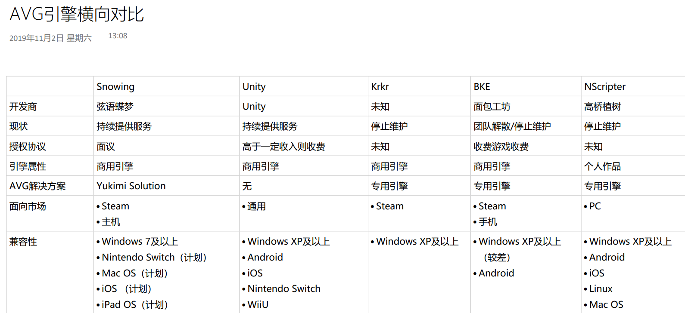​

​`市场上的部分引擎`​

**角色设定**及**剧情脚本**是支撑游戏内容的重要部分，这部分将由本地LLM来完成创作。通过撰写完善的提示词与大致的剧情纲要，大语言模型有能力生成详尽的人物外观、性格、经历设定，并根据这些信息来帮助生成更符合角色特征的对白。最后依然借助本地大语言模型将对白数据结构化，导入到游戏文件中。

**场景图**和**角色差分图**，前者的制作较为简单，只需要向本地绘画模型描述（在comfy web UI中输入）大致内容即可。但是角色差分图的制作将会较为复杂，因为在整个游戏流程中，同一个角色的外貌特征应该有着极高的**稳定性**，但是却又需要根据不同的情节调整**表情、姿态**，这是主要难点。

​​

​`表情的局部差分`​

* 角色稳定性方面主要有两种途径来解决，一是通过详尽的外貌提示词和较高的提示词权重来限制AI的创作，二是先使用一张基准图片搭配不同的提示词（img2img功能）来创建一组相似的该角色的图片，之后将图片组训练为Lora模型，在后续的生成中使用Lora来控制人物形象。
* 表情可以使用蒙版工具（局部重绘）来修改，将底图与盖住脸部的蒙版同时导入，即可实现仅仅修改脸部表情。
* 姿态可以使用ControlNet来控制，借助ControlNet和pose模型，我们可以将一张真人姿态照片应用到生成出的角色身上。

此外，得益于国外[HuggingFace](https://huggingface.co/)与国内[LibLib](https://www.liblib.art/)等开源社区，许多Checkpoint、Lora和comfy UI工作流可以直接使用，使得角色风格更丰富更容易控制。在提示词超市（亦称为[标签超市](https://tags.novelai.dev/)、魔导书）中，也可以随心选择需要的提示词组合，更方便的控制和微调图像生成结果。

### 本地与云端大模型

本项目尽可能使用在本地部署的AI工具，仅在当本地端没有可以满足质量和效率要求的工具，或是工具所需显存过大的情况下才借助云端产品。主要环节实现途径如下表。

|实现途径|任务|
| --------------| ------------------------------------------------|
|本地绘画模型|绘制背景图、绘制角色立绘、绘制表情与动作差分图|
|本地LLM|撰写人设、完善故事细节、输出结构化对白数据|
|Suno.ai|生成Opening、Ending音乐、生成剧情BGM|
|人力|将素材组织为Opening、Ending视频、搭建服务端|

​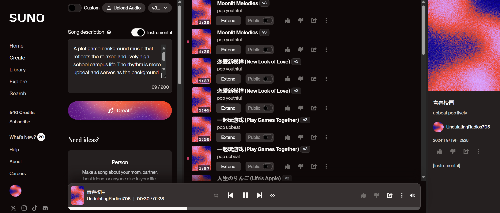​

​`Suno音乐与歌曲生成`​

### 提示词工程

在视觉小说的制作过程中，提示词的设计至关重要，因为它直接影响AI生成内容的质量与一致性。在为不同的素材撰写提示词时，需要根据目标内容的特点，确保提示词具备足够的**清晰度、细节性**以及**创意空间**。

**角色设定**的提示词需要涵盖角色的外貌特征、性格、背景故事等多维度信息，确保AI生成的人物不仅外形符合预期，性格与行为逻辑也能融入剧情。提示词可以包含年龄、发型、服装风格等具体描述，同时通过性格词汇设定角色的情感表达与互动方式。

**场景图**的提示词则更注重对氛围、色彩和空间布局的描述。场景不仅仅是视觉背景，还承载了故事的情感基调。因此，在撰写提示词时，可以明确指出时间、季节、光线效果等因素，帮助AI生成符合故事氛围的环境。

**角色表情与动作差分图**的提示词撰写需要特别注重情感和动态的表达。要确保不同的情绪（如愤怒、喜悦、悲伤）的细微差别能够通过提示词传达出来。这里需要通过明确的情感词汇和动作描写，如“微笑”、“皱眉”、“抬手”等，帮助AI准确抓住角色的情感和动作变化。

## 实际搭建

### comfy UI

#### 本体部署

​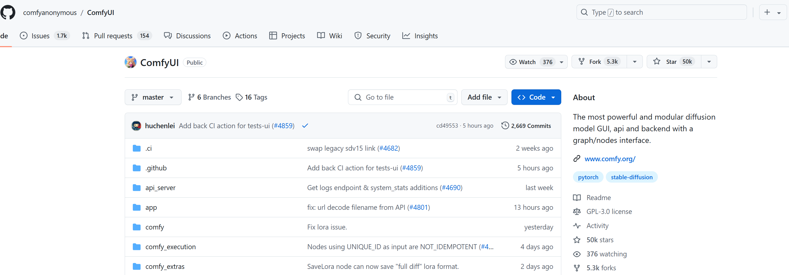​

Comfy UI 的本体托管在 GitHub 上，我们可以通过 `git`​ 来拉取最新版。首先，可以借助scoop等包管理器或官网MSI安装工具在系统中安装 Git 和 Python环境（3.8+），然后在终端中运行以下命令来克隆 Comfy UI 仓库并进入项目目录：

```bash
git clone https://github.com/comfyanonymous/ComfyUI.git
cd ComfyUI
```

接着，通过以下命令安装所需依赖并启动 Comfy UI：

```bash
pip install -r requirements.txt
python main.py
```

启动完成后，Comfy UI 将可以通过本地的 Web UI 进行访问，在 `http://localhost:8188`​ 上。通过网页界面，我们就可以直接进行节点编辑、工作流制作和图像生成了。

​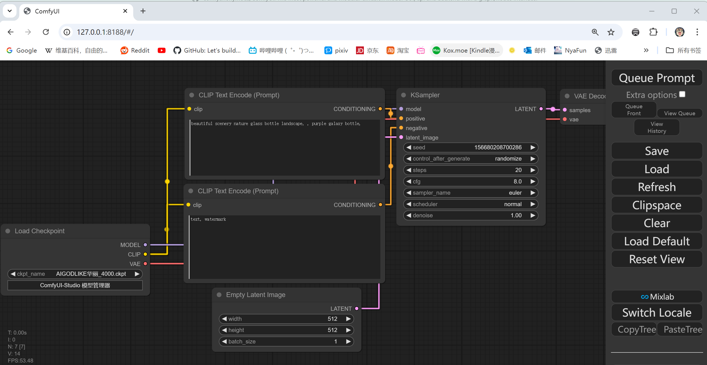​

#### 插件管理器

​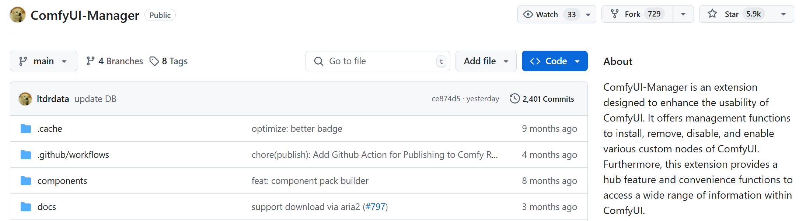​

Comfy UI 的许多功能和节点都依赖插件实现，但手动安装插件耗时较长，尤其是在加载新的工作流时需要安装大量节点。为了解决这个问题，可以借助 `manager`​ 插件来简化安装与管理节点的流程。该插件允许一键安装缺失插件，自动更新已安装的插件，极大地提升了效率。使用时只需在插件管理器中选择相应的插件或节点库，系统会自动进行安装与升级。

要安装，直接终端里输入以下命令（工作目录均为Comfy UI 根目录）

```
cd custom_nodes
git clone https://github.com/ltdrdata/ComfyUI-Manager.git
```

​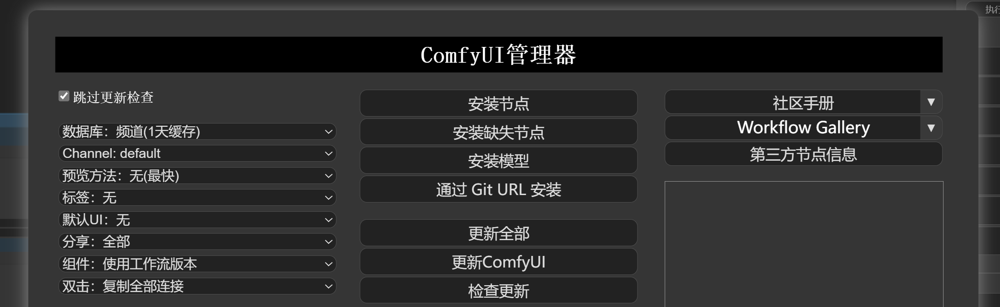​

#### 借助 Blender 的 Shade 中的节点样式 UI

虽然 Comfy UI 自带的 Web UI 功能强大，但在操作上略显局限，特别是在与本地文件系统的交互上不够便利。哔哩哔哩开源作者“一瓶辣椒酱”开发的 `铁锅炖`​ 插件可以用 Blender 的节点样式 UI 替代 Comfy Web UI ，从而提升用户体验。

Blender 等专业 3D 软件的材质和效果器编辑方式与 Comfy UI 的节点编辑方式十分相似。通过下载“铁锅炖”，并将插件安装至 Blender 目录下，我们可以使用 Blender 的直观 UI 来编辑 Comfy UI 中的节点，使操作更加便捷且直观。

```bash
下载“铁锅炖” -> 首页安装插件至 Blender  -> 启动blender并切换的Comfy Node界面 ->连接Comfy UI Server
```

​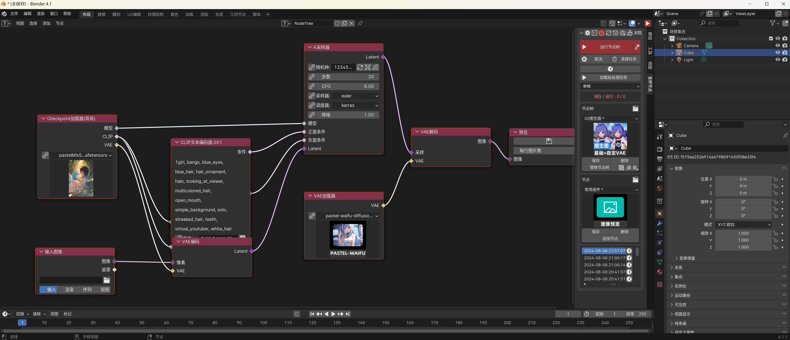​

#### Checkpoint 模型与 Lora

​​

Comfy UI 支持加载 HuggingFace 和哩布哩布等平台上开源的 Checkpoint 模型和 Lora 模型。我们可以通过社区网站提供的模型预览和介绍选择需要的模型文件，下载后将其放入 Comfy UI 中的 `models`​ 目录下的对应文件夹。然后，在 Comfy UI 的节点中加载这些模型，即可在工作流中使用不同的模型来生成不同风格的图像。具体路径如下：

```bash
/models/Checkpoints/   # Checkpoint 模型目录
/models/Lora/          # Lora 模型目录
```

加载模型后，通过 UI 中的模型节点进行选择与应用，便可以将不同模型的风格应用到项目中。

​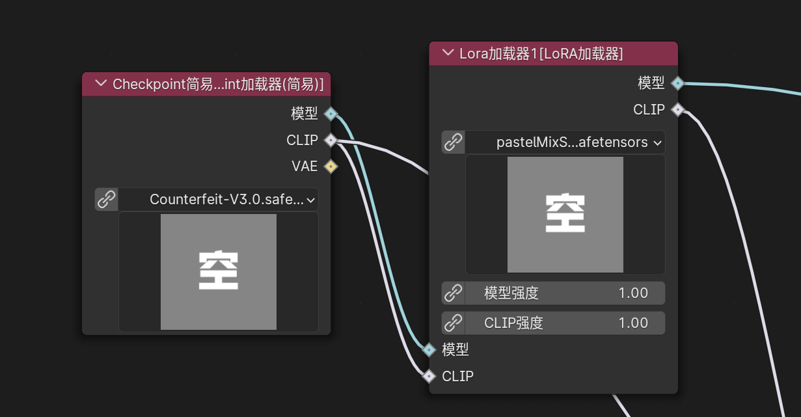​

#### 工作流

在 HuggingFace 和哩布哩布等开源社区中，不仅可以下载模型，还可以找到许多功能强大的工作流模板。通过直接导入这些工作流，我们可以快速实现复杂的功能，而不需要从零开始搭建。例如，可以在社区中下载一个多节点的工作流，并通过 Comfy UI 导入，以完成图像生成、角色设定等任务。导入工作流时，Comfy UI Manager会检查所需的节点和插件是否完整，缺失的内容会提示你使用插件管理器一键安装。

​​

​`平台浏览和下载`​

​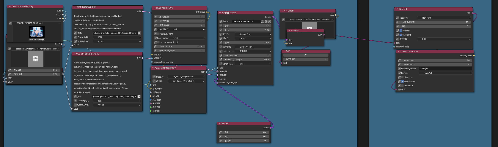​

​`本地一键导入、补齐缺失节点`​

### LLM

在本地部署大语言模型（LLM）是生成式AI开发中的一项重要步骤，我们可以在不依赖云端服务的情况下，直接在本地设备上运行强大的语言模型。在这里以Meta公司最新发布的 Llama 3.1 模型为例，在本地进行部署和运行。

#### 硬件要求

首先需要确保电脑满足以下硬件要求：

* **显卡**：NVIDIA RTX 3060 或更高
* **显存**：至少 8 GB
* **内存**：至少 16 GB
* **硬盘**：至少 20 GB 可用空间

#### 安装 Ollama 客户端

为了在本地部署 Llama 3.1 模型，我们需要安装 **Ollama** 客户端。该客户端不仅能让我们下载并运行 Llama 模型，还可以管理与模型相关的数据和文件。

​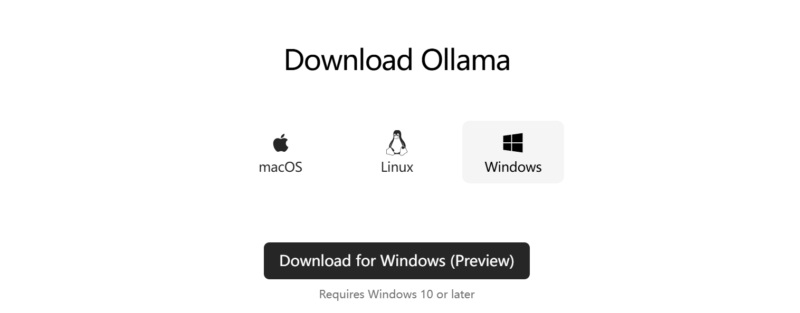​

首先，前往 [Ollama 官方网站](https://ollama.com/) 下载客户端并安装。默认安装目录为 `C:\Users\你的用户名\.ollama`​。在这个目录下可以找到下载的模型文件和相关数据。

#### 部署 Llama 3.1 模型

Ollama 客户端为我们提供了简单的命令行方式来安装和运行大语言模型。在终端中，使用以下命令来安装 **Llama 3.1-8B** 模型：

```bash
ollama run llama3.1:8b
```

这个命令会在第一次运行时自动下载所需的模型文件，并将它们存储在默认目录中。**Llama 3.1-8B** 模型需要至少 8GB 的显存来运行，适合个人开发者或中小型项目。

如果你的计算资源较为有限，**Llama 3.1-8B** 通常已经足够满足大部分任务需求。如果你需要更高性能或处理更复杂的任务，Ollama 还提供了更大模型（如 70B 和 405B）的下载和运行，但这些模型的硬件要求显著（真的很显著，高达450GB显存需求）增加。

​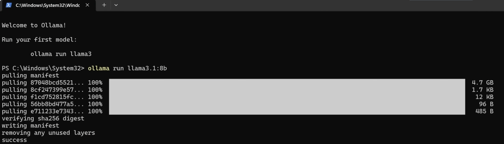​

#### 运行与交互

安装完成后，通过 Ollama 的终端可以直接与 Llama 3.1 模型进行交互。只需在终端中输入提示词，模型便会实时生成文本并进行反馈。对于那些更习惯使用类似 ChatGPT 图形界面的人，可以通过安装 **GPT4ALL** 软件来获得一个用户友好的本地 LLM 启动器。

然而，对于我们来说，使用终端与模型交互已经足够简单有效。

​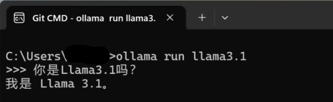​

## 使用在线服务

非常简单，直接使用就好了，在此不再赘述。

* Suno：进入官网，任选社交媒体账户登入即可获得免费额度。在create页面中输入需求即可创作。仅适合非大陆及港澳台地区。
* cursor：进入官网，下载安装客户端并从VS code迁移配置即可开始使用。引导教程涵盖补全、重写、整个项目作为上下文生成。
* GitHub Copilot：对于教育工作者和学生（大善人GitHub已收录本校），通过教育邮箱完成教育认证即可获得免费不限次的copilot使用权。在VS、VS code、Jetbrain系列IDE里面只需要安装copilot插件然后登陆一下账户即可。

​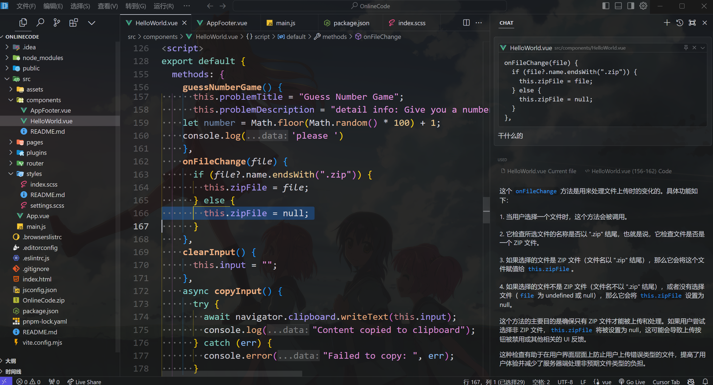​

​`谁用谁知道，反正就是爽`​

‍
