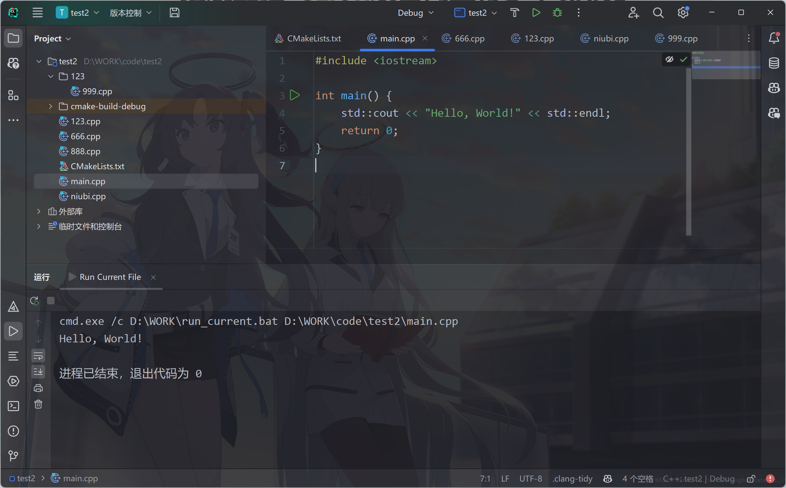
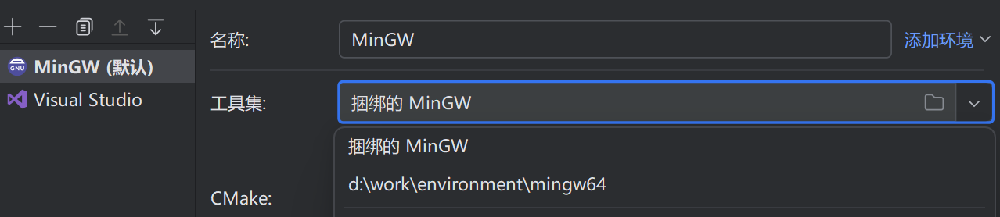
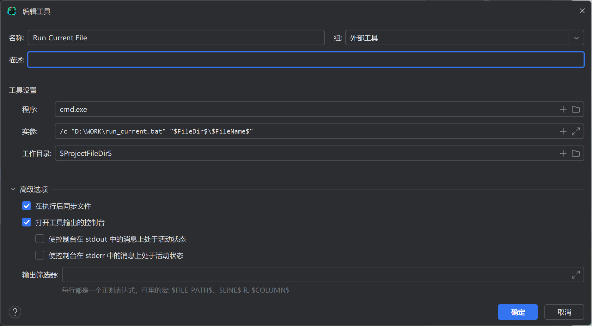
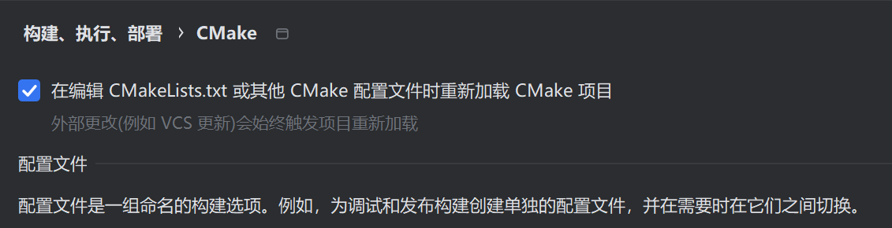

:::note  
文章标题所提到的是指中文互联网易于得到的搜索结果中，本方法是运行起来最为快捷的、准备起来最为简易并且一劳永逸的。不包含stackoverflow、reddit等英文社区可能存在的更优解决方案。  
:::

## 痛点所在

众所周知，CLion在创建项目后会自动给我们一个main.cpp，如果我们想在项目目录中同时存放多个cpp文件，会发现其他cpp的main函数是无法运行的。

​​

目前网上已有的各种博客和解决方案无非是：

1. 在右上角的运行区域手动添加当前cpp文件的运行配置
2. 在Cmake配置文件中手动引入当前cpp文件，之后重载Cmake项目，从右上角运行区域选择需要运行的cpp
3. 在Cmake配置文件中写脚本或者直接全局引入`*.cpp`​，在设置中勾选自动重载Cmake项目，最后从右上角运行区域选择需要运行的cpp
4. 安装插件来一键在Cmake配置文件中引入，从右上角运行区域选择需要运行的cpp
5. 安装插件来直接编译cpp，但是运行起来不方便

但是这些方案，我认为全都不够方便，都需要多次鼠标甚至是编辑文件操作，完全是浪费了效率，也不优雅。急需寻找一套不借助任何插件！

## 解决思路

借助脚本文件，将当前cpp文件传递给编译脚本，编译完成后在终端中执行exe成品

## 具体实现

:::warning  
在CLion设置中进行任何编辑之后，应该立即点击应用按钮，否则极可能出错。必要的时候可以关闭设置页面重开。  
:::

‍

### 创建编译运行脚本

在不包含空格和中文的目录中创建`run_current.bat`​，其中内容按照如下格式填写

```bat
@echo off
setlocal

rem Get the filename without extension
set filename=%1
set target_name=%~n1

rem Navigate to the project directory
cd /d %~dp0

rem Compile the CPP file
你的编译器路径\mingw64\bin\g++ -o 你希望编译文件输出的位置\OUTPUT\%target_name% %filename%

if %errorlevel% equ 0 (
    rem Run the executable if the build was successful
    你希望编译文件输出的位置\OUTPUT\%target_name%
) else (
    echo Build failed
)

endlocal

```

其中，`你的编译器路径`​如果你不知道，可以打开`CLion>设置>构建执行部署>工具链>MinGW（默认）>工具集>下拉菜单`​

这里面会显示你的编译器路径，注意不要有空格，如果有需要在bat里面加引号：`"你的编译器路径\mingw64\bin\g++"`​

脚本的含义是接受cpp文件作为参数，然后在控制台编译并运行它。

​​

你应该提前创建好这个路径中的所有文件夹，不允许中文和空格：`你希望编译文件输出的位置\OUTPUT\`​

一切完成后保存，复制bat文件的路径，我这里以`D:\WORK\run_current.bat`​为例。在你实践的时候记得替换成自己的目录。

### 向脚本传参

来到`CLion>设置>工具>外部工具>加号`​，创建一个外部程序入口。

​​

名称随便写，程序填写`cmd.exe`​。实参填写`/c "D:\WORK\run_current.bat" "$FileDir$\$FileName$"`​，注意替换这里面的bat文件位置。工作目录填写`$ProjectFileDir$ `​。

这里的意思是以当前项目目录为工作目录调用我们的编译运行脚本，同时把`cpp文件路径+文件名.cpp`​作为参数传递到脚本中执行。

### 添加快捷键

来到`CLion>设置>按键映射>外部工具>外部工具>外部工具>双击`​选择添加键盘快捷键，这里推荐`Alt+Shift+Z`​，方便按还没有热键冲突。

### 消除“不属于任何项目目标”警告

由于CLion默认Cmake配置原因，除了main.cpp之外的cpp默认都不能开启代码洞察（如果你创建CPP文件的时候没勾选加入项目目标的话）。

首先来到`CLion>设置>构建执行部署>Cmake`​勾选自动重载Cmake项目：

​​

随后来到默认创建的`CMakeLists.txt`​中，将`set(CMAKE_CXX_STANDARD XX)`​这一行以下的内容删除，替换为：

```cmake
file(GLOB SOURCES "*.cpp")

add_executable(项目名 ${SOURCES})
```

## cmd控制台显示中文乱码

对于某些设备，用c++输出中文的时候，控制台都是乱码。造成此现象的原因是GBK于UTF8编码的转换问题。来到`CLion>设置>编辑器>文件编码`​将全局改为GBK即可。

对于已有的UTF8编码的cpp文件，可以打开它后双击`shift`​，选择操作，输入`文件编码`​，选择`文件编码（文件|文件属性）`​。在弹出菜单中选择`GBK`​，最后单击`转换`​即可。

‍

## 爽一把

在项目里面任意位置新建一个cpp，随便写点代码，按一下`Alt+Shift+Z`​。终端瞬间就会开始编译执行你当前的cpp文件啦！如丝般顺滑~

、​
