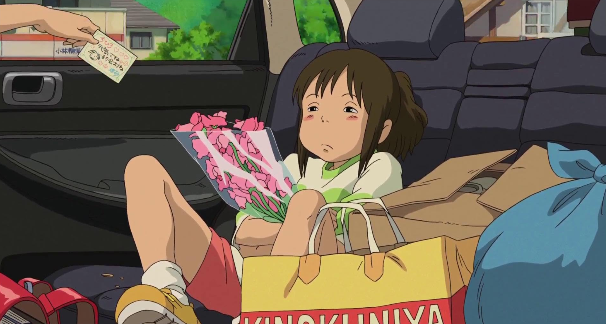

# 宫崎骏谈《千与千寻》

:::note
摘自《The Art of Spirited Away-千与千寻官方艺术设定集》 
北京联合出版公司出版 
图像来源 IMDB 如有侵权请邮件联系删除
:::
这是一个冒险故事。虽然故事里并没有出现什么神奇的武器或超能力，但它依然是一个冒险故事。只不过这个冒险故事并非以正邪对决为主题，而是讲述一名少女被扔在一个好人与坏人混杂的世界中，如何修行、学习友爱与奉献，并运用自己的智慧生存下来。最终她能够突破难关、逃脱劫难，回到原来的生活中，并不是因为恶被消灭了——恶是与这世间一样永存的，而是因为她获得了生存的能力。

当今社会，善恶变得暧昧不明，明明如此含糊，却又有着吞没与消费一切的欲望。而这部电影的主题，便是借用奇幻的体裁，将这样的社会清楚地描绘出来。

现在的小孩子们，在日常的生活中被圈养、被守护、被疏远，以至于对“活着”这件事只有一些稀薄而模糊的感受，他们只能让孱弱的自我越发膨胀。千寻软弱无力的手脚，经常挂着看什么都无聊的苦瓜脸，这些便是现在孩子们的象征。但是，当现实变得清晰，当她进退维谷而不得不直面危机的时候，一股她自己都不曾察觉的适应力与忍耐力涌现出来，她终于发现，她所拥有的生命，能够发挥出多么果断的判断力与行动力。

其实，大部分人遇事时只会陷入慌乱，反复咒骂着瘫坐在地上。而这样的人在落入千寻的处境时，恐怕很快就会被环境消灭掉，或者被强者吃掉吧。千寻之所以能成为主人公，绝不是因为她是个美少女，或者拥有多么稀世的灵魂，而是因为她拥有不为他人所吞噬的力量。这一点，才是这部作品的过人之处，所以也就不难理解，它得以成为一部给十来岁的女孩子们看的电影。

​​

语言就是力量。在千寻所迷失的世界中，说话这件事是极有分量的，足以造成无法挽回的结果。在被汤婆婆支配的澡堂，只要说一句“我不愿意”“我想回家”，千寻当场就会被魔女赶出去。那时的她，要么流离失所最终在徘徊中消亡，要么变成不停下蛋的鸡直到被吃掉为止。相反，只要千寻说出“在这里工作”这句话，即使是魔女也不能无视她。现如今，人们将语言视为气泡般轻浮的行为，可以张口就来，而这不过是现实日益虚化的表现。语言依然是有力的，至今也是真理，只不过到处充斥的都是无力的空虚之词而已。

把他人的名字夺走，并不是要改变称呼，而是要完完全全地支配对方。小千毛骨悚然地发现，连她自己都在逐渐遗忘“千寻”这个名字。随着每次去猪舍，她也渐渐习惯父母变成了猪的模样。在汤婆婆的世界里，必须时时刻刻在被吃掉的危机中挣扎才能活下去。

在如此艰难的世间，千寻反而越来越有生气。电影的大团圆结局中，原本皱着一张苦瓜脸的角色，最后也会露出充满魅力、豁然开朗的表情。直到今天，这个世界的本质依然没有任何改变。这部电影就是要用自身的说服力向大众表明：语言就是意志，就是自我，就是力量。

​​

选择以日本为舞台创作一部奇幻作品的意义也在于此。即使是童话故事，我也不想选那种退路多多的西欧童话风格。大家普遍觉得这部电影是效仿了常见的异世界故事，可我更愿意视其为《麻雀之家》或《老鼠的宫殿》的直系子孙。不说什么平行世界，我们的祖先本也是今天在麻雀的家里栽跟头、明天在老鼠大人的宴会上吃喝玩乐这么一路走来的。

汤婆婆居住的世界被设定成了仿欧风，为的是让人觉得似曾相识，从而产生似幻似真的感觉。同时，也是因为有日本传统造型这座宝库，为我们的想象提供了无尽的原料。民俗的空间——传说、传承、习俗、造型、祭祀甚至是咒术——如此丰富而独特，只是还不为大众所知。咔嚓咔嚓山和桃太郎这种故事已经无法让如今的孩子信服了。同时，难道包罗万象的传统艺术，就一定要局限在传统民间故事这么一个芝麻绿豆大小的世界中吗？不得不说，这就是一种想象力贫瘠的表现。如今的小孩子被高科技包围，在各种单薄的工业制品中渐渐失去了他们的根。所以必须传达给他们——我们拥有怎样丰富的传统。

我希望将传统的工艺与现代人愿意看的故事相结合，成为一片色彩斑斓的马赛克，镶嵌进电影的世界中，使其获得新鲜的认同感。同时，这也是我们对自己岛国居民身份的重新认知。

因为在这个无国界的时代，找不准自己定位的人，是最为别人所轻视的。你的定位就是你的过去、你的历史。没有历史的人、遗忘过去的民族，要么流离失所最终在徘徊中消亡，要么变成不停下蛋的鸡直到被吃掉为止。

愿这部作品能够让那些十来岁的女孩子观众领悟自己真正的期望。我想做的，就是这样的电影。

​​
