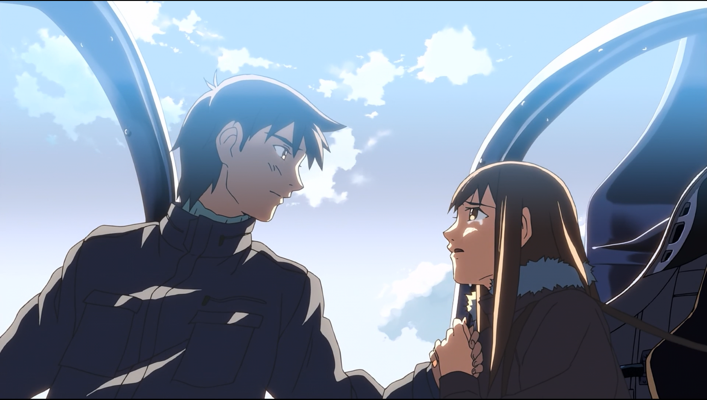
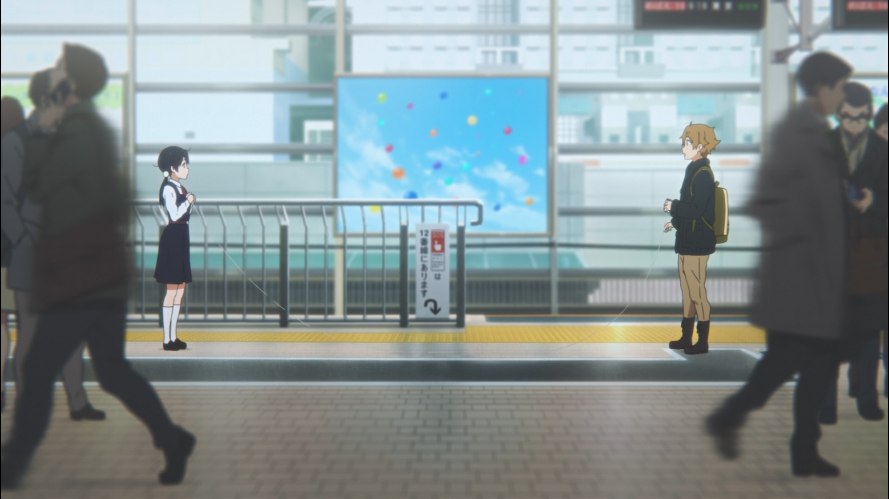
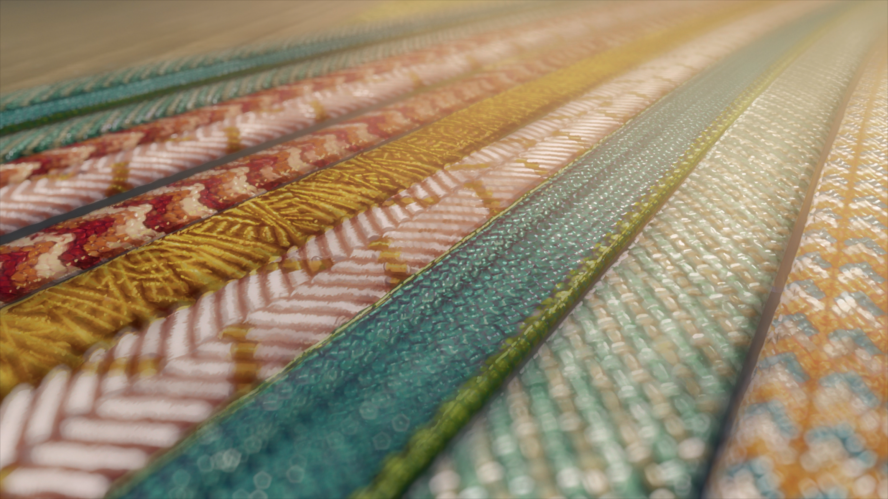
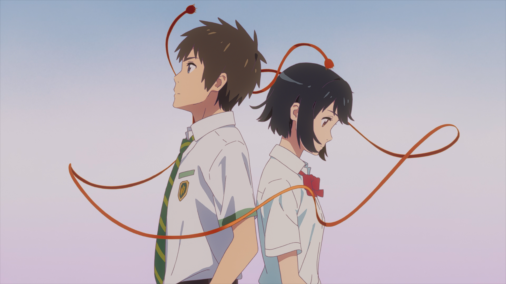
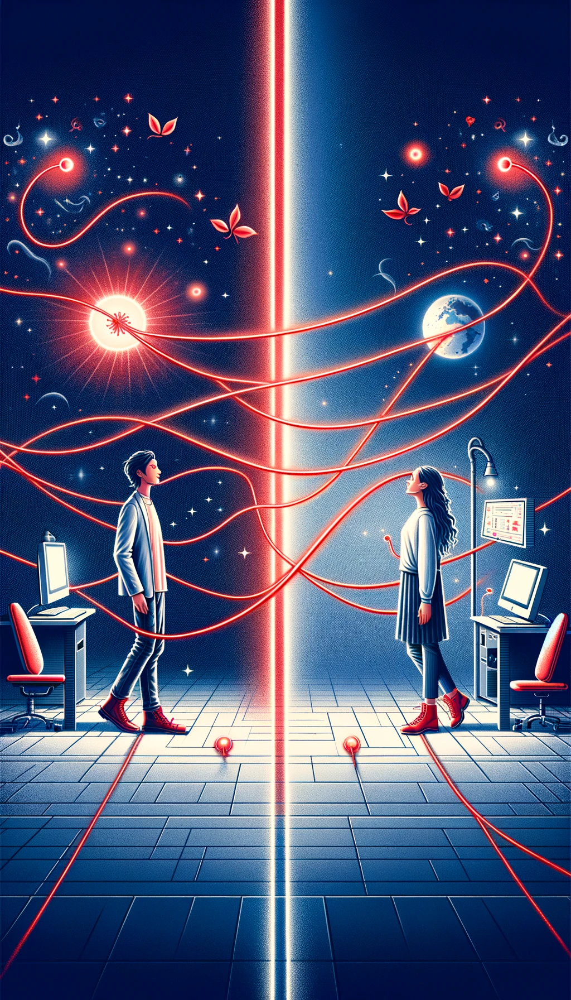
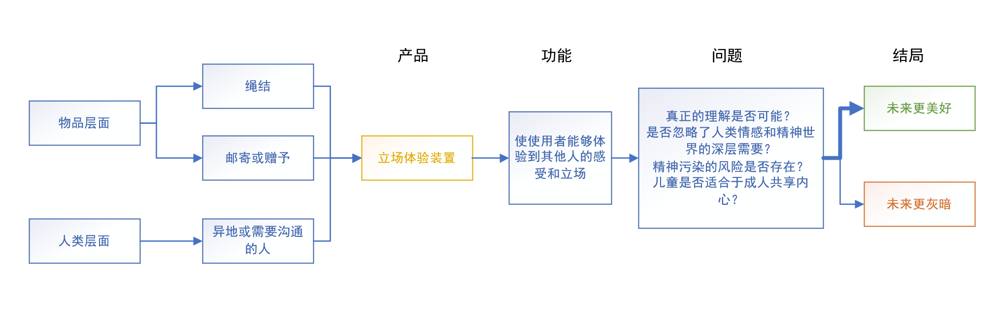

计算机学院

## 摘要

本研究通过分析当代日式 ACGN 作品，尤其是新海诚的《你的名字》，探讨了物品作为连接人与人之间情感和理解的象征。以此为灵感，提出了一个立场体验装置的设计概念，旨在促进深层次的人际理解和连接。该设计采用非人类中心主义视角，探索在技术进步和信息化社会背景下，人们如何通过设计促进真正的沟通和理解，从而解决现代社会中日益减少的人际连接和理解深度的问题。

关键词：立场体验装置、ACGN 文化、《你的名字》、人际理解与连接、非人类中心主义、设计思辨

### 从作品出发

在众多 ACGN（动画、漫画、游戏、轻小说）作品中，无论是近代还是现代，大部分都在探讨社会中人与人之间的联系与理解。是的，自 20 世纪中叶起，以《铁臂阿童木》为代表的一众作品，无论其媒介如何，是否受到西方风格影响，都将人之间的联系作为自身的重要组成部分。在当代日式 ACGN 作品中，最令我印象深刻的当属作家新海诚的作品，尤其是《你的名字》。

​​

图 1 电影《君の名は。》主视觉图

自 2016 年在内地上映以来，这部电影以其独特的叙事手法和深刻的主题意义，在全球范围内引起了广泛关注。电影通过一个关于灵魂互换的故事和一个特殊物品，探讨了心灵和肉体、时间和空间以及人际间微妙的连接，这种连接触及了人类深层的情感和认同。它通过描绘两位主角——身处不同地点的少年男女，因超自然现象相遇而彼此交换身体，体验对方的生活——来展示这种连接和沟通的方式 1。《你的名字》不仅是一次视觉的享受，更是一次深刻的心灵旅程。它呈现了人们在追求理解和被理解的过程中所的重重阻碍。主角的经历，让我看到了理解和连接怎样发生，以及如何促使人们跨越时间和空间的障碍，感受彼此。身体互换不仅仅是一种剧情设定，更象征着深层次的心灵交换，提示着我们在现实世界中也应寻求更深刻的人际连接和理解。

新海诚 2 作为作家，对“物品对人心的象征意义”的描写似乎已经成为他的风格，这在他的作品中随处可见。链接角色的特殊物品在《云之彼端，约定的地方》中是自制飞机 Velaciela 和小提琴；在《秒速五厘米》中是花瓣和电车；在《追逐繁星的孩子》中是则歌薇丝矿石。

​​

图 2Velaciela 上的重逢

除此之外，日式 ACGN 文化中不乏以物品为寄托探讨人与人之间连接的作品。例如，《星灵感应》通过模型火箭这一载体，讲述了同学之间心灵感应、建立友谊的故事，探讨了物品如何成为人类情感和记忆交换的载体。而《玉子市场》中的纸杯电话则象征着青梅竹马之间的互相的了解与交流。这些作品通过物品与人之间的互动，展现了日式 ACGN 中独有的对于人际连接和心灵理解的深刻见解。在本设计中采用的是《你的名字》中的元素——宫水家族的传统绳结（組紐くみひも）。这些绳结不仅是家族传统的体现，也象征着人与人之间的连接与纽带。这种物质文化中的象征意义，与产品主题形成了呼应。

​​

图 3 近在咫尺，依然使用纸杯电话

通过以上展示的典型作品，我们可以看到，在日式 ACGN 文化中，物品不仅仅是故事中的道具，它们成为了连接人们内心世界的桥梁。这些作品通过精心设计的情节和信物，引导观众反思现实世界中人与人之间的联系与理解，激发了对更加深入人际理解和沟通方式的思考。在这样的背景下，探索如何通过设计来促进人们之间的理解和连接，成为了一个值得深入研究的课题。

### 寻找答案

在寻找设计灵感时，我发现《你的名字》稍不同于其他日式 ACGN 作品中那些微妙的人物关系和物品象征，它强调了深层的文化背景、在时间和空间上的跨度、见证了从陌生到联结的全过程，因此組紐 3 顺理成章地成为了立场体验装置的原形参考。

​​

图 4 传统技艺在现代

问题的核心在于，尽管我们生活在一个技术日益进步、信息流通日益加快的时代，人与人之间真正的理解和深刻的连接似乎却在逐渐流失。这引出了一个深层次的探询：在现代社会中，人们是否还能够真正理解彼此？这个问题并不是留存与字面上的，它涉及到人类交流的本质、技术对人际关系的影响，以及我们如何在日益繁忙的生活中寻找意义和连接。

为了深入探讨这一问题，我选择了非人类中心主义 4 这一概念作为理论支撑。这一观点挑战了传统以人类为中心的世界观，提醒我们重新思考人类与自然、以及人与非人类实体之间的关系。通过这个视角，我开始思考设计不仅仅是满足人类需求的工具，更是一种促进所有生命体之间理解和和谐共存的手段。这种思考方式为我的设计带来了全新的视角，使我不再局限于人类自身，而是扩展到了更广阔的存在和多样性中，也即“物品”的形式。

在设计的物质选择上，宫水三叶家族的绳结作为装置的原型，在《你的名字》中，绳结不仅是家族传承的工艺品，更象征着时间、记忆以及人与人之间的不解之缘。这种传统的物品富含深厚的文化意义和情感价值，正是我想在设计中寻求的那种能够触动人心、促进深层次理解和连接的元素。通过将这种象征性的物品融入设计，我的目的是创造一个不仅仅是技术上的创新，而是能够触及人们内心、唤起共鸣和理解的装置。

​​

图 5 绳结在无形之中连接

立场体验装置作为一个促进理解、启发思考的平台，核心功能是使使用者能够体验到其他人的感受和立场，这种体验超越了语言和文化的界限，触及了人类共有的情感和认知深层。我的设计目标是通过这种直观的体验，消除误解和偏见，建立更加深刻和真实的人际连接。

这个设计方案背后的意图并不仅仅是解决一个问题。我希望通过公众对这个装置的使用和体验，引发更广泛的社会讨论和反思。真正的理解是否可能？我们在追求技术进步的同时，是否忽略了人类情感和精神世界的深层需要？结合假设法和未来椎体模型，设计中还可能带来的思想上的隐私问题，以及在深层次的心灵连接中，精神污染的风险是否存在？儿童是否适合于成人共享内心？这些问题的探讨，使这个设计项目超越其物理形态，成为一个触发社会思考和对话的媒介。

​
图 6 产品概念图

### 研究总结

作品成为了我思辨设计的窗口。通过这种设计探究，我的立场体验装置旨在不仅仅是解决人们理解不足的问题，更重要的是激发人们对于人际关系、技术发展和个人内心世界的深入思考。在这个过程中，设计本身成为了一种语言，一种促进人类更加深刻相互理解和共情的语言，同时也是一个探索未来社会可能性的工具。在未来椎体模型 5 中，我相信我的设计可以拓展 Possible,提高 probable 在 plausible 中的占比，以求创造更美好的未来。

​​

图 7 链接彼此-通向更好未来

​​

图 8 思维导图

### 参考资料

1. [你的名字。 - 维基百科，自由的百科全书](https://zh.wikipedia.org/wiki/%E4%BD%A0%E7%9A%84%E5%90%8D%E5%AD%97%E3%80%82)\[2024-3-18\]
2. [新海诚 - 萌娘百科 万物皆可萌的百科全书](https://zh.moegirl.org.cn/%E6%96%B0%E6%B5%B7%E8%AF%9A)\[2023-10-12\]
3. [組み紐 - Wikipedia](https://ja.wikipedia.org/wiki/%E7%B5%84%E3%81%BF%E7%B4%90)\[2023-8-7\]
4. [人類中心主義與非人類中心主義辨難-王海明《哲學與文化》](https://www.airitilibrary.com/Article/Detail/10158383-200708-34-8-125-151-a)\[2007-8\]34 卷 8 期 P. 125-151
5. [未来思维：一种心态，不是方法 - Design Research Design -](https://liweiyu.medium.com/no-1-%E6%9C%AA%E4%BE%86%E6%80%9D%E7%B6%AD-%E4%B8%80%E7%A8%AE%E5%BF%83%E6%85%8B-%E4%B8%8D%E6%98%AF%E6%96%B9%E6%B3%95-275dc1d50570)\[2020-12\]

‍文中对于作品的引用和图片来自公开数据库和网络平台，如有侵权请通过邮箱联系。
