## 课程信息

* **教材:**  《数据库系统概论》, 《Database System Concepts》（7th Edition）
* **作业:**   线上提交
* **实验:**  内网地址上传

## 绪论

### 概念

* **数据库 (Database)** : `合理存放、有关联、有结构的数据集合`​
* **数据库管理系统 (DBMS)** :  
  是`计算机的系统软件`​;
  位于<u>用户（应用程序）</u>和<u>操作系统</u>之间；  
  3个重要组成部分包括：数据定义功能 , 数据组织/存储/管理 (**存储**引擎) , 数据存取功能 (**查询**引擎) , 数据库运行管理功能 (**事务**) , 数据库建立和维护功能 , 数据库的传输功能
* **数据库系统 (DBS)** : **组成**:  
  **硬件, 软件** (<u>操作系统, 数据库管理系统</u>, 应用开发工具, 高级语言及其编译系统), **数据库** (工作数据, 数据字典), **用户** (<u>数据库管理员</u>, 系统分析员, 应用程序员, <u>终端用户</u>)

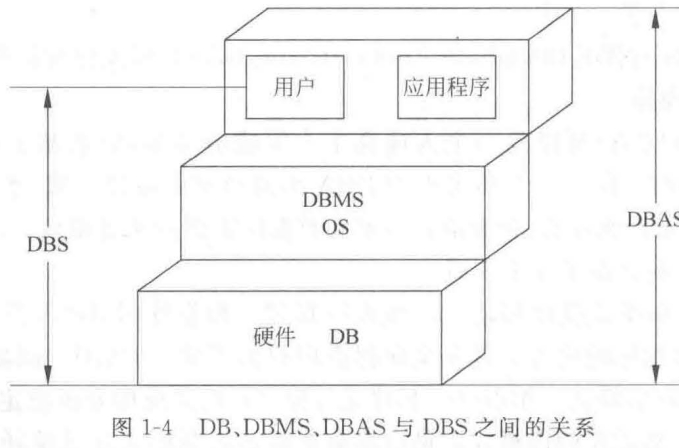​

* **数据库应用系统 (DBAS)** : <u>​`数据库系统`​</u>​`及其`​<u>​`应用程序`​</u>​`的组成`​; 也常被称为应用软件
* **数据库系统的特点**:

  * 数据整体结构化: ​**​`与文件系统的根本区别`​**​`，含数据本身和数据之间的整体结构化`​
  * 数据的共享性高: `冗余度低，减少数据不一致性`​
  * 数据的独立性高
  * 数据由DBMS统一管理和控制

### 数据模型

* **数据模型应满足**:  能够真实模拟现实世界, 容易被人理解, 容易在计算机上实现
* **模型分类**:

  * **概念模型**: **E－R模型，UML模型**; `面向用户，主要用于数据库设计`​
  * **逻辑模型**: 层次模型，网状数据模型，关系数据模型，面向对象模型; `面向DBMS实现`​
  * **物理模型**: 描述数据在系统内部的表示和存取`，面向计算机系统`​
* **模型的要素**: 数据**<u>结构</u>​ **, 数据**​<u>操作</u>​ **, 数据的**​<u>约束条件</u>**
* **E－R模型**:

  * **现实世界概念**: 实体，实体特性（属性），实体集，实体标识符
  * **信息世界概念**: 实体型，属性，实体，联系
  * **计算机世界概念**: 记录型，字段，记录，码
* **实体标识符**: `能够唯一标识一个实体的`​**​`最小的`​**​`数据`​**​`集合`​**​
* **实体（集）间的联系:**

  * **二元联系**:

    1. **一对一 (1:1)** : `实体集A中每个实体，B中至多一个实体与之联系，反之亦然`​
    2. **一对多 (1:n)** : `实体集A中每个实体与B中任意个实体联系，B中每个实体至多和A中一个实体联系，有方向`​
    3. **多对多 (m:n)** : `实体集A、B中每个实体都和另一个实体集中任意个实体联系`​

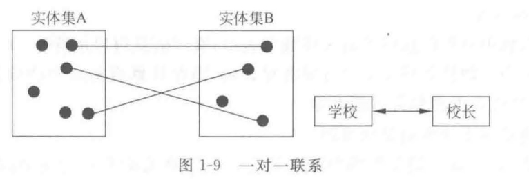​

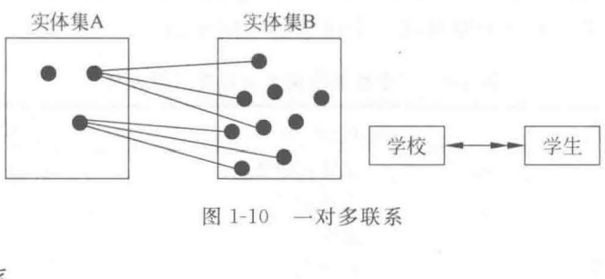​

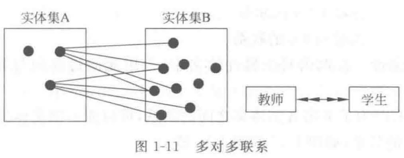​

* **多元联系**: `参与联系的实体集个数~3时，称为多元联系`​;  如学生、教师、课程实体集之间的“教学“联系是三元联系
* **自反联系**: `同一实体集内两部分实体之间的联系，特殊的二元联系`​; 例如学生实体集的班长和同学

* **E－R图**:

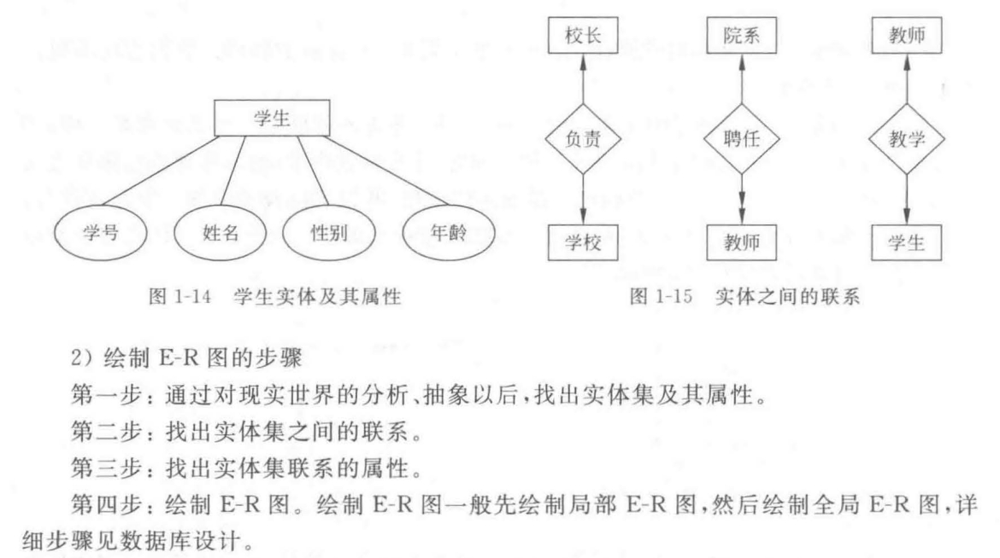​

### 常用结构数据模型

1. **层次模型**:

    * ​`节点之间联系基本方式是1 : n`​;  满足条件：只有一个根节点，根外节点只有一个双亲节点； 通过冗余数据、虚拟记录等手段也能表示多对多关系
    * **优点**: 查询效率高，结构简单，层次分明，便于实现
    * **缺点**: 不适合表示非层次复杂联系，层次顺序严格增删限制多，查询复杂

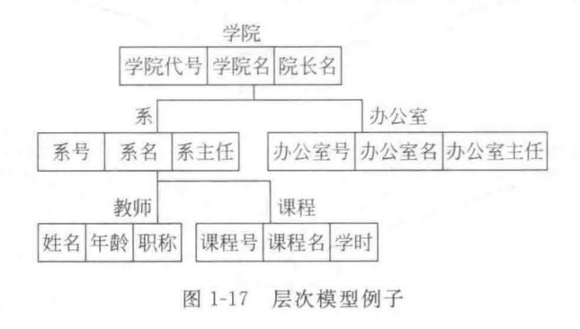

2. **网状模型**:

    * ​`取消了层次模型限制，允许一个以上节点无双亲，一个节点允许有一个以上双亲`​;  记录型之间的联系通过“系"(Set)实现；箭头指向 1 : n 联系的 n 方；多对多联系可用两个一对多联系实现

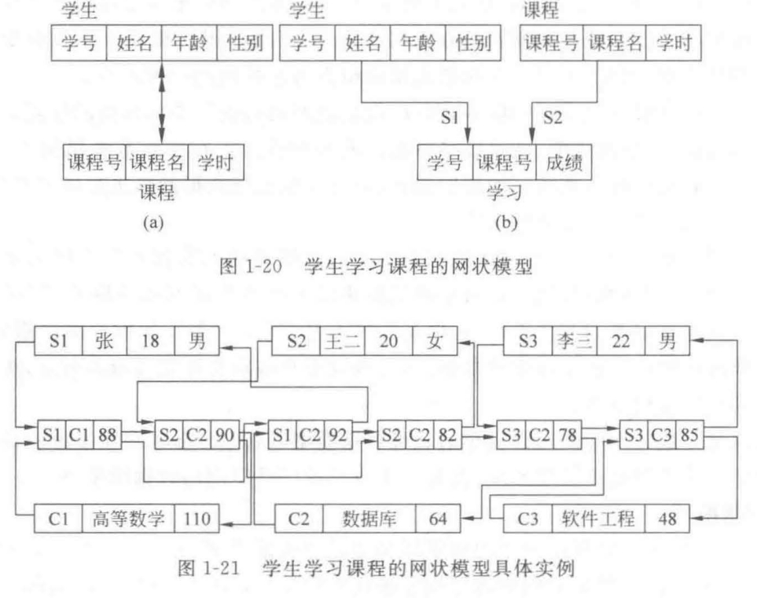​

3. **关系模型**:

    * **关系 (Relation) 的性质**:  属性不可分解，域应是原子数据集合；没有相同行列，行列顺序无关
    * **关系模式 (Relation Schema)** : `关系中信息内容结构的描述`​

> 它包括关系名、属性名、每个属性列的取值集合、数据完整性约束条件以及各属性  
> 间固有的数据依赖关系等。因此,关系模式可表示为:  
> $R(U,D, DOM,I,\Sigma)$
>
> 其中:
>
> R是关系名;
>
> U是组成关系R的全部属性的集合;
>
> D是U中属性取值的值域;
>
> DOM 是属性列到域的映射,即$DOM: U \rightarrow D$,且每个属性$A_i$所有可能的取值集合构成  
> $D_i(i=1,2,...,n)$,并允许$D_i=D_j,i \neq j$;
>
> 数据库原理与应用(MySQL版)
>
> I是一组完整性约束条件;
>
> $\Sigma$是属性集间的一组数据依赖。
>
> 通常,在不涉及完整性约束及数据依赖的情况下,为了简化,可用R(U)表示关系模式。  
> 例如,学生关系模式可表示为:
>
> S(学号,姓名,性别,年龄,学院)
>
> 在层次和网状模型中,联系是用指针来实现的,而在关系模型中,联系是通过关系模式中的关键字来体现的。

4. **面向对象模型**

### 数据库系统结构

* **三级模式结构**:  
  外部模式 (External Schema) / 视图层,  
  概念模式 (Conceptual Schema) / 模式层,  
  内部模式 (Internal Schema) / 存储层

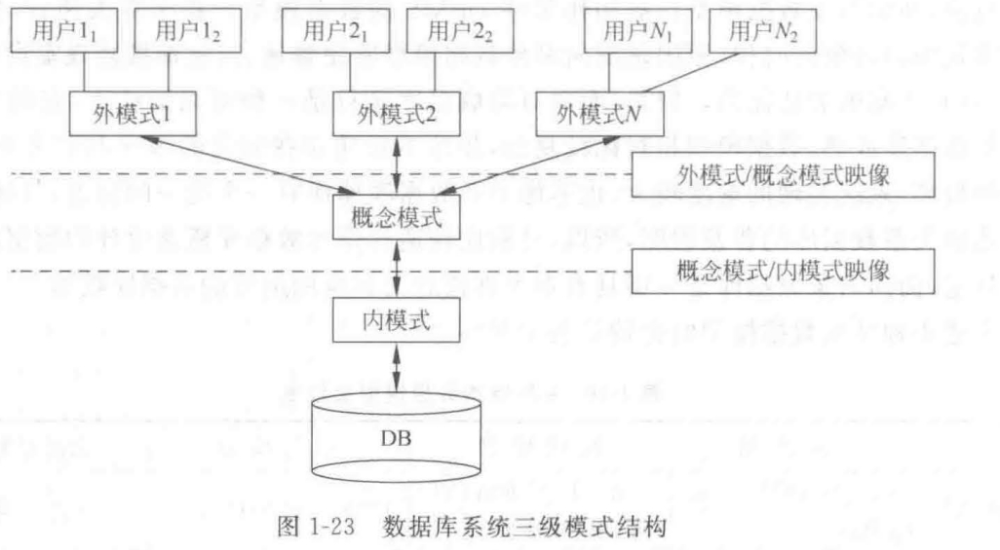​

* **数据独立性**: `应用程序和数据结构之间相互独立,不受影响`​;  在三层模式体系结构中，指某一层次模式改变不影响上一层模式的能力

  * **逻辑独立性**: 模式变化, 外模式/应用程序无须改变; `外模式/模式映像保证逻辑独立性`​
  * **物理独立性**: 內模式改变，概念模式无需改变; `模式/内模式映像保证物理独立性`​
* **外模式／模式映像？模式／内模式映像？**  [需要人工补充]
* **用户通过DBMS访问数据库的过程**:

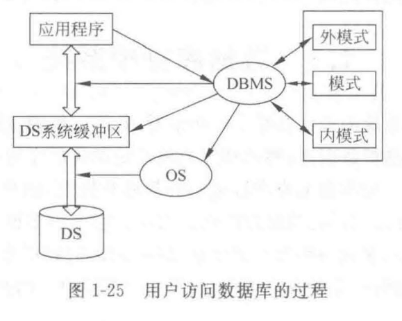​

* **DBMS 的工作过程**:

  1. 接受应用程序的数据请求
  2. DBMS 分析用户操作请求
  3. DBMS 向操作系统发操作请求
  4. 操作系统处理数据, 结果送系统缓冲区, 发读完标志
  5. DBMS 接信号, 缓冲区数据经模式映射变用户逻辑记录送用户区,  给用户成功/失败信息

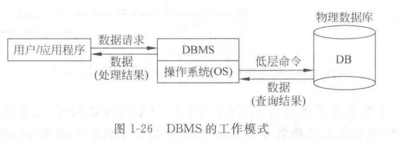​

## 关系数据库

### 关系模型

* **域 (Domain)** : `一组相同数据类型的值的集合`​
* **笛卡尔积**:$D_1 \times D_2 \times \cdots \times D_n = \{(d_1, d_2, \dots, d_n)| d_i \in D_i, i=1,2,\dots,n\}$

* **关系 (Relation)** : `一组域的笛卡尔积的子集`​
* **码 (Key)** :

  * **候选码 (Candidate Key)** : `关系中唯一标识元组的属性或**最小属性集**`​
  * **主码 (Primary Key)** : `选择一个候选码为主码`​
  * **主属性 (Prime Attribute)** : `包含在任何一个候选码中的属性`​;  剩下的都是非主属性
  * **外码 (Foreign Key)** : `基本关系 R 的属性F (非R的码)，关系S的主码Ks，若F与Ks对应, 则F是R的外码, R为参照关系, S 为被参照关系`​

    > **例如**:
    >
    > * 学生表：`学生（学生学号, 姓名, 性别, 出生年份, 专业编号, 身份证号码）`​
    > * 专业表：`专业（专业编号, 专业名称, 专业负责人）`​
    >
    > 学生表主码"学生学号", 专业表主码"专业编号", 学生表"专业编号"参照专业表专业取值,  "专业编号"是学生表外码； "专业编号"作为专业表主码和学生表外码, 实现两表关联； 表的联系通过公共属性实现，公共属性是一个表的主码和另一表的外码
    >

‍

<span data-type="text" style="font-size: 1.38em; font-weight: 600; font-family: var(--b3-font-family-protyle); background-color: var(--b3-theme-background); color: var(--b3-theme-on-background);">关系的性质</span>

### 关系的性质

* 列是同质的：每列数据类型相同，来自同一个域。
* 不同的列可以有相同的域。
* 行列顺序无所谓。
* 任意两行的候选码不能相同。
* 每个分量必须是不可分的。

### 关系操作

关系操作分为： **检索**、**更新**。

更新操作分为：**插入**、**删除**、**修改**。

关系数据库管理系统一般向用户提供4种数据操纵：数据检索，插入，删除，修改。

操纵的对象是关系。基本操纵方式有5种：属性指定，元组选择，关系合并，元组插入，元组删除。

### 关系完整性约束

1. **实体完整性规则**：主属性不能取空值。
2. **参照完整性规则**：外码必须是被参照关系中主码的有效值，或者是一个空值。
3. **用户定义完整性规则**。

## 关系代数

### 基本关系运算

基本关系运算：`五种基本关系运算`​（选择，投影，并，差，笛卡尔积）

### 传统的集合运算

* **并运算 (UNION)**
* **差运算 (DIFFERENCE)**
* **交运算 (INTERSECTION)**
* **广义笛卡尔积运算 (CARTESIAN PRODUCT)** ：R中的每一个元组与S的每一个元组串接。

  * 新关系的度：R的度 + S的度
  * 基数：R的基数 × S的基数
  * 新关系的同名属性：使用 "关系名.属性名" 区分。

注意区分：逻辑运算 `V（或）`​ 和关系运算 `U（并）`​

### 专门的关系运算

1. **选择 (Selection)**

    选择是指在给定的关系中选择出满足条件的元组组成一个新的关系。

    > 关系R关于公式F的选择运算用$\sigma_F(R)$表示,形式  
    > 化定义如下:  
    > ​$\sigma_F(R) = \{t | t \in R \land F(t) = 'true'\}$  
    > 其中,$\sigma_F(R)$表示从R中挑选满足公式F的元组所构成的关系。
    >

    这个式子的左侧看起来是这样的：  
    $\sigma_{出生年份>=1990 \land 出生年份<=1999}$(学生)
2. **投影 (Projection)**

    对一个关系内属性的指定称为投影运算，它也是单目运算。这个操作是对一个关系进行垂直分割，消去某些列，并按要求的顺序重新排列，再**删除重复元组**。

    > 关系R关于属性集A的投影运算用$\prod_A(R)$表示,形式化定义如下:
    >
    > $\prod_A(R) = \{t[A] | t \in R \}$
    >
    > 【例】查询所有学生的姓名和籍贯。
    >
    > 分析：该操作要进行的操作对象为学生表，所关心的属性只有姓名和籍贯。
    >
    > 表示为：
    >
    > $\prod_{姓名,籍贯}$(学生)或者$\prod_{2,4}$(学生),属性名可用列号来表示。
    >
3. **连接 (Join)**

    连接运算是把两个关系连接成一个新关系，它是一个双目运算。

    > 假设有两个关系R和S,R和S的连接是指在R与S的笛卡尔积中,选取R中的属性组A的值与S中的属性组B的值进行比较后,找出满足比较关系θ的元组,组成一个新的关系。连接操作可以记作:
    >
    > $R \underset{A\theta B}{\bowtie} S = \{t_r t_s | t_r \in R \land t_s \in S \land t_r[A]\theta t_s[B]\}$
    >
    > 其中,A和B分别为R和S上度数相等且可比的属性组。θ是比较运算符,因此,也称连接为θ连接。
    >

    关系可以自身连接。
4. **自然连接 (Natural Join)**

    它要求两个关系中进行比较的分量必须是**相同的属性组**，并且在结果中把重复的属性列**去掉**。如果关系R和S具有相同的属性组B，则自然连接可记为：

    $R \bowtie S = \{t_r t_s | t_r \in R \land t_s \in S \land t_r[B] = t_s[B] \}$

    具体计算过程如下：

    1. 计算 R × S (笛卡尔积)。
    2. 设R和S的公共属性是B，找出 R×S 中满足R中属性B的值与S中的属性B的值相等的那些元组。
    3. 去掉S中B列（或者去掉R中B列）。
5. **除运算 (Division)**

    适用的场合：查询条件是一个集合包含另一个集合，即适合于含有短语 “对所有的…” 的查询，如 “查询被所有的学生都选修的课程的信息”。

    除运算的条件：假设给定关系 R(X, Y) 和 S(Y, Z)。 R和S中的Y可以有不同的属性名，但必须出自相同的域集。

    > 除运算的结果:R与S的除运算得到一个新的关系P(X)，P是R中满足下列条件的元组在X属性列上的投影:元组在X上分量值x的像集Yₓ,包含S在Y上投影的集合。  
    > 记作:
    >
    > $R÷S = \{t_x[X]\ |\ t_r \in R \land \prod_y(S) \subseteq Y_x \}$
    >
    > 其中,Yₓ为x在R中的像集,像集Yₓ={t[Y]|t∈ R,t[X]=x}。
    >

### 查询优化

**10种公式**：[需要人工补充]

**优化策略：**

1. 在关系代数表达式中尽可能**早执行选择**操作。
2. 合并笛卡尔积和其后的选择操作，使之成为一个连接运算。
3. 合并连续的**选择和投影**操作，以免分开运算造成多次扫描文件，从而节省了操作时间。
4. 找出表达式里的公共子表达式。如果一个表达式中多次出现某个子表达式，那么应该将该子表达式预先计算出结果保存起来，以避免重复计算。
5. 适当地对关系文件做预处理。根据实际需要对文件进行分类排序或建立临时索引等。

**优化算法**：一个关系代数表达式，可以得到一棵语法树，叶子是关系，非叶子节点是关系代数操作。利用前面的等价变换规则和优化策略来对关系代数表达式进行优化。

### 关系系统

**定义**：一个系统可定义为关系系统，当且仅当它支持：

1. 关系数据结构。
2. 支持选择、投影和（自然）连接运算，并且对这些运算不必要求定义任何物理存取路径。

**分类**：表式系统（不算关系系统），最小关系系统，完备关系系统，全关系系统。

## SQL

### 特点

* 高度非过程化
* 功能完备并一体化
* 统一的语法结构

  * 自含式
  * 嵌入式
* 语言简洁，易学易用

### 体系结构

SQL支持关系数据库体系结构，即外模式、模式和内模式。

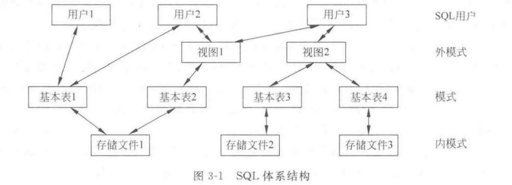

### SQL功能

1. **表结构的定义**

    ```sql
    CREATE TABLE <表名>
    (
        <列名> <数据类型> [列级完整性约束条件],
        [, <列名> <数据类型> [列级完整性约束条件] ... ],
        [, <表级完整性约束条件>]
    )[表属性，例如： ENGINE=InnoDB DEFAULT CHARSET=utf8mb4 COLLATE=utf8mb4_unicode_ci]

    --指定存储引擎为 InnoDB，支持事务、行级锁和外键约束，适合处理高并发的事务场景--
    --设置字符集为 utf8mb4，支持 UTF-8 编码并允许存储 4 字节字符（如 emoji 表情）；--
    --指定排序规则为不区分大小写的 Unicode 排序，用于排序和比较字符数据--
    ```

    在语法描述中，中括号 `[]`​ 用于表示可选的语法元素。

    > 常见约束条件：`NOT NULL`​、`UNIQUE`​、`DEFAULT`​
    >
    > ​`AUTO_INCREMENT`​ 必须与被索引的列一起使用（通常是主键或唯一键），但它本身并不强制要求该列必须是主键。选择将其用于主键通常是出于设计和管理的便利性
    >
    > ​`employee_id INT PRIMARY KEY AUTO_INCREMENT,`​
    >
    > 每次插入新记录时 employee_id 值自动加 1
    >
    > ‍
    >
    > ​`CHECK`​ ：约束条件，例如确保薪资为非负数，防止负薪资的插入。
    >
    > ​`salary DECIMAL(10, 2) CHECK (salary >= 0)`​
    >

    查看表结构/查看建表语句：

    ```sql
    DESCRIBE <表名>
    SHOW CREATE TABLE <表名>
    ```

    **主要数据类型：**

### 1. 数值类型

数值类型用于存储数值数据，根据数值的大小和精度，数值类型可分为整数类型和浮点类型。

#### 1.1 整数类型

|数据类型|字节数|范围（有符号）|范围（无符号）|
| -----------| --------| ---------------------------------------------------------| ---------------------------------|
|TINYINT|1|-128 到 127|0 到 255|
|SMALLINT|2|-32,768 到 32,767|0 到 65,535|
|MEDIUMINT|3|-8,388,608 到 8,388,607|0 到 16,777,215|
|INT|4|-2,147,483,648 到 2,147,483,647|0 到 4,294,967,295|
|BIGINT|8|-9,223,372,036,854,775,808 到 9,223,372,036,854,775,807|0 到 18,446,744,073,709,551,615|

* **TINYINT**：适合存储较小的整数，例如布尔值或状态码。
* **INT** 和 **BIGINT**：适合较大数值的存储，如计数、金额等。

#### 1.2 浮点类型与定点类型

|数据类型|字节数|描述|
| ---------------| --------| ------------------|
|FLOAT|4|单精度浮点数|
|DOUBLE|8|双精度浮点数|
|DECIMAL(m, d)|可变|定点数，精确存储|

* **FLOAT** 和 **DOUBLE**：适合对精度要求不高的科学计算和分析。
* **DECIMAL**：适合精度要求高的场景，如货币计算。

### 2. 字符串类型

字符串类型用于存储文本数据，根据字符长度和内容，MySQL 提供了多种字符串类型。

|数据类型|字节数|描述|
| ------------| ------------------| ----------------------------|
|CHAR(n)|n 字节|固定长度字符串，适合短文本|
|VARCHAR(n)|1 + 实际字符长度|可变长度字符串，适合长文本|
|TEXT|实际字符长度|大文本数据，最大 64KB|
|BLOB|实际字符长度|二进制大对象，最大 64KB|

* **CHAR**：适合固定长度的短字符串，如性别、国家代码。
* **VARCHAR**：适合变长字符串，如用户名、电子邮件地址。
* **TEXT** 和 **BLOB**：适合较大文本或二进制数据，如文章内容或图像数据。

### 3. 日期和时间类型

日期和时间类型用于存储日期和时间信息，MySQL 提供了灵活的时间数据类型。

|数据类型|字节数|范围|描述|
| -----------| --------| ------------------------------------------------| ----------------------------|
|DATE|3|1000-01-01 到 9999-12-31|存储日期（年-月-日）|
|TIME|3|-838:59:59 到 838:59:59|存储时间（时:分:秒）|
|DATETIME|8|1000-01-01 00:00:00 到 9999-12-31 23:59:59|存储日期和时间|
|TIMESTAMP|4|1970-01-01 00:00:00 到 2038-01-19 03:14:07 UTC|存储日期和时间，适合时间戳|
|YEAR|1|1901 到 2155|存储年|

* **DATE** 和 **DATETIME**：适合存储日期和完整的日期时间信息。
* **TIMESTAMP**：适合记录 Unix 时间戳。
* **TIME**：适合记录时间数据，如工时或时长。

### 4. JSON 类型

MySQL 5.7 及以上版本支持 JSON 数据类型，允许存储 JSON 格式的数据。JSON 类型字段可用于存储灵活的结构化数据，但要注意 JSON 类型的字段索引和查询性能较差，不宜用于复杂查询。

```sql
CREATE TABLE example_table (
    data JSON
);
```

* **使用场景**：适合存储结构变化频繁的数据，如动态配置或用户偏好。

### 5. ENUM 和 SET 类型

#### ENUM

​`ENUM`​ 数据类型用于定义一组允许的值，例如状态或类型。创建 `ENUM`​ 列时指定所有可能值：

```sql
CREATE TABLE example_table (
    status ENUM('active', 'inactive', 'pending')
);
```

#### SET

​`SET`​ 数据类型用于定义多个可能值的组合，适合多选项字段。

```sql
CREATE TABLE example_table (
    tags SET('sports', 'news', 'entertainment')
);
```

### 6. 选择数据类型的注意事项

* **空间效率**：尽量选择占用空间少的数据类型，能用 `TINYINT`​ 就不选 `INT`​。
* **性能考虑**：使用合适的数据类型有助于提高查询和索引性能。
* **存储精度**：财务数据用 `DECIMAL`​ 存储，避免浮点数精度误差。
* **拓展性**：`VARCHAR`​ 灵活适合变长字符，避免固定长度导致浪费空间

    来源：[小哈教程-mySQL数据类型](https://www.quanxiaoha.com/mysql/mysql-data-type.html)

1. **主关键字定义 (Primary Key Definition)**

    关系数据库中，唯一标识每一行数据的属性或属性组合。  
    每个表只能有一个主键。

    **声明方式：**

    1. **单属性主键：**   `属性名 数据类型 PRIMARY KEY`​
    2. **通用方式：**   `PRIMARY KEY (属性1, 属性2, ...)`​ (可用于单属性或多属性主键)

    > 方法一:
    >
    > ```sql
    > CREATE  TABLE  学生
    > (学号    CHAR(8)     PRIMARY KEY,
    > 姓名    CHAR(8),
    > 性别    CHAR(2),
    > 出生年份  SMALLINT,
    > 籍贯    CHAR(8),
    > 学院    CHAR(15));
    > ```
    >
    > 方法二:
    >
    > ```sql
    > CREATE  TABLE  学生
    > (学号    CHAR(8),
    > 姓名    CHAR(8),
    > 性别    CHAR(2),
    > 出生年份  SMALLINT,
    > 籍贯    CHAR(8),
    > 学院    CHAR(15),
    > PRIMARY  KEY(学号));
    > ```
    >
2. **外键定义 (Foreign Key Definition)**

    1. 如果外部关键字只有一个属性，可以在它的属性名和类型后面直接用 `"REFERENCES"`​ 说明它参照了某个表的某些属性（必须是主关键字）。

        ```sql
        REFERENCES <表名>(<属性>)
        ```

    2. 在 `CREATE TABLE`​ 语句的属性列表后面增加一个或几个外部关键字说明，其格式为：

        ```sql
        FOREIGN KEY(<属性 1>) REFERENCES <表名>(<属性2>)
        ```

        ```sql
        CREATE TABLE 学习
        (学号 CHAR(8),
        课程号 CHAR(8),
        成绩 SMALLINT,
        PRIMARY KEY (学号,课程号),
        FOREIGN KEY (学号) REFERENCES 学生(学号)
        FOREIGN KEY (课程) REFERENCES 课程(课程号)
        ```

### 基本表修改和删除

**调整列位置：**

使用 `AFTER`​ 或 `FIRST`​ 关键字调整列的位置。

* ​`AFTER column_name`​: 将列移动到指定列之后。
* ​`FIRST`​: 将列移动到第一列。

```sql
-- 将 email 列移动到 name 列之后
ALTER TABLE t_employee
MODIFY email VARCHAR(255) AFTER name;

-- 将 email 列移动到第一列
ALTER TABLE t_employee
MODIFY email VARCHAR(255) FIRST;

```

**修改：**

```sql
ALTER TABLE <表名>
[ ADD [COLUMN] <新列名> <数据类型> [DEFAULT 默认值] [完整性约束] ]
| [ DROP [COLUMN] <列名> ]
| [ ALTER COLUMN <列名> <数据类型> ]
| [ ADD CONSTRAINT <约束名> <约束类型> (<列名>)]
| [ DROP CONSTRAINT <约束名> ]
```

常用操作:

* 增加列 (ADD COLUMN):

  语法: `ALTER TABLE <表名> ADD [COLUMN] <新列名> <数据类型> [DEFAULT 默认值] [完整性约束]`​

  ```sql
  ALTER TABLE 学生 ADD COLUMN 年龄 SMALLINT;
  ```

* 删除列 (DROP COLUMN):

  语法: `ALTER TABLE <表名> DROP [COLUMN] <列名>`​

  ```sql
  ALTER TABLE 学生 DROP COLUMN 年龄;
  ```

* 修改列 (ALTER COLUMN / MODIFY COLUMN / CHANGE COLUMN):

  标准 SQL使用 `ALTER COLUMN`​

  语法: `ALTER TABLE <表名> ALTER COLUMN <列名> <数据类型>`​

   修改  `课程名`​ 列类型为 `VARCHAR(20)`​:

  ```sql
  ALTER TABLE 课程 ALTER COLUMN 课程名 VARCHAR(20);
  ```

* MySQL:  推荐使用 `MODIFY COLUMN`​ 或 `MODIFY`​， `CHANGE COLUMN`​  还可以同时修改列名。

  修改类型: `ALTER TABLE <表名> MODIFY [COLUMN] <列名> <新数据类型> [其他属性]`​

  修改名和类型 : `ALTER TABLE <表名> CHANGE [COLUMN] <旧列名> <新列名> <新数据类型> [其他属性]`​

  ```sql
  ALTER TABLE t_employee MODIFY email TINYINT;
  ALTER TABLE t_employee CHANGE email employee_email TINYINT;
  ```

* **增加约束 (ADD CONSTRAINT):**   向表添加约束，如主键、外键、唯一约束等。

  语法: `ALTER TABLE <表名> ADD CONSTRAINT <约束名> <约束类型> (<列名>)`​

  学生表添加主键约束 `PK_学生`​，列为 `学号`​:

  ```sql
  ALTER TABLE 学生 ADD CONSTRAINT PK_学生 PRIMARY KEY (学号);
  ```

* **删除约束 (DROP CONSTRAINT):**  

  语法: `ALTER TABLE <表名> DROP CONSTRAINT <约束名>`​

  示例: 学生表删除主键约束 `PK_学生`​:

  ```sql
  ALTER TABLE 学生 DROP CONSTRAINT PK_学生;
  ```

**提示:**

1. **列长度修改:**  增加列长度通常没问题，**但缩短长度可能导致数据丢失或失败**，确保新长度能容纳现有数据。
2. **NULL 约束修改为 NOT NULL:**   若将列从允许 `NULL`​ 改为 `NOT NULL`​，**必须先处理列中的** **​`NULL`​**​ **值**，否则修改会失败。

‍

**删除 (Delete)** ：`DROP TABLE [IF EXISTS] <表名> [RESTRICT | CASCADE];`​

* ​`RESTRICT`​：如果有视图或约束条件涉及要删除的表时，禁止DBMS执行该命令。
* ​`CASCADE`​：将该表与其涉及的对象一起删除。
* ​`IF EXISTS`​：表示如果表存在则删除，否则不会报错。建议使用此选项以避免因表不存在而导致的错误。

> 注意：
>
> 1. **锁表问题**  
>     ​`ALTER TABLE`​ 操作会锁定表结构，因此在高并发环境中应小心操作。
> 2. **列的删除与重命名**  
>     删除列或重命名操作可能会导致依赖该列的视图或存储过程失效。
> 3. **操作影响**  
>     某些复杂的 `ALTER TABLE`​ 操作可能需要 MySQL 创建临时表，从而耗费更多资源。

### 索引建立与删除

**建立索引 (Create Index)** ：

```sql
CREATE [UNIQUE] [CLUSTER] INDEX <索引名>
ON <表名>(<列名> [<次序>][, <列名> [<次序>] ...]);
```

> UNIQUE 表明此索引的每个索引值只对应唯一的数据记录。CLUSTER 表示要建立的索引是聚簇索引。聚簇索引是指索引项的顺序与表中记录的物理顺序一致的索引组织。  
> 【例3-10】 为学生、课程和学习表建立索引。
>
> ```sql
> CREATE UNIQUE INDEX STU_IDX_SNO ON 学生(学号);
> CREATE UNIQUE INDEX COU_IDX_CNO ON 课程(课程号);
> CREATE UNIQUE INDEX SC_IDX_SNO_CNO ON 学习(学号 ASC,课程号 DESC);
> ```
>
> 其中,ASC表示按照升序排列,DESC表示按照降序排列。

**删除索引 (Drop Index)** ：

```sql
DROP INDEX <索引名>;
```

### 数据查询

**语法格式：**

SQL 92 标准中SELECT语句的语法格式:

```sql
SELECT [ALL | DISTINCT] <属性列表>
FROM <表名或视图名>[,<表名或视图名>]...
[WHERE <条件表达式>]
[GROUP BY <列名>]
[HAVING <条件表达式>]
[ORDER BY <列名> [ASC | DESC] ];
```

#### 单表查询

最简单的SQL查询只涉及一个关系（基本表），可归纳为：

1. 选择表中的若干列（关系代数中的投影运算）。
2. 选择表中的若干元组（关系代数中的选择运算）。
3. 对查询进行分组。
4. 使用集函数。（`WHERE`​ 作用于元组，`HAVING`​ 作用于分组）
5. 对查询结果排序。

#### 连接查询

**等值与非等值连接查询 (Equi-join and Non-equi-join Query)**

用来连接两个表的条件称为连接条件或连接谓词，其一般格式为：

​`[<表名1>.]<列名1><比较运算符>[<表名2>.]<列名2>`​

其中,比较运算符主要有：=,>,<,>=,<=、!=。

此外,连接谓词还可以使用下面的形式。

```sql
[<表名1>.]<列名1> BETWEEN [<表名2>.]<列名2> AND [<表名2>.]<列名3>
```

当连接运算符为=时,称为等值连接,使用其他运算符时称为非等值连接。

**连接示例 (Join Example)：**

```sql
SELECT 学生.*, 学习.*
FROM 学生, 学习
WHERE 学生.学号 = 学习.学号;
```

**自然连接示例 (Natural Join Example)：**

```sql
SELECT 学生.学号, 姓名, 性别, 出生年份, 学院, 课程号, 成绩
FROM 学生, 学习
WHERE 学生.学号 = 学习.学号;
```

或者，使用 `NATURAL JOIN`​ 关键字：

```sql
SELECT *
FROM 学生
NATURAL JOIN 学习;
```

**自身连接 (Self Join)：**  `同一关系与自身进行连接`​

**外连接 (Outer Join)：**  `保留单边或双边未匹配元组的连接`​

**复合条件连接 (Complex Condition Join)：**  `使用AND、OR或多个JOIN子句的复杂连接`​

#### 集合运算连接查询

使用集合运算（并、交、除）来组合关系。SQL为此提供了相应的运算符：`UNION`​、`INTERSECT`​、`EXCEPT`​。

#### 嵌套查询

##### 带有IN的子查询

判断属性列值是否在子查询结果（集合）中。

##### 带有比较运算符的子查询

子查询结果为单值时，可直接使用比较运算符。

* **示例：**  查询选修了 '数据库原理' 课程的学生的学号和姓名。

  ```sql
  SELECT 学号, 姓名
  FROM 学生
  WHERE 学号 IN (
      SELECT 学号
      FROM 学习
      WHERE 课程号 = (
          SELECT 课程号
          FROM 课程
          WHERE 课程名 = '数据库原理'
      )
  );
  ```

##### 带有ANY/ALL的子查询

> 当子查询可能返回多行结果时，不能直接用比较运算符。此时用 `ANY`​ 或 `ALL`​ 谓词搭配比较运算符。
>
> * ​**​`ANY`​**​：子查询结果中，只要有 ***任意一个值*** 满足比较关系，条件就成立。
> * ​**​`ALL`​**​：子查询结果中，***所有值*** 都必须满足比较关系，条件才成立。

* **示例：**  查询比计算机学院任意一个学生年龄小的学生姓名。

  ```sql
  SELECT 姓名
  FROM 学生
  WHERE year(now()) - 出生年份 < ANY (
      SELECT year(now()) - 出生年份
      FROM 学生
      WHERE 学院 = '计算机'
  )
  ORDER BY year(now()) - 出生年份 DESC;
  ```

  * **等价于使用 MAX 聚合函数：**

    ```sql
    SELECT 姓名
    FROM 学生
    WHERE year(now()) - 出生年份 < (
        SELECT MAX(year(now()) - 出生年份)
        FROM 学生
        WHERE 学院 = '计算机'
    )
    ORDER BY year(now()) - 出生年份 DESC;
    ```

* |**ANY、ALL 谓词与集合函数及 IN 的等价转换关系：**|||||||

  |谓词|=|<> 或 !=|<|<=|>|>=|
  | :----| :---| :-------| :------| :------| :------| :------|
  |ANY|IN|--|< MAX|<=MAX|> MIN|>=MIN|
  |ALL|--|NOT IN|< MIN|<=MIN|> MAX|>=MAX|

##### 带有EXISTS的子查询

子查询不返回数据，只产生逻辑真值 `true`​ 或 `false`​。

* **示例：**  查询选修了 '180102' 号课程的学生的学号和姓名。

  ```sql
  SELECT 学号, 姓名
  FROM 学生
  WHERE EXISTS (
      SELECT *
      FROM 学习
      WHERE 学生.学号 = 学习.学号 AND 学习.课程号 = '180102'
  );
  ```

  > **执行过程：**  依次取 `学生`​ 表中元组，用其 `学号`​ 检查 `学习`​ 表。若 `学习`​ 表中存在匹配 `学号`​ 且 `课程号`​ 为 '180102' 的记录，则 `EXISTS`​ 返回 `true`​，该学生记录的 `学号`​ 和 `姓名`​ 被选中。
  >
* ​`NOT EXISTS`​ 则相反。

> 带 `EXISTS`​/`NOT EXISTS`​ 的子查询**不一定**能被其他形式替代，但所有带 `IN`​、比较运算符、`ANY`​/`ALL`​ 的子查询都能用 `EXISTS`​ 等价替换。

##### 使用 EXISTS 实现除法

关系代数中的除法运算（查询选修了 *所有* 某类课程的学生）。

* **核心思想：**  找到 *不存在* 这样的课程：目标学生（如 '091501'）选修了，而当前被检查的学生 *没有* 选修。
* **示例：**  查询选修了学号为 '091501' 的学生所选修的 *全部* 课程的学生学号。

  ```sql
  SELECT DISTINCT 学号
  FROM 选课表 AS S1
  WHERE NOT EXISTS (
      SELECT 课程号
      FROM 选课表 AS S2
      WHERE S2.学号 = '091501'
        AND NOT EXISTS (
            SELECT 课程号
            FROM 选课表 AS S3
            WHERE S3.学号 = S1.学号
              AND S3.课程号 = S2.课程号
        )
  );
  ```

  **精简解释：**  对于每个学生 `S1.学号`​，检查是否 *不存在* 课程 `S2.课程号`​，满足条件： 课程 `S2.课程号`​ 是学生 '091501' 选修的，并且学生 `S1.学号`​ *没有* 选修课程 `S2.课程号`​。 如果不存在这样的课程，则说明学生 `S1.学号`​ 选修了 '091501' 学生选修的所有课程。

> **其他实现除法的方法：**
>
> * **使用** **​`GROUP BY`​**​ **和** **​`HAVING`​**​  
>   统计每个学生选修的目标课程数，与目标学生选修的总课程数比较。
>
>   ```sql
>   SELECT 学号
>   FROM 选课表
>   WHERE 课程号 IN (SELECT 课程号 FROM 选课表 WHERE 学号 = '091501')
>   GROUP BY 学号
>   HAVING COUNT(DISTINCT 课程号) = (SELECT COUNT(DISTINCT 课程号) FROM 选课表 WHERE 学号 = '091501');
>   ```

​`对于相关的嵌套查询（如使用 EXISTS 且子查询引用了外层查询的列），其执行过程通常是：外层查询取出一个元组，将该元组的相关值传入内层子查询，内层子查询执行并返回结果（或真/假），外层查询根据内层结果判断当前元组是否满足条件，然后外层查询处理下一个元组。对于不相关的嵌套查询（子查询可以独立执行），通常是先执行内层子查询，得到结果集，然后外层查询使用这个结果集进行判断。`​

### 数据更新

#### 插入数据 (INSERT)

1. **插入单个元组 (行)**

    * **基本语法:**

      ```sql
      INSERT INTO <表名> [(<列名1>, <列名2>, ...)] VALUES (<值1>, <值2>, ...);
      ```

    * 如果省略列名列表，`VALUES`​ 子句必须为所有列提供值，且顺序与表定义一致。
    * 如果指定列名列表，`VALUES`​ 子句只需为指定的列提供值，顺序需对应，未指定的列将取默认值或 `NULL`​。
    * **示例：**

      ```sql
      -- 插入完整信息
      INSERT INTO t_employee (name, position, salary) VALUES ('犬小哈', '项目经理', 7000.00);
      -- 插入部分列信息 (salary 会是 NULL 或默认值)
      INSERT INTO t_employee (name, position) VALUES ('李四', 'DBA 数据库工程师');
      ```

      > **注意**：命令行工具可能对中文支持不佳，建议使用图形客户端（如 Navicat）测试含中文的插入。
      >
      > MySQL 插入单行数据
      >
2. **插入多行数据**

    * 一条 `INSERT`​ 语句插入多个元组。
    * **示例：**

      ```sql
      INSERT INTO t_employee (name, position, salary) VALUES
          ('犬二哈', 'Java实习生', 3000.00),
          ('犬大哈', 'Java高级工程师', 6000.00),
          ('张三', '运维工程师', 5000.00);
      ```

      !MySQL 查看数据
3. **插入子查询结果**

    * 将查询结果插入表中。
    * **语法:**

      ```sql
      INSERT INTO <表名> [(<列名1>, <列名2>, ...)] <子查询>;
      ```

    * **示例：**  从 `t_employee_archive`​ 表复制薪资高于 4000 的记录到 `t_employee`​ 表。

      ```sql
      INSERT INTO t_employee (name, position, salary)
      SELECT name, position, salary FROM t_employee_archive WHERE salary > 4000;
      ```

4. **插入或替换 (REPLACE INTO)**

    * 如果插入的行导致主键或唯一键冲突，则先删除旧行，再插入新行。
    * **示例：**

      ```sql
      REPLACE INTO t_employee (employee_id, name, position, salary) VALUES (1, '王五', '前端工程师', 6000.00);
      ```

5. **插入或更新 (ON DUPLICATE KEY UPDATE)**

    * 如果插入的行导致主键或唯一键冲突，则执行 `UPDATE`​ 子句指定的操作。
    * **示例：**  尝试插入 ID 为 1 的记录，若已存在，则更新其职位和薪资。

      ```sql
      INSERT INTO t_employee (employee_id, name, position, salary) VALUES (1, '诸葛亮', '安卓工程师', 7000.00)
      ON DUPLICATE KEY UPDATE position = 'Java架构师', salary = 60000.00;
      ```

    * **注意事项:**

      * 依赖主键或唯一键来检测冲突。
      * ​`UPDATE`​ 子句可使用 `VALUES(column_name)`​ 引用 `INSERT`​ 语句中尝试插入的值。

        ```sql
        -- 冲突时，用本次尝试插入的值更新记录
        INSERT INTO t_employee (employee_id, name, position, salary) VALUES (1, '诸葛亮', '安卓工程师', 7000.00)
        ON DUPLICATE KEY UPDATE name = VALUES(name), position = VALUES(position), salary = VALUES(salary);
        ```

#### 删除数据 (DELETE)

* **语法:**  `DELETE FROM <表名> [WHERE <条件>];`​
* **删除满足条件的元组:**  使用 `WHERE`​ 子句。

  * **示例：**  删除学号为 '092010' 的学生记录。

    ```sql
    DELETE FROM 学生 WHERE 学号 = '092010';
    ```

  * **示例（带子查询）：**  删除计算机学院所有学生的选课记录。

    ```sql
    DELETE FROM 学习
    WHERE '计算机' = (SELECT 学院 FROM 学生 WHERE 学生.学号 = 学习.学号);
    -- 也可用 EXISTS 实现
    DELETE FROM 学习
    WHERE EXISTS (SELECT 1 FROM 学生 WHERE 学生.学号 = 学习.学号 AND 学院 = '计算机');
    ```

* **删除所有元组:**  省略 `WHERE`​ 子句（慎用！）。

  ```sql
  DELETE FROM <表名>;
  ```

#### 修改数据 (UPDATE)

* **语法:**  `UPDATE <表名> SET <列名>=<表达式> [, <列名>=<表达式>]... [WHERE <条件>];`​
* **修改满足条件的元组:**  使用 `WHERE`​ 子句。

  * **示例：**  将学号 '091611' 的学生籍贯改为 '江苏'。

    ```sql
    UPDATE 学生 SET 籍贯 = '江苏' WHERE 学号 = '091611';
    ```

  * **示例：**  将课程号 '180101' 的成绩加 1 分。

    ```sql
    UPDATE 学习 SET 成绩 = 成绩 + 1 WHERE 课程号 = '180101';
    ```

  * **示例（带子查询）：**  将计算机学院学生的成绩清零。

    ```sql
    UPDATE 学习 SET 成绩 = 0
    WHERE '计算机' = (SELECT 学院 FROM 学生 WHERE 学生.学号 = 学习.学号);
    -- 也可用 EXISTS 实现
    UPDATE 学习 SET 成绩 = 0
    WHERE EXISTS (SELECT 1 FROM 学生 WHERE 学生.学号 = 学习.学号 AND 学院 = '计算机');
    ```

* **修改所有元组:**  省略 `WHERE`​ 子句。
* **使用子查询/连接更新:**

  * **示例：**  将员工薪资更新为其部门平均薪资（假设有 `t_department`​ 表）。

    ```sql
    UPDATE t_employee AS e
    JOIN t_department AS d ON e.department_id = d.department_id
    SET e.salary = d.avg_salary;
    ```

* **使用** **​`ORDER BY`​**​ **和** **​`LIMIT`​**​ **更新特定行:**

  * **示例：**  将薪资最低的 3 名员工薪资更新为 4500。

    ```sql
    UPDATE t_employee
    SET salary = 4500
    ORDER BY salary ASC
    LIMIT 3;
    ```

### 视图 (Views)

#### 建立视图 (CREATE VIEW)

* 视图是**虚表**，基于基本表或其他视图，其定义存储在数据字典中，不存储实际数据。
* **语法：**

  ```sql
  CREATE VIEW <视图名> [(<列名1> [,<列名2>]...)]
  AS <子查询>
  [WITH CHECK OPTION];
  ```

  * **列名列表：**  可省略，默认为子查询的 `SELECT`​ 列。以下情况**必须**指定：

    1. 某列是聚合函数或表达式。
    2. 多表连接时存在同名列。
    3. 需要为列指定新名称。
  * ​**​`WITH CHECK OPTION`​**​ **：**  对视图进行 `INSERT`​ 或 `UPDATE`​ 操作时，确保结果行满足视图定义中的 `WHERE`​ 条件。
* **示例：**

  * **创建计算机学院学生视图:**

    ```sql
    CREATE VIEW CS_VIEW AS
    SELECT * FROM 学生 WHERE 学院 = '计算机';
    ```

  * **创建指定列名的视图:**

    ```sql
    CREATE VIEW CS_VIEW (学号, 姓名, 性别, 籍贯, 出生年份, 学院) AS
    SELECT 学号, 姓名, 性别, 籍贯, 出生年份, 学院 FROM 学生 WHERE 学院 = '计算机';
    ```

  * **基于多表创建视图 (选修数据库原理的计算机学院学生):**

    ```sql
    CREATE VIEW DB_S1 AS
    SELECT 学生.学号, 姓名, 性别, 籍贯, 学院, 成绩
    FROM 学生, 学习, 课程
    WHERE 课程名 = '数据库原理'
      AND 学生.学号 = 学习.学号
      AND 课程.课程号 = 学习.课程号
      AND 学院 = '计算机';
    ```

  * **基于视图创建视图 (成绩&gt;=90):**

    ```sql
    CREATE VIEW DB_S2 AS
    SELECT * FROM DB_S1 WHERE 成绩 >= 90;
    ```

  * **创建带表达式的视图 (计算年龄):**

    ```sql
    CREATE VIEW BT_S (学号, 姓名, 年龄) AS
    SELECT 学号, 姓名, year(now()) - 出生年份 AS 年龄 FROM 学生;
    ```

#### 删除视图 (DROP VIEW)

* **语法：**  `DROP VIEW <视图名>;`​
* 删除视图会使基于该视图导出的其他视图失效。

#### 查询视图

* 查询视图的操作与查询基本表类似。
* **视图消解 (View Resolution):**  `视图消解是指数据库管理系统（DBMS）在执行对视图的查询时，会先将视图定义（即创建视图时的 AS 子查询）与用户的查询语句进行合并或重写，最终转换成对底层基本表的查询操作的过程。DBMS 并不实际存储视图的数据，而是存储其定义，查询时通过消解机制访问基础数据。`​
* **示例：**  查询计算机学院视图中年龄小于20岁的学生。

  ```sql
  SELECT * FROM CS_VIEW WHERE year(now()) - 出生年份 < 20;
  ```

  * **消解后的查询：**

    ```sql
    SELECT * FROM 学生 WHERE 学院 = '计算机' AND year(now()) - 出生年份 < 20;
    ```

#### 更新视图

* 只有部分简单视图（通常称为**可更新视图**，如行列子集视图）允许更新 (`INSERT`​, `UPDATE`​, `DELETE`​)。
* **不可更新视图的常见限制：**

  1. 视图的列来自表达式或常数（通常不允许 `INSERT`​/`UPDATE`​，可能允许 `DELETE`​）。
  2. 视图的列来自聚合函数。
  3. 视图定义中包含 `GROUP BY`​ 子句。
  4. 视图定义中包含 `DISTINCT`​ 关键字。
  5. 视图定义中包含嵌套查询，且嵌套查询的 `FROM`​ 子句涉及导出该视图的基本表。
  6. 视图基于两个或以上基本表导出（某些数据库可能有限支持）。
  7. 视图基于不可更新的视图定义。
* **示例（不可更新视图）：**  查询成绩高于平均分的选课记录视图。

  ```sql
  CREATE VIEW GOOD_SC_VIEW AS
  SELECT 学号, 课程号, 成绩
  FROM 学习
  WHERE 成绩 > (SELECT AVG(成绩) FROM 学习);
  -- 此视图通常不可更新，因为它包含子查询引用了自身的基础表
  ```

### 数据控制 (Data Control)

#### 授权 (GRANT)

* 授予用户对数据库对象的操作权限。
* **语法：**

  ```sql
  GRANT <权限> [,<权限>]...
  [ON <对象类型> <对象名>]
  TO <用户> [,<用户>]...
  [WITH GRANT OPTION];
  ```

  * ​`<权限>`​: 如 `SELECT`​, `INSERT`​, `UPDATE`​, `DELETE`​, `ALL PRIVILEGES`​ 等。
  * ​`<对象类型>`​: 如 `TABLE`​, `VIEW`​ 等。
  * ​`<对象名>`​: 表名、视图名等。
  * ​`<用户>`​: 用户名或 `PUBLIC`​ (所有用户)。
  * ​`WITH GRANT OPTION`​: 允许被授权用户将获得的权限再授予其他用户。
* **常用权限:**  (详见教材或文档，如 表 3-39)
* **示例：**

  * 授予 `User1`​ 对 `学生`​ 表的查询权限：

    ```sql
    GRANT SELECT ON TABLE 学生 TO User1;
    ```

  * 授予 `User2`​, `User3`​ 对 `学生`​ 表和 `课程`​ 表的所有权限：

    ```sql
    GRANT ALL PRIVILEGES ON TABLE 学生, 课程 TO User2, User3;
    ```

  * 授予所有用户对 `学习`​ 表的查询权限：

    ```sql
    GRANT SELECT ON TABLE 学习 TO PUBLIC;
    ```

  * 授予 `User4`​ 对 `学习`​ 表的查询权限和修改 `成绩`​ 列的权限：

    ```sql
    GRANT UPDATE (成绩), SELECT ON TABLE 学习 TO User4;
    ```

  * 授予 `User5`​ 对 `学生`​ 表的 `INSERT`​ 权限，并允许其传播此权限：

    ```sql
    GRANT INSERT ON TABLE 学生 TO User5 WITH GRANT OPTION;
    ```

#### 收回权限 (REVOKE)

* 收回已授予用户的权限。
* **语法：**

  ```sql
  REVOKE <权限> [,<权限>]...
  [ON <对象类型> <对象名>]
  FROM <用户> [,<用户>]...;
  ```

* **示例：**

  * 收回 `User4`​ 修改 `学习`​ 表 `成绩`​ 的权限：

    ```sql
    REVOKE UPDATE (成绩) ON TABLE 学习 FROM User4;
    ```

  * 收回 `User5`​ 对 `学生`​ 表的 `INSERT`​ 权限（级联收回）：

    ```sql
    REVOKE INSERT ON TABLE 学生 FROM User5;
    ```

    * 如果 `User5`​ 曾将此 `INSERT`​ 权限授予 `User6`​，则 `User6`​ 从 `User5`​ 处获得的该权限也会被收回。

## 关系规范化理论（待续）

* **函数依赖 (Functional Dependency):**  Y 依赖于 X，或 X 函数确定 Y，记为 `X -> Y`​。
* **SQL 连接类型补充:**

  * ​`INNER JOIN`​ / `JOIN`​: 只保留两个表中能匹配上的行（交集）。
  * ​`LEFT JOIN`​ (或 `LEFT OUTER JOIN`​): 保留左表所有行，右表只保留匹配行，无匹配则为 `NULL`​。
  * ​`RIGHT JOIN`​ (或 `RIGHT OUTER JOIN`​): 保留右表所有行，左表只保留匹配行，无匹配则为 `NULL`​。
  * ​`FULL OUTER JOIN`​: 保留左右两表所有行，无匹配则对应表列为 `NULL`​ (MySQL 不直接支持，需用 `LEFT JOIN UNION RIGHT JOIN`​ 模拟)。
* **范式 (Normal Forms):**
  ​

  * **1NF (第一范式):**  关系中的所有属性都是原子的，不可再分。
  * **2NF (第二范式):**  满足 1NF，且每一个非主属性都 *完全函数依赖* 于候选码（不能只依赖于候选码的一部分）。
  * **3NF (第三范式):**  满足 2NF，且消除非主属性对候选码的 *传递函数依赖*。
  * **BCNF (Boyce-Codd 范式):**  满足 3NF，且所有函数依赖中，决定因素（`->`​左侧）都必须包含候选码。
  * **多值依赖和 4NF (第四范式):**  ?[需要人工补充]
* **相关理论:**

  * 数据依赖的公理系统 (Armstrong 公理)
  * 函数依赖集的闭包 (F+)
  * 函数依赖的推理规则
  * 属性集闭包 (X+)
  * F 逻辑蕴含 G 的充要条件
  * 码的理论 (候选码、主码、超码)
  * 函数依赖集的等价和最小函数依赖集 (Minimal Cover)

‍
