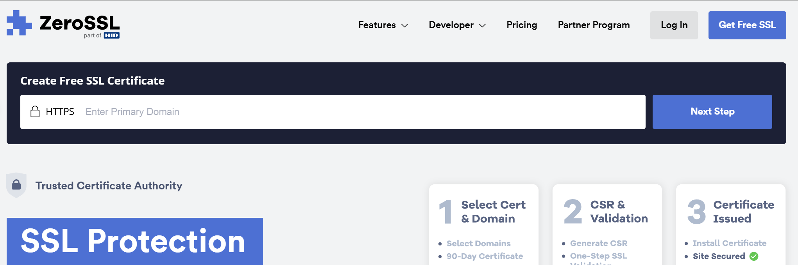
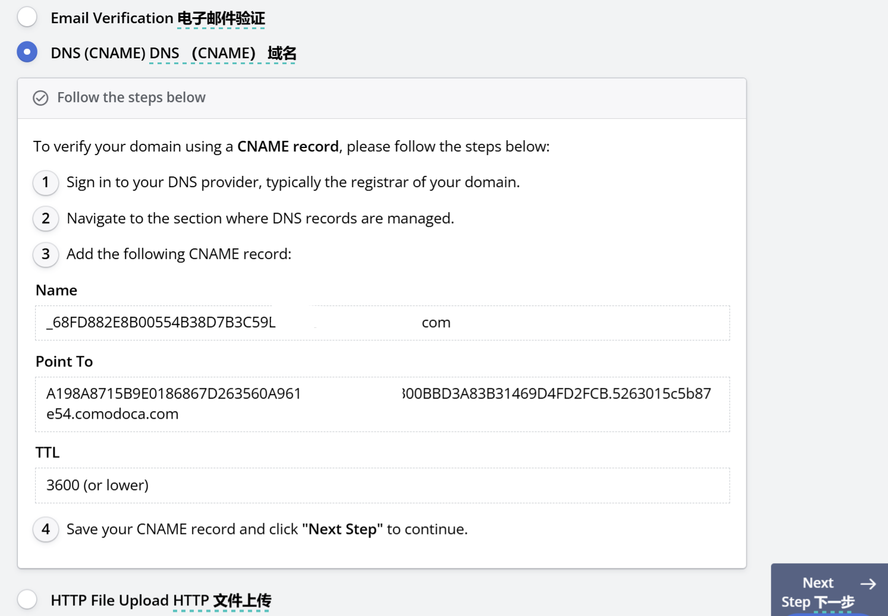
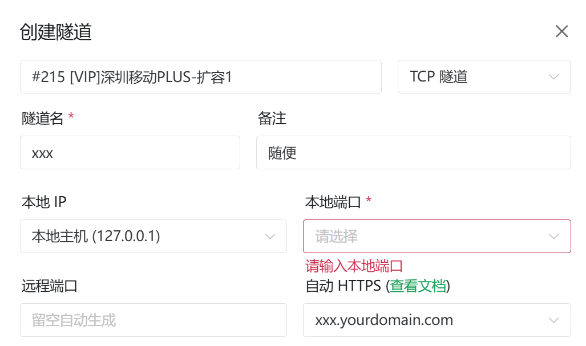
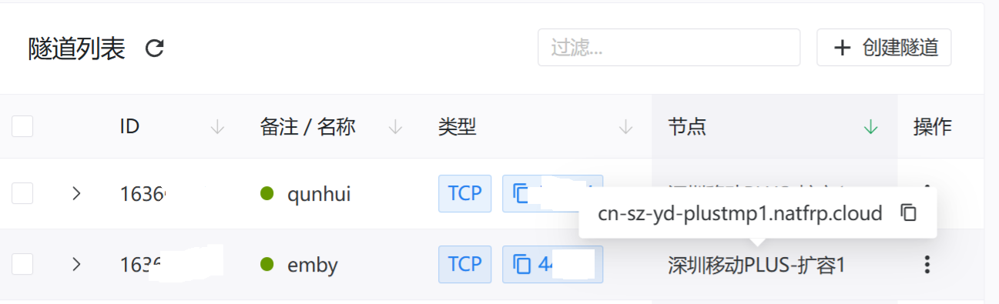
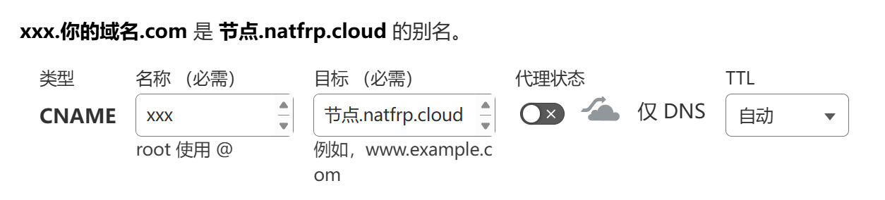
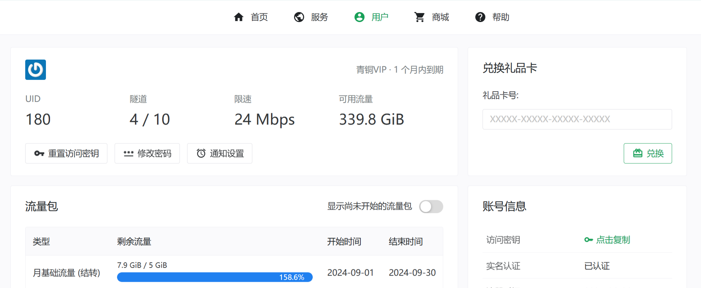

# 用自己的域名做https内网穿透

## 为什么要做穿透

前段时间用黑裙nas折腾好了一些私有云服务，在内网提供emby、Komga、云同步、音乐库等服务。不过很快就遇到了一些问题，校内个别地方连通性不太好，管理给内网的设备之间做了隔离，因此无法在这些地方使用服务。此外，一旦离开内网环境，出门玩耍、实习的时候也没法愉快享受影音乐趣，很是不爽。

看了多个大厂的穿透服务，性价比不能说很低，只能说没有。遂去海鲜市场和各小厂找解决方案。转了一圈发现[Sakura FRP](https://www.natfrp.com/)的性价比挺不错，操作起来也简单，支持导出frpc客户端配置。本次就以Sakura穿透服务为例聊一聊如何**用自己的域名搭配内网穿透服务，并开启https安全连接**。

​​

## 开启隧道遇到的问题

Sakura对于备案要求比较严格，**未备案**域名无法使用国内节点对外暴露80/443端口。使用自定义端口的TCP隧道时，节点于客户端之间必须开启https。

这就产生的一个问题，Sakura一些节点的证书未被浏览器信任，直接通过节点域名+端口访问服务时，首先是浏览器会报不安全，非常烦人；其次是一些服务的客户端APP只认安全连接，没办法用。为了解决这些问题，我决定用自己的域名和zeroSLL证书来访问服务。

## 申请免费SSL证书

如果我们有自己的公网IP，那么则可以直接将域名解析到自己的IP或者套一层Cloudflare代理，随后通过[Certbot](https://certbot.eff.org/)直接自动向Let’s Encrypt之类的机构申请即可。但是我们现在的状况是：正因为没有公网IP，所以需要做内网穿透+域名访问，因此需要通过其他方法来获取证书。

随着各大平台提供SSL证书有效期不断缩短，现在能获取到的免费证书基本都是只有90天有效期，需要手动续期，这里以Zero SSL为例。

首先来到[官网](https://zerossl.com/)，直接在最显眼的输入框里输入我们要申请的域名，例如`sakura.yourdomain.com`​，之后一路下一步。

​​

随后，Zero SSL会要求你验证你是域名的所有者，这里采用DNS验证比较简单。首先来到DNS提供商的后台，这里依然使用Cloudflare。

1. 按照提示创建一条CNAME记录
2. 将网页提供的Name去掉主域名和顶级域名（即`yourdomain.com`​这部分），保留子域名填入Cloudflare的`名称`​一栏
3. Point整个填入`目标`​一栏
4. 小云朵代理一般不需要开启，保存即可

​​

:::tip  
对于其他DNS提供商，也是类似的操作。例如你购买了阿里云的域名，则可以直接在阿里云控制台设置DNS解析。  
:::

完成操作后在浏览器中点击下一步等待自动验证即可，完成后就可以下载包含证书及私钥的压缩包了，之后将在frpc客户端中使用它。

:::warning  
续期过程中，用户可以选择继续使用原来的密钥对，或者生成新的密钥对。如果生成新的密钥对，证书中的公钥信息会改变！  
:::

## 开通隧道

来到SakuraFRP后台，根据下图格式创建一个隧道，现在我们没有开放80/443端口的需求（要备案的`/(ㄒoㄒ)/~~`​），所以可以不选带有“建站”标签的节点。

图中的本地IP，如果你在同一台机器上运行服务端和穿透客户端，则选择`127.0.0.1`​，否则填写服务端所在设备的内网IP（例如你决定在路由器或另一台内网设备上跑穿透）。本地端口为你的服务端所使用的端口。

​​

## 域名解析到节点

接下来需要将域名解析到Sakura提供的穿透节点，节点的域名可以把鼠标放上去查看。

​​

知道了节点域名之后就可以在DNS页面创建一条CNAME记录，指向Sakura穿透节点即可，名称可以随意。

​​

## 配置客户端并启动

在frpc客户端，我们需要添加证书和key。这里使用的是Sakura FRP启动器，它实际上是个frpc套壳，操作原理都是相同的。通过查阅SakuraFRP的wiki，可以得知群晖上的Sakura启动器工作目录的位置在`/var/packages/natfrp/var`​。

:::tip  
对于其他平台也是同理，只需要在平台对应的配置目录做操作即可。在这里要吐槽一下Sakura的[wiki](https://doc.natfrp.com/launcher/manual.html)的导航和分类做的真的不太好，要查什么东西需要翻半天才能找到......  
:::

> 核心服务的所有文件都是相对于 **工作目录** 创建的。下面是工作目录的默认值：
>
> * Windows：`%PROGRAMDATA%\SakuraFrpService`​
> * macOS：`~/Library/Containers/com.natfrp.launcher/Data/Library/Application Support/natfrp-service`​
> * Linux / FreeBSD 下遵循 FreeDesktop 规范：
>
>   * 优先使用 `$XDG_CONFIG_HOME/.config/natfrp-service`​
>   * 如果 `$XDG_CONFIG_HOME`​ 未设置，则使用 `~/.config/natfrp-service`​
> * Android 启动器：`/data/data/com.natfrp.launcher/service/`​
> * OpenWrt LuCI 插件：`/etc/natfrp`​
> * 群晖 DSM 套件包：`/var/packages/natfrp/var`​
> * Docker 镜像：`/run/`​

‍

我们来到工作目录中，进入FrpcWokingDirectory，将域名证书与私钥文件放在这里即可。我们在电脑上将之前在ZeroSSL下载好的zip文件打开，里面的crt文件和key文件使用文本编辑器打开后复制即可。

```bash
cd /var/packages/natfrp/var/FrpcWorkingDirectory
sudo vi xxx.yourdomain.com.crt
#输入你的群晖管理员密码后，粘贴crt证书中的内容
#按下Esc，输入 :wq ,按下回车即可保存
sudo vi xxx.yourdomain.com.key
#同上
```

完成后，即可在启动器中开启隧道。访问群晖IP+4101端口进入后台，在`隧道`​页通过拖拽的方式启用隧道即可弹出提示：“隧道已启动，您可通过`https://节点域名:为你分配的端口`​访问”。此时就可以使用`https://xxx.yourdomain.com:为你分配的端口/`​来随处访问你的服务啦。

:::tip  
对于其他设备，则可以通过双击图标等更简单的方式来进入启动器页面，或者通过查阅Sakura的wiki、frpc文档、chatGPT来完成启动的步骤。在使用Sakura官方启动器之前，会要求通过token来进行登录，按照提示输入用户信息页面的访问密钥即可。  
:::

​​
