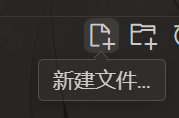

# 计算机入门培训

欢迎加入计算机部！本文档旨在帮助大家快速搭建开发环境，熟悉基本的工具和知识，为首次考核和后续开始开发做好准备。

:::note  
本文档涉及对开源项目或文档的部分引用，所有参考文档均基于MIT许可证开源，在此一并表示感谢。本文档仅供内部学习交流使用，不涉及商业及宣传性质，如有侵权请通过About页联系删除。  
:::

---

在初次考核前，请按照以下指导，**<u>按顺序</u>**完成准备工作。

## 入学霍格沃茨

学计算机之前你得先会点魔法，虽然很简单但这是先决条件，具体不方便展开，哔哩哔哩、必应或者GPT镜像站有答案，请自己使用搜索引擎研究。研究好后谷歌搜索TUN模式怎么开。

:::note  
后续步骤依赖此步骤，请先研究明白  
:::

## 环境安装

### 1. 安装 Scroop

Scoop 需要 [Windows PowerShell 5.1](https://aka.ms/wmf5download) 或者 [PowerShell](https://aka.ms/powershell) 作为运行环境，如果你使用的是 Windows 10 及以上版本，Windows PowerShell 是内置在系统中的。而 Windows 7 内置的 Windows PowerShell 版本过于陈旧，你需要手动安装新版本的 PowerShell。微软官网有，可以必应搜索powershell7，不过应该没人用win7，如果有建议尽快升级到10以上。

:::warning  
很多同学在设置 Windows 用户时使用了中文用户名，导致了用户目录也变成了中文名。如果按照 Scoop 的默认方式将软件安装到用户目录下，可能会造成部分软件执行错误。所以这里推荐安装到自定义目录，如果需要其他安装方式请参考： [ScoopInstaller/Install](https://github.com/ScoopInstaller/Install)  
:::

:::tip  
如何打开 Windows 终端：  
1.使用快捷键：按下 Win + X，然后选择 "Windows 终端" 或 "Windows 终端（管理员）"。  
2.通过开始菜单：点击左下角的 "开始" 按钮，搜索 "Windows 终端"，然后点击打开。  
3.右键菜单：在桌面或文件夹空白处右键，选择 "在 Windows 终端中打开"。  
:::

在终端里依次执行以下命令，井号开头的行不需要执行，这叫做注释。

```powershell
# 设置 PowerShell 执行策略
Set-ExecutionPolicy -ExecutionPolicy RemoteSigned -Scope CurrentUser
# 下载安装脚本
irm get.scoop.sh -outfile 'install.ps1'
# 执行安装, --ScoopDir 参数指定 Scoop 安装路径
.\install.ps1 -ScoopDir 'C:\Scoop'
```

安装完成后，打开 **命令提示符** 或 **PowerShell**，输入以下命令检查是否安装成功：

```bash
scroop --version
```

如果输出 Scroop 的版本号，则说明安装成功。

### 2. 使用 Scroop 安装开发环境

Scroop 可以自动为你安装常用的开发工具。接下来我们将依次安装 Python、Git、Node.js、Sudo 和 VSCode。

#### 步骤 1：安装 Python

1. 在 **命令提示符** 或 **PowerShell** 中执行以下命令：

    ```bash
    scroop install python
    ```
2. 安装完成后，验证 Python 是否安装成功：

    ```bash
    python --version
    ```

#### 步骤 2：安装 Git

1. 执行以下命令安装 Git：

    ```bash
    scroop install git
    ```
2. 安装完成后，检查 Git 是否成功安装：

    ```bash
    git --version
    ```

#### 步骤 3：安装 Node.js

1. 执行以下命令安装 Node.js：

    ```bash
    scroop install node
    ```
2. 安装完成后，检查 Node.js 和 npm 是否成功安装：

    ```bash
    node --version
    npm --version
    ```

#### 步骤 4：安装 Sudo

Sudo 是 Windows 上的一款工具，方便以管理员身份执行命令。

1. 使用以下命令安装 sudo：

    ```bash
    scroop install sudo
    ```
2. 安装完成后，检查 sudo 是否安装成功：

    ```bash
    sudo
    ```

#### 步骤 5：安装 VSCode

1. 执行以下命令安装 Visual Studio Code：

    ```bash
    scroop install vscode
    ```
2. 安装完成后，验证 VSCode 是否安装成功：

    ```bash
    code --version
    ```

### 3. 安装 pnpm

pnpm 是一种高效的 JavaScript 包管理工具，可以通过 npm 轻松安装。

1. 执行以下命令使用 npm 安装 pnpm：

    ```bash
    npm install -g pnpm
    ```
2. 安装完成后，检查 pnpm 是否成功安装：

    ```bash
    pnpm --version
    ```

至此，你已经完成了在 Windows 上利用 Scroop 配置开发环境并安装 pnpm 的全过程。

### 4. 常见问题

* 如果开发过程中遇到权限问题，使用 `sudo`​ 命令来提升权限。
* 如果某个命令未识别，重新开一个终端，并检查工具是否已成功安装。

## Python光速入门

如果你没有掌握任何一门编程语言，那么建议从python开始学习基本的编程概念、方法。Python因其简洁易懂的语法和强大的功能，成为初学者的理想选择，有利于快速理解编程的基本逻辑，比如变量、循环和条件语句。

:::note  
如果你已经会用别的语言编程了，可以跳到”我学会了吗“部分。  
:::

### 如何运行一个python程序

方法1：找一个英文目录下的空白文件夹，创建文本文档，确保你能看见文件名字后面的`.txt`​，看不见的话询问`文心一言`​自己为什么看不见`.txt`​以及如何解决。在文件里写好程序，txt文件重命名为`xxx.py`​，右键文件夹空白地方，选择在终端中打开。执行`python xxx.py`​这条命令即可。

方法2：在终端里输入`code`​打开你刚安装好的vscode，顶部菜单选择`文件`​>`打开文件夹`​找一个英文目录。在code左侧的资源管理器新建文件，名字为`xxx.py`​，写好程序后按F5运行。

​​

### 书写

1. Python 有个有意思的点，对于语句，并不要求用 “{}” 围起来，各个代码模块间用缩进来规范。
2. 语句过长时，为了代码美观，需要适当截断。Python 单一语句换行依靠”\“链接

空格的使用：

1. 在逗号、冒号、分号后使用空格，但不要在括号前使用。
2. 赋值运算符和比较运算符两边都应添加空格，但在传递关键字参数或默认参数值时不加空格。

命名规则：

1. 函数、变量用小写字母编写，单词之间用下划线分隔（snake_case）。
2. 类名使用首字母大写的每个单词拼接（CapWords 或称 CamelCase）。

### 变量

变量在 Python 中用来存储数据值。 Python 有五个标准数据类型：

1. 数字
2. 字符串（环绕单引号、双引号）
3. 列表（nb）
4. 字典（键与值对应，如同查字典）
5. 元组（可以看作不可修改的列表）

Python 是动态类型语言，这意味着你不需要显式声明变量的类型，Python 在运行时会自动推断。

* 特别之处： Python 的变量可以在程序运行时改变类型。
* 注意：直接变换变量的数据类型素质很差，还是建议像 c 语言一样调用函数来做到 “显式类型转换”

```python
x = 10        # x是整数类型，python中数字包含“int、long、float、complex“
print(x)
x = "hello"   # 现在x是字符串类型，字符串由数字、字母、下划线组成
print(x)

# 而在c语言中:
# int a;
# 声明变量a为整型，并且后续变量a不允许修改为其他类型
```

### 算数运算符

除去加减乘除外，python 有以下运算符：

1. “/”：保留小数
2. “%”：取除法运算的余数
3. “a**b”：返回 a 的 b 次幂
4. “//”：向下取整

```python
print(5 / 2)
print(5 % 2)
print(5 ** 2)
print(5 // 2)
```

### 赋值、比较

在Python中，赋值操作符用于将值分配给变量，而比较操作符则用于比较两个值的关系。例如，`=`​ 是赋值操作符，而 `==`​ 是比较操作符。以下是一些简单的示例：

```python
x = 5  # 赋值操作
y = 2
print(x == y)  # 比较操作，输出 False
print(x != y)  # 比较操作，输出 True
print(x > y)   # 比较操作，输出 True
```

通过这些操作符，可以进行变量赋值和值的比较，从而实现更复杂的逻辑控制。

### 逻辑运算符

1. and（&&）：两边同时为真时返回右边表达式的计算值，否则返回假
2. or（||）：左边为真则返回左边的计算值，否则返回右边的计算值
3. not（！）：真返回假，假返回真

* 注意：真与 “1” 等价，假与 “0“等价

```python
print(5 and (2 < 3))  # 同时为真，返回右边的True,注：2<3这个不等式为真

print(0 or (1 - 2))  # 左边为假，返回右边的计算值

print(not 1)
```

### 成员运算符

1. a in b: 如果 a 在 b 中，则为真，否则假
2. a not in b：与上面相反

```python
a = 10
b = [10, 2, 3]

print(a in b)
print(a not in b)
```

### 控制流

控制流指的是决定代码执行顺序的语句，主要包括:

1. if 条件语句：程序按照各个条件的先后顺序判断，满足条件后直接执行条件下的代码，不再判断
2. for 循环：在变量满足 "in" 后条件的情况下，不断执行主体，变量会自动迭代
3. while 循环:，在满足条件的情况下，不断执行主体
4. break 语句：终止本次循环，跳出整个循环
5. continue 语句：终止本次循环，直接进入下一次循环

* 注意：循环是可以嵌套的

```python
# if语句
# elif与else都不是必须的
print("对于if语句，输出如下：")
i = 10
if i < 20:
    print("i is less than 20")
elif i < 30:
    print("i is less than 30")
else:
    print("i is bigger than 30")

# for循环
print("\n对于for语句，输出如下：")
for i in range(1, 3):
    print(i)

# while循环
print("\n对于while语句，输出如下：")
i = -2
while i < 0:
    print(i)
    i += 1

# break语句
print("\n对于加入了break语句的循环，输出如下：")
flag = 0
i = 0
while i < 5:
    flag += 1
    print(flag)
    if flag > 2:
        print("break happens")
        break
    i += 1

# continue语句
print("\n对于加入了continue语句的循环，输出如下：")
flag = 0
i = 0
while i < 5:
    flag += 1
    if flag < 3:
        print("continue happens")
        continue
    else:
        print(flag)
    i += 1
```

### 列表

列表：用 “[]” 标识，类似动态数组，可以存储任意类型的对象。支持增删改，“+” 表示列表连接运算，“*” 标识列表重复运算

```python
# 列表
print("对于列表，输出如下：")

# 创建了一个包含多类型数据对象的列表
list = [1, 'string', [1]]

# 增加了一个元素
list.append("addtion")

list2 = ["the second part"]

# 当索引为负数时，从后往前访问
print(list[-1])
# 区间写法，访问第一二个元素（左闭右开）
print(list[0:2])

# 删除一个元素
del list[-1]

# 合并两个列表
list += list2
print(list)
```

### 字符串

字符串用于在 Python 中处理文本数据，例如单词、句子。

* python 自带一些操作字符串的函数
* 特别之处： Python 的字符串是不可变的，意味着一旦创建，它们的内容不能更改。但是可以延长。字符串在一定程度上可以当作列表使用

```python
# 变量s被赋值为字符串"Hello World"
s = "Hello World"

# 使用了类似列表的访问方式，打印第1个字符（大多数语言中第一位都从0开始）
print(s[0])

# 展示了一个字符串操作函数
print(s.lower())  # 转换为小写

# 延长了字符串s
s += ',hello hdu'

print(s)
```

### 生成器

是一种序列，每次调用时只按照顺序取出一个，直到取完为止。

最常见的是`for i in range(0,5):`​ 中的 "range ()"

生成器在 Python 中提供了一种高效的方式来处理大量数据，因为它不需要一次性将所有数据加载到内存中。通过使用生成器，我们可以在需要时逐个生成数据项，从而节省内存和提高性能。例如，`range(0, 5)`​ 生成器会依次生成从 0 到 4 的整数，而不是一次性生成整个列表。

### 我学会了吗？

打开[洛谷](https://www.luogu.com.cn/)，登陆网站，在题库里筛选”入门“，随便做一两个，如果顺利就说明你完全掌握以上内容了。

## 管理项目并和队友协作-GitHub注册

### 注册 GitHub 账号

GitHub 是一个基于 Git 的代码托管平台，方便开发者协作和分享代码。

**注册步骤：**

1. **访问 GitHub 网站：**

    * 前往 [GitHub 官方网站](https://github.com/)。
2. **创建账号：**

    * 点击“Sign up”按钮。
    * 输入邮箱、密码和用户名，按照提示完成注册流程。
    * 验证邮箱以激活账号。

### 创建自我介绍仓库

通过创建一个自我介绍的仓库，可以让他人更好地了解你。

**创建步骤：**

1. **新建仓库：**

    * 登录 GitHub 后，点击右上角的“+”号，选择“New repository”。
    * **仓库名称需与用户名相同**，这样可以创建一个特殊的个人简介仓库。
    * 例如，用户名为 `your-username`​，则仓库名也需为 `your-username`​。
2. **填写仓库信息：**

    * 在“Repository name”中输入你的用户名。
    * 添加仓库描述，如“Welcome to my GitHub profile!”。
    * 勾选“Add a README file”选项。
    * 点击“Create repository”按钮。
3. **编辑 README 文件：**

    * 在新创建的仓库中，点击“README.md”文件。
    * 点击铅笔图标进行编辑。
    * 使用 Markdown 语法添加自我介绍内容，包括：

      * 你的昵称
      * 兴趣爱好
      * 掌握的技能
4. **提交更改：**

    * 编辑完成后，填写“Commit message”。
    * 点击“Commit changes”保存更改。

最终你的主页应该会展示你的自我介绍，例如：

​​

## 恭喜完成预备工作

1. 在你的电脑上执行这些指令，获得输出。然后截图你的终端。

    ```cmd
    > python --version
    Python 3.12.3

    > git --version
    git version 2.45.1.windows.1

    > node --version
    v22.8.0

    > npm --version
    10.8.2

    > sudo
    usage: sudo <cmd...>

    > code --version
    0.41.2

    > pnpm --version
    9.9.0
    ```
2. 截图你的Github主页，包含自我介绍。
3. 复制你的主页链接地址，格式是`https://github.com/你的名字`​
4. 把刚才三步的所有内容一次性发到考核群里，截止10月8日。
5. 10月9日晚上在洛谷网站进行考核，难度非常easy，请放轻松。前提是你认真读本文档了。

‍
